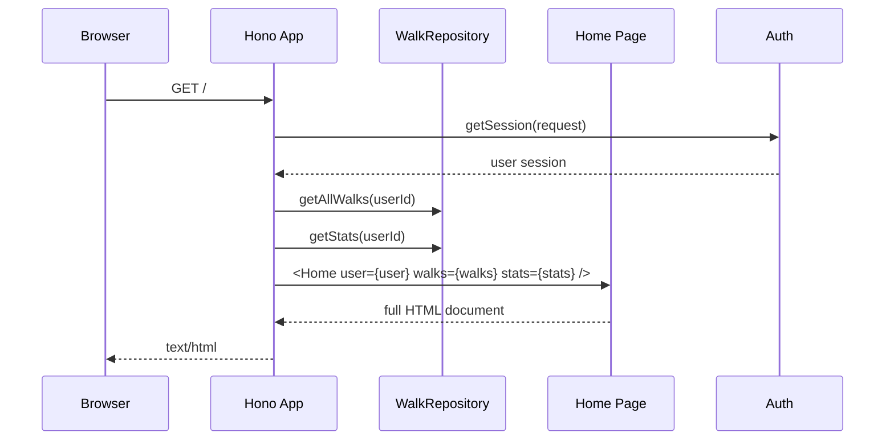
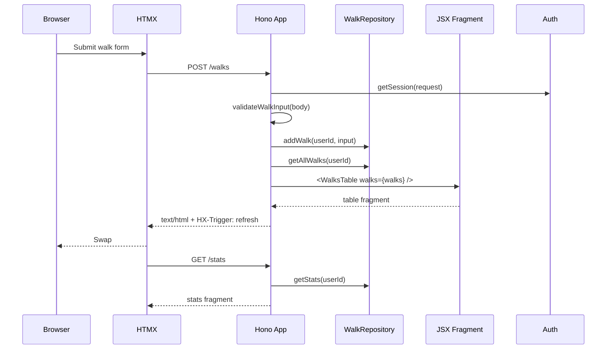

# Architecture

Walking Pace Tracker is intentionally small, but it is structured as a template for Hono + HTMX applications that want server-rendered UI, testable routes, and minimal browser-side JavaScript.

It follows an HTML-first philosophy: server routes own state and validation, JSX components own markup, HTMX owns transport and swaps, and CSS custom properties own presentation decisions. The result should feel like a normal web app, not a miniature SPA hidden inside server code.

## Goals

- Keep runtime setup separate from app construction.
- Render full pages and HTMX fragments with the same JSX component tree.
- Let HTML own interaction contracts through HTMX attributes.
- Keep persistence behind a narrow repository interface.
- Keep auth behind a provider interface so route tests can use a deterministic in-memory provider, local review can use SQLite-backed auth, and production can use Better Auth.
- Make components, routes, database behaviour, and HTMX contracts independently testable.
- Keep browser assets explicit, bundled, and easy to inspect.
- Prefer boring composition over hidden framework magic.
- Make accessibility and screenshots part of normal development, not a release afterthought.

## Influences

The template borrows from a few ideas and tools:

- [Atomic Design](https://bradfrost.com/blog/post/atomic-web-design/) for a shared vocabulary around primitives, composed pieces, feature regions, and pages.
- [Hypermedia Systems](https://hypermedia.systems/) and [HTMX](https://htmx.org/) for the idea that HTML can remain the application protocol.
- [Hono](https://hono.dev/) for a small, dependency-light request layer.
- [Open Props](https://open-props.style/) for design tokens that keep raw values out of component styles.
- [Vite](https://vite.dev/) for browser CSS, client JavaScript, static assets, production manifests, and Storybook bundling.
- [Storybook](https://storybook.js.org/) for isolated component and app-state review.
- [Pa11y](https://pa11y.org/) and [Playwright](https://playwright.dev/) for automated confidence around accessibility, browser workflows, and visual states.

Those influences are intentionally applied lightly. The app should be understandable by reading `createApp()`, the repository, and the component tree without learning a large internal framework first.

## Core Shape

The app has two entry points with different responsibilities:

- `src/index.ts` is the runtime entrypoint. It reads environment variables, creates a database provider, runs migrations, creates repositories, creates the Hono app, and exports Bun's `fetch` handler.
- `src/app.tsx` is a small public export boundary for `createApp()`. The route implementation lives under `src/http/`, receives dependencies, registers routes, and returns a Hono app without owning process setup.

That split keeps production startup simple while making tests cheap:

```ts
const provider = createSqliteDatabaseProvider({ filename: ":memory:" });
await provider.migrate();
const repository = provider.createWalkRepository();
const authProvider = new TestAuthProvider([...users]);
const invitationService = new InvitationService({
  authProvider,
  emailSender,
  inviteRepository: provider.createInviteRepository(),
});
const app = createApp({ authProvider, invitationService, walksRepository: repository });
```

Tests use the same route tree as production, but swap the database for an in-memory SQLite database and the auth backend for a deterministic test provider.

## Layers

```text
src/
├── client/                    # Vite browser entry and bundled CSS
├── index.ts                   # process/runtime composition
├── app.tsx                    # public app factory export
├── auth/                      # auth provider contract, Better Auth, SQLite, and test adapters
├── components/
│   ├── atoms/                 # primitive elements and controls
│   │   ├── Button/            # component, tests, and export
│   │   ├── Chip/              # compact metadata indicator
│   │   └── Card/              # reusable surface container with CSS variable sizing
│   ├── molecules/             # small composed UI pieces
│   │   ├── LabelledOutput/    # label + output value used by summary metrics
│   │   ├── ScrollableTable/    # generic sticky-header table shell
│   │   └── WalksRow/          # component, tests, and export
│   ├── organisms/             # feature sections and regions
│   ├── pages/                 # full page compositions
│   ├── templates/             # document shell
│   └── library.ts             # app-agnostic component export boundary
├── db/
│   ├── calculator.ts          # pure pace math
│   ├── contracts/             # shared provider/repository conformance tests
│   ├── model.ts               # domain types, repository contracts, and database provider contract
│   ├── providers/             # env selection plus SQLite/Postgres lifecycle adapters
│   ├── repositories/          # SQLite/Postgres walk and invite persistence implementations
│   └── migrations/            # SQLite and Postgres schema migrations
├── envs/                      # environment-specific fixtures such as local review presets
├── http/                      # Hono app factory, route classes, request helpers, and route tests
│   └── routes/                # system, auth, walk, and admin route registration
├── services/                  # application services such as email and invitations
├── stories/                   # Storybook helpers and sample data
└── walks/
    └── validation.ts          # form input validation
```

The boundaries are deliberately plain. There is no global application state, no client-side store, and no framework-specific data loader layer. Routes ask repositories for data, pass that data to JSX components, and return HTML. That makes data flow deliberately visible: form input enters a route, validation runs, persistence changes, the route asks for fresh read models, and the server returns the fragment HTMX should swap into the page.

## Request Flow

Initial page requests return the complete document:



HTMX interactions return only the fragment that should be swapped:



Clear actions follow the same fragment pattern. `DELETE /walks/:id` clears one row owned by the current user and returns a refreshed `WalksTable`. `DELETE /walks` clears the current user's table and returns the empty table state. The clear controls are still native forms, with POST fallback routes for browsers that do not run JavaScript.

## Auth And Invitations

`AuthProvider` is the route-facing contract for sessions, sign-in/sign-out, user creation, role changes, and bans. Production composition uses Better Auth with the admin plugin and Postgres. Local SQLite composition uses `SqliteAuthProvider` so a file-backed `DB_PATH` can persist seeded admin accounts for UI review. Route tests use `TestAuthProvider`, which keeps session cookies deterministic without coupling route tests to auth internals.

Better Auth owns production users, credential accounts, sessions, and verification tables. The local SQLite provider owns equivalent local-only user and session tables for development. `src/services/invitations` owns invitations so it can enforce the `USER_LIMIT` cap across existing users and pending invitations before sending email. `InvitationService` hashes invite tokens before persistence, creates accounts through `AuthProvider`, marks invitations accepted or revoked, and sends invite links through `EmailSender` from `src/services/email`.

Admins are normal users with the `admin` role. They can manage accounts and view another user's scores through a read-only `WalksTable`, but walk mutation routes always use the authenticated user's id and never accept an arbitrary owner id from the request.

## Deployment Shape

The production deployment target is Railway. `railway.json` pins the Dockerfile builder, runs `bun run db:migrate` as the pre-deploy command, starts the service with `bun run start`, and uses `/healthz` as a public deployment health check. Railway injects `PORT`, and `src/index.ts` reads it before exporting Bun's fetch handler.

`scripts/seed-admin.ts` is intentionally separate from app startup. It uses the same database and auth provider selection as the app: `DATABASE_URL` seeds Postgres through Better Auth, while `DB_PATH` seeds a local SQLite database. It either creates the first admin or upgrades an existing account to the `admin` role. `scripts/seed-local-dev.ts` is local-only and seeds reusable SQLite review profiles from `src/envs/local/local-presets.ts` so tests and manual UI review share the same account fixtures.

## HTMX Pattern

HTMX behaviour is declared on the component that owns the interaction.

- `WalkForm` posts to `/walks`, targets `#walks-list`, and resets itself after the request.
- `WalksRow` owns the clear button for a single walk.
- `WalksTable` owns the clear-all button because it affects the whole table.
- `Home` owns stable fragment anchors such as `#stats` and `#walks-list`.
- Auth and admin forms use `HxForm`, which keeps native `method` and `action` fallbacks while adding HTMX attributes for fragment updates.

This keeps server responses small and predictable. A route that is triggered by HTMX should return the smallest meaningful fragment, not a full page.

Walk mutation routes return `HX-Trigger: refresh`, and the stats fragment listens for `refresh from:body`. That keeps stats updates server-directed and avoids inline client scripts inside component attributes.

Actual HTMX runtime behaviour belongs in Playwright E2E tests. Unit-level tests assert the server-side contract: the attributes rendered into HTML, the route side effects, the `HX-*` headers, and the fragment shape returned to HTMX requests.

## Progressive Forms

Every mutating control should start as a native HTML form or link, then add HTMX as an enhancement. Components that accept HTMX attributes implement `HtmxProps`, whose prop names match the rendered attribute names with the `hx-` prefix. That keeps JSX close to the browser contract and avoids translating `hxPost` into `hx-post` in each component.

`HxForm` is the default form wrapper. It renders native `action` and `method` first, then spreads validated `hx-*` attributes. With JavaScript enabled, HTMX handles sign-in, invite acceptance, admin mutations, walk creation, and clear actions as fragments or `HX-Redirect` responses. Without JavaScript, the same controls submit through normal browser navigation:

- sign-in, sign-out, invite acceptance, admin role/ban/invite actions, and walk creation post directly to their route
- clear-one and clear-all controls post to fallback routes because browsers cannot submit native `DELETE`
- admin account selection uses `href` for normal navigation and `hx-get` plus `hx-push-url` for enhanced navigation
- the theme toggle is nonessential and falls back to the default readable color scheme

## Components

Components are grouped by how they are used:

- **Atoms** are primitive controls, surfaces, and small indicators such as `Button`, `Card`, `Chip`, `Switch`, and `WalksCell`.
- **Molecules** compose atoms into small pieces such as `InputGroup`, `LabelledOutput`, `ScrollableTable`, and `WalksRow`.
- **Organisms** represent feature-level UI such as `WalkForm`, `Stats`, and `WalksTable`.
- **Pages** compose feature sections into a screen.
- **Templates** own the HTML document shell and Vite asset tags.
- **Library exports** in `src/components/library.ts` expose app-agnostic atoms and molecules for reuse without mixing in domain-specific pages or organisms.

Each component lives in its own directory with the files that describe its behaviour:

```text
components/atoms/Button/
├── Button.tsx
├── Button.test.tsx
└── index.ts
```

That local folder shape keeps the implementation, tests, and public export together. When a component grows, its related files grow in place instead of spreading across broad global files. Shared CSS is Vite-managed from `src/client/styles.css`, while component class names keep ownership visible in markup and tests.

The app uses semantic HTML where possible. The home page uses the reusable `Card` atom rendered as a `main` region, with separate `section` elements and `h3` section headings. The history region is a real table with a sticky header and a scrollable body. `Chip` is used for compact metadata such as the walk count, and `LabelledOutput` names the "label plus machine-readable output value" shape used by the summary metrics.

`Card` is the template surface primitive. It can fill the available viewport space or take fixed dimensions through props that set CSS custom properties such as `--card-width`, `--card-height`, `--card-min-height`, and `--card-max-height`.

`ScrollableTable` is the reusable table shell. It owns the sticky header, scrollable body, border model, row sizing, and responsive column custom properties. Feature tables such as `WalksTable` provide columns, rows, empty states, and HTMX actions without reimplementing the table mechanics. Its body hides horizontal overflow so header and body columns stay aligned; vertical scrolling remains below the header.

## Design Philosophy

The template tries to make the common path obvious:

- **HTML is the contract.** Components render semantic HTML with HTMX attributes where interaction is needed. Tests assert the HTML contract, not incidental implementation details.
- **The server is the source of truth.** Mutations go through routes, the repository is read again after a mutation, and the returned fragment represents the canonical current state.
- **Components are named after what they are.** `Button`, `Chip`, `Card`, `LabelledOutput`, `ScrollableTable`, and `WalksRow` describe rendered structure rather than vague domain ideas.
- **CSS class contracts stay visible.** Components keep semantic class names close to their markup, while Vite bundles the shared CSS entry.
- **CSS variables carry design decisions.** Components consume semantic variables like `--surface`, `--table-text`, and `--border-subtle`; theme switching changes those variables centrally.
- **Tests follow boundaries.** Component tests cover markup, route tests cover full-page behaviour, HTMX tests cover fragment contracts, database tests cover persistence, and Pa11y covers accessibility regressions.
- **Services are injected.** Route creation receives providers and services rather than constructing them internally. Scripts follow the same direction by keeping entrypoints small and putting reusable logic behind classes or helper modules in `scripts/lib`.

## Browser Assets

Vite owns browser CSS, client JavaScript, static files, and production manifests. The app remains server-rendered by Hono and Bun; Vite is not the app server.

- `src/client/main.ts` imports HTMX, exposes it for browser debugging, imports the bundled CSS, and owns theme-toggle behaviour.
- `src/client/styles.css` imports Open Props and contains the app's CSS class contracts.
- `public/` contains static public files such as `favicon.svg` and `robots.txt`.
- `Layout` renders Vite dev-server tags when `VITE_DEV_SERVER_URL` is set, otherwise it reads `dist/client/.vite/manifest.json` and links hashed production assets.
- `src/http/static-assets.ts` serves Vite-built `/assets/*` files and public root files from the Bun app in production.

`bun run dev` starts both the Hono server and Vite dev server. `bun run build` emits production browser assets to `dist/client`.

Theme values are expressed as CSS custom properties mapped to Open Props tokens. Light and dark modes change variables on `:root[data-theme="..."]`, so component styles consume semantic variables such as `--surface`, `--table-bg`, and `--table-text` instead of hard-coding theme-specific colors.

Theme motion is also tokenized. Shared surfaces use `--theme-transition`; text switches immediately with `--theme-text-transition` to avoid low-contrast color interpolation; inputs own their focus transition so native input rendering does not lag behind the rest of the UI.

## Persistence

`WalkRepository` in `src/db/model.ts` is the contract used by the app:

```ts
export interface WalkRepository {
  getAllWalks(userId: string): Promise<WalkWithStats[]>;
  addWalk(userId: string, walk: WalkInput): Promise<void>;
  deleteWalk(userId: string, id: number): Promise<boolean>;
  clearWalks(userId: string): Promise<number>;
  getStats(userId: string): Promise<Stats>;
}
```

`DatabaseProvider` in `src/db/model.ts` is the base database interface used by runtime composition. It owns the selected database kind, migration lifecycle, connection cleanup, and repository factories. The `createRepositories()` method returns the walk and invitation repositories together, so app startup can switch between SQLite and Postgres without knowing the concrete provider type.

`SqliteDatabaseProvider` powers in-memory tests and local file storage, while `PostgresDatabaseProvider` supports production deployments through `DATABASE_URL`.

Repository implementations own inserts, deletes, and reads. Pace calculations are delegated to `Calculator`, keeping math pure and easy to test.

The database also enforces core constraints:

- miles must be greater than zero
- minutes cannot be negative
- seconds must be between 0 and 59
- total duration must be greater than zero
- walk reads and mutations are scoped by `user_id`

Request validation happens before storage, and database constraints remain as a second line of defense.

Shared adapter conformance lives in `src/db/contracts/repository-contracts.ts`. SQLite runs those provider, walk repository, and invitation repository contracts by default. Postgres contract tests run when `TEST_DATABASE_URL` points at a disposable test database. See [docs/architecture/database-adapters.md](./docs/architecture/database-adapters.md) for the adapter checklist.

## Testing Strategy

The tests are split by behaviour boundary rather than by implementation detail.

- colocated `*.test.tsx` component tests render JSX to strings and assert semantic markup plus component contracts such as HTMX attributes, switch state, table controls, and empty states.
- `src/http/app.test.tsx` exercises full-page and error route behaviour through `app.request()`.
- `src/http/htmx.test.tsx` owns successful HTMX mutations, sends `HX-*` headers, and asserts fragment-only response shape.
- `better-auth-provider.test.ts` verifies the auth provider factory can create users, sign in, read sessions, and persist local SQLite auth across provider instances.
- `local-presets.test.ts` verifies local dev account fixtures, roles, banned state, and repeatable walk seeding.
- `service.test.ts` under `services/invitations/` verifies invite creation, acceptance, and user-cap enforcement.
- `repository-contracts.ts` defines shared SQLite/Postgres provider and repository conformance suites.
- `app.e2e.ts` uses Playwright against a seeded in-memory app server to cover browser login, HTMX mutations, stats refresh, and admin score review.
- Storybook stories cover generic library components and important app states; `bun run test:storybook` smoke-tests those stories in Chromium.
- `calculator.test.ts` covers pure pace, speed, average, median, and validation behaviour.
- `scripts/check-deprecations.ts` asks the TypeScript language service for suggestion diagnostics and fails on deprecated API usage, including editor-only warnings that normal typechecking allows.
- `scripts/lib/coverage-report.test.ts` verifies the local LCOV-to-HTML coverage report generator used by `bun run coverage`.

This avoids overlap between app tests and HTMX tests. App tests answer "does the server render the full page and reject bad input correctly?" HTMX tests answer "does a successful interaction mutate state and return the fragment contract the browser expects?"

## Extending The Template

For a new feature, follow the same path:

1. Add domain types and repository methods behind an interface.
2. Add validation for request input before persistence.
3. Add or extend a route class under `src/http/routes/`, then register it in `src/http/app.tsx`.
4. Add JSX components at the smallest useful level.
5. Add or update CSS class contracts in `src/client/styles.css`.
6. Add component tests for rendered behaviour.
7. Add route tests for server-side behaviour.
8. Add HTMX contract tests for fragment responses.
9. Add Storybook states and Playwright coverage when the behaviour depends on the browser.

That pattern keeps the app boring in a good way: the server owns state, components own markup, HTMX owns swaps, and tests stay close to the contracts users actually depend on.
