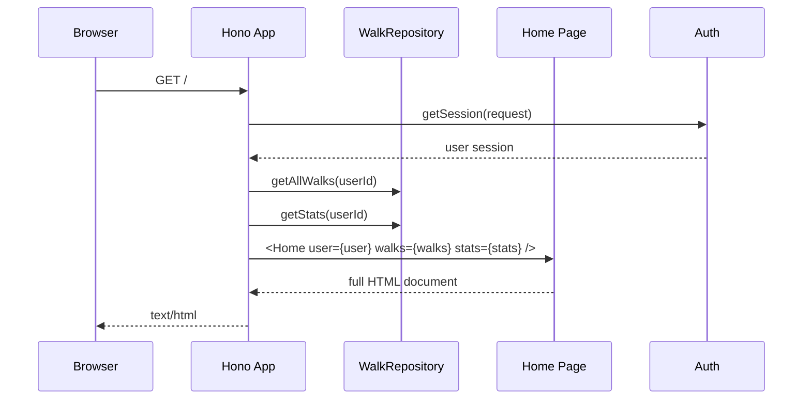
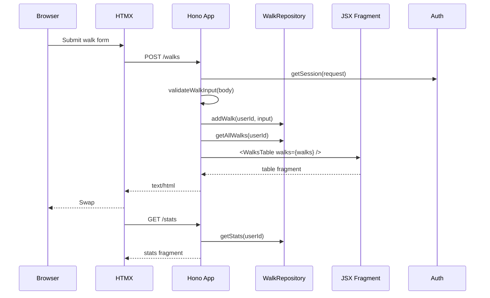

# Architecture

Walking Pace Tracker is intentionally small, but it is structured as a template for Hono + HTMX applications that want server-rendered UI, testable routes, and minimal browser-side JavaScript.

It follows an HTML-first philosophy: server routes own state and validation, JSX components own markup, HTMX owns transport and swaps, and CSS custom properties own presentation decisions. The result should feel like a normal web app, not a miniature SPA hidden inside server code.

## Goals

- Keep runtime setup separate from app construction.
- Render full pages and HTMX fragments with the same JSX component tree.
- Let HTML own interaction contracts through HTMX attributes.
- Keep persistence behind a narrow repository interface.
- Keep auth behind a provider interface so route tests can use a deterministic in-memory provider while production uses Better Auth.
- Make components, routes, database behaviour, and HTMX contracts independently testable.
- Keep styles close to the elements they belong to.
- Prefer boring composition over hidden framework magic.
- Make accessibility and screenshots part of normal development, not a release afterthought.

## Influences

The template borrows from a few ideas and tools:

- [Atomic Design](https://bradfrost.com/blog/post/atomic-web-design/) for a shared vocabulary around primitives, composed pieces, feature regions, and pages.
- [Hypermedia Systems](https://hypermedia.systems/) and [HTMX](https://htmx.org/) for the idea that HTML can remain the application protocol.
- [Hono](https://hono.dev/) for a small, dependency-light request layer.
- [Open Props](https://open-props.style/) for design tokens that keep raw values out of component styles.
- [Pa11y](https://pa11y.org/) and [Puppeteer](https://pptr.dev/) for automated confidence around accessibility and visual states.

Those influences are intentionally applied lightly. The app should be understandable by reading `createApp()`, the repository, and the component tree without learning a large internal framework first.

## Core Shape

The app has two entry points with different responsibilities:

- `src/index.ts` is the runtime entrypoint. It reads environment variables, creates a database provider, runs migrations, creates repositories, creates the Hono app, and exports Bun's `fetch` handler.
- `src/app.tsx` exports `createApp()`. It receives dependencies, registers routes, and returns a Hono app without owning process setup.

That split keeps production startup simple while making tests cheap:

```ts
const provider = createSqliteDatabaseProvider({ filename: ":memory:" });
await provider.migrate();
const repository = provider.createWalkRepository();
const authProvider = new TestAuthProvider([...users]);
const invitationService = new InvitationService({
  authProvider,
  emailSender,
  inviteRepository: provider.createInviteRepository(),
});
const app = createApp({ authProvider, invitationService, walksRepository: repository });
```

Tests use the same route tree as production, but swap the database for an in-memory SQLite database and the auth backend for a deterministic test provider.

## Layers

```text
src/
├── index.ts                   # process/runtime composition
├── app.tsx                    # Hono route factory
├── auth/                      # auth provider contract, Better Auth adapter, and test adapter
├── components/
│   ├── atoms/                 # primitive elements and controls
│   │   ├── Button/            # component, styles, tests, and export
│   │   ├── Chip/              # compact metadata indicator
│   │   └── Card/              # reusable surface container with CSS variable sizing
│   ├── molecules/             # small composed UI pieces
│   │   ├── LabelledOutput/    # label + output value used by summary metrics
│   │   ├── ScrollableTable/    # generic sticky-header table shell
│   │   └── WalksRow/          # component, styles, tests, and export
│   ├── organisms/             # feature sections and regions
│   ├── pages/                 # full page compositions
│   ├── templates/             # document shell
│   └── styles.ts              # server-side style aggregation boundary
├── db/
│   ├── calculator.ts          # pure pace math
│   ├── model.ts               # domain types and repository contracts
│   ├── provider.ts            # env-driven provider selection
│   ├── repository.ts          # Bun SQLite walk implementation
│   └── postgres-repository.ts # Postgres walk implementation
├── email/                     # Resend and console email senders
├── invitations/               # invite service and repository contract
└── walks/
    └── validation.ts          # form input validation
```

The boundaries are deliberately plain. There is no global application state, no client-side store, and no framework-specific data loader layer. Routes ask repositories for data, pass that data to JSX components, and return HTML. That makes data flow deliberately visible: form input enters a route, validation runs, persistence changes, the route asks for fresh read models, and the server returns the fragment HTMX should swap into the page.

## Request Flow

Initial page requests return the complete document:



HTMX interactions return only the fragment that should be swapped:



Clear actions follow the same fragment pattern. `DELETE /walks/:id` clears one row owned by the current user and returns a refreshed `WalksTable`. `DELETE /walks` clears the current user's table and returns the empty table state.

## Auth And Invitations

`AuthProvider` is the route-facing contract for sessions, sign-in/sign-out, user creation, role changes, and bans. Production composition uses Better Auth with the admin plugin. SQLite-backed tests and scripts use `TestAuthProvider`, which keeps session cookies deterministic without coupling route tests to Better Auth internals.

Better Auth owns users, credential accounts, sessions, and verification tables. The app owns invitations so it can enforce the `USER_LIMIT` cap across existing users and pending invitations before sending email. `InvitationService` hashes invite tokens before persistence, creates accounts through `AuthProvider`, marks invitations accepted or revoked, and sends invite links through `EmailSender`.

Admins are normal users with the `admin` role. They can manage accounts and view another user's scores through a read-only `WalksTable`, but walk mutation routes always use the authenticated user's id and never accept an arbitrary owner id from the request.

## HTMX Pattern

HTMX behaviour is declared on the component that owns the interaction.

- `WalkForm` posts to `/walks`, targets `#walks-list`, and triggers a stats refresh after the request.
- `WalksRow` owns the clear button for a single walk.
- `WalksTable` owns the clear-all button because it affects the whole table.
- `Home` owns stable fragment anchors such as `#stats` and `#walks-list`.

This keeps server responses small and predictable. A route that is triggered by HTMX should return the smallest meaningful fragment, not a full page.

Actual HTMX runtime behaviour belongs in browser or end-to-end tests if the app grows that far. The current unit-level tests assert the server-side contract: the attributes rendered into HTML, the route side effects, and the fragment shape returned to HTMX requests.

## Components

Components are grouped by how they are used:

- **Atoms** are primitive controls, surfaces, and small indicators such as `Button`, `Card`, `Chip`, `Switch`, and `WalksCell`.
- **Molecules** compose atoms into small pieces such as `InputGroup`, `LabelledOutput`, `ScrollableTable`, and `WalksRow`.
- **Organisms** represent feature-level UI such as `WalkForm`, `Stats`, and `WalksTable`.
- **Pages** compose feature sections into a screen.
- **Templates** own the HTML document shell, shared scripts, linked assets, and style injection.

Each component lives in its own directory with the files that describe its behaviour:

```text
components/atoms/Button/
├── Button.tsx
├── Button.styles.ts
├── Button.test.tsx
└── index.ts
```

That local folder shape keeps the implementation, tests, styles, and public export together. When a component grows, its related files grow in place instead of spreading across broad global files.

The app uses semantic HTML where possible. The home page uses the reusable `Card` atom rendered as a `main` region, with separate `section` elements and `h3` section headings. The history region is a real table with a sticky header and a scrollable body. `Chip` is used for compact metadata such as the walk count, and `LabelledOutput` names the "label plus machine-readable output value" shape used by the summary metrics.

`Card` is the template surface primitive. It can fill the available viewport space or take fixed dimensions through props that set CSS custom properties such as `--card-width`, `--card-height`, `--card-min-height`, and `--card-max-height`.

`ScrollableTable` is the reusable table shell. It owns the sticky header, scrollable body, border model, row sizing, and responsive column custom properties. Feature tables such as `WalksTable` provide columns, rows, empty states, and HTMX actions without reimplementing the table mechanics. Its body hides horizontal overflow so header and body columns stay aligned; vertical scrolling remains below the header.

## Design Philosophy

The template tries to make the common path obvious:

- **HTML is the contract.** Components render semantic HTML with HTMX attributes where interaction is needed. Tests assert the HTML contract, not incidental implementation details.
- **The server is the source of truth.** Mutations go through routes, the repository is read again after a mutation, and the returned fragment represents the canonical current state.
- **Components are named after what they are.** `Button`, `Chip`, `Card`, `LabelledOutput`, `ScrollableTable`, and `WalksRow` describe rendered structure rather than vague domain ideas.
- **Styles belong near structure.** Component styles live beside the component and are aggregated for SSR. This keeps the benefits of colocation without requiring a bundler.
- **CSS variables carry design decisions.** Components consume semantic variables like `--surface`, `--table-text`, and `--border-subtle`; theme switching changes those variables centrally.
- **Tests follow boundaries.** Component tests cover markup, route tests cover full-page behaviour, HTMX tests cover fragment contracts, database tests cover persistence, and Pa11y covers accessibility regressions.

## Styling

Styles are colocated with their components as `*.styles.ts` modules:

```text
components/
├── atoms/
│   └── Switch/
│       ├── Switch.tsx
│       └── Switch.styles.ts
└── organisms/
    └── WalksTable/
        ├── WalksTable.tsx
        └── WalksTable.styles.ts
```

`src/components/styles.ts` is intentionally only an aggregation boundary. It imports the colocated style modules and joins them into the CSS string injected by `Layout`.

This gives each component a local style owner without adding a bundler yet. If the template later adopts Vite, this boundary is the natural place to switch from server-injected CSS strings to bundled CSS assets.

Theme values are expressed as CSS custom properties mapped to Open Props tokens. Light and dark modes change variables on `:root[data-theme="..."]`, so component styles consume semantic variables such as `--surface`, `--table-bg`, and `--table-text` instead of hard-coding theme-specific colors.

Theme motion is also tokenized. Shared surfaces use `--theme-transition`; text switches immediately with `--theme-text-transition` to avoid low-contrast color interpolation; inputs own their focus transition in `InputGroup.styles.ts` so native input rendering does not lag behind the rest of the UI.

## Persistence

`WalkRepository` in `src/db/model.ts` is the contract used by the app:

```ts
export interface WalkRepository {
  getAllWalks(userId: string): Promise<WalkWithStats[]>;
  addWalk(userId: string, walk: WalkInput): Promise<void>;
  deleteWalk(userId: string, id: number): Promise<boolean>;
  clearWalks(userId: string): Promise<number>;
  getStats(userId: string): Promise<Stats>;
}
```

`DatabaseProvider` owns connection setup, migrations, repository creation, and connection cleanup. It creates both walk and invite repositories. `SqliteDatabaseProvider` powers in-memory tests and local file storage, while `PostgresDatabaseProvider` supports production deployments through `DATABASE_URL`.

Repository implementations own inserts, deletes, and reads. Pace calculations are delegated to `Calculator`, keeping math pure and easy to test.

The database also enforces core constraints:

- miles must be greater than zero
- minutes cannot be negative
- seconds must be between 0 and 59
- total duration must be greater than zero
- walk reads and mutations are scoped by `user_id`

Request validation happens before storage, and database constraints remain as a second line of defense.

## Testing Strategy

The tests are split by behaviour boundary rather than by implementation detail.

- colocated `*.test.tsx` component tests render JSX to strings and assert semantic markup plus component contracts such as HTMX attributes, switch state, table controls, and empty states.
- `app.test.tsx` exercises full-page and error route behaviour through `app.request()`.
- `htmx.test.tsx` owns successful HTMX mutations, sends `HX-*` headers, and asserts fragment-only response shape.
- `better-auth-provider.test.ts` verifies the Better Auth adapter can create users, sign in, and read sessions.
- `service.test.ts` under `invitations/` verifies invite creation, acceptance, and user-cap enforcement.
- `repository.test.ts` uses SQLite `:memory:` databases to verify CRUD, aggregate stats, database constraints, and user scoping.
- `calculator.test.ts` covers pure pace, speed, average, median, and validation behaviour.

This avoids overlap between app tests and HTMX tests. App tests answer "does the server render the full page and reject bad input correctly?" HTMX tests answer "does a successful interaction mutate state and return the fragment contract the browser expects?"

## Extending The Template

For a new feature, follow the same path:

1. Add domain types and repository methods behind an interface.
2. Add validation for request input before persistence.
3. Add route handlers in `createApp()` that return either a full page or a focused fragment.
4. Add JSX components at the smallest useful level.
5. Put styles beside the component in a matching `*.styles.ts` file.
6. Add component tests for rendered behaviour.
7. Add route tests for server-side behaviour.
8. Add HTMX contract tests for fragment responses.

That pattern keeps the app boring in a good way: the server owns state, components own markup, HTMX owns swaps, and tests stay close to the contracts users actually depend on.
