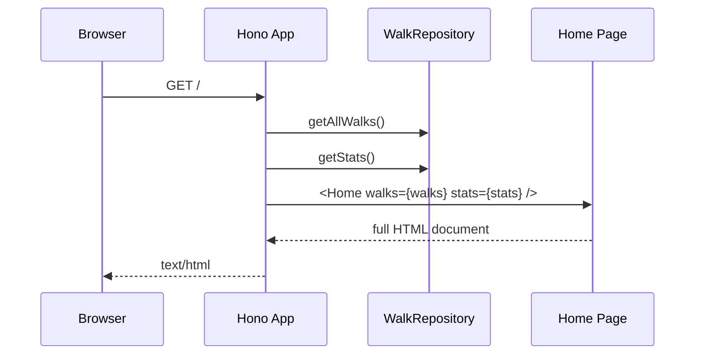
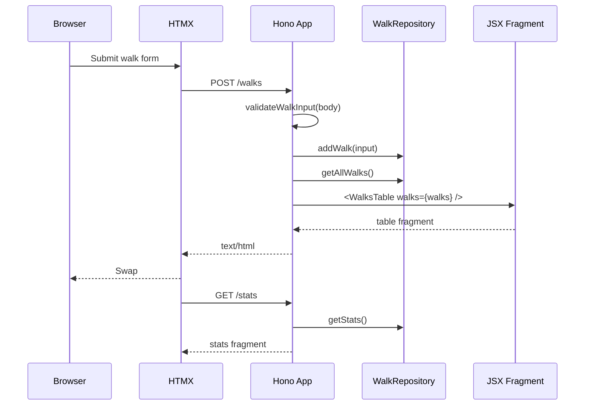

# Architecture

Walking Pace Tracker is intentionally small, but it is structured as a template for Hono + HTMX applications that want server-rendered UI, testable routes, and minimal browser-side JavaScript.

## Goals

- Keep runtime setup separate from app construction.
- Render full pages and HTMX fragments with the same JSX component tree.
- Let HTML own interaction contracts through HTMX attributes.
- Keep persistence behind a narrow repository interface.
- Make components, routes, database behavior, and HTMX contracts independently testable.
- Keep styles close to the elements they belong to.

## Core Shape

The app has two entry points with different responsibilities:

- `src/index.ts` is the runtime entrypoint. It reads environment variables, creates the SQLite repository, creates the Hono app, and exports Bun's `fetch` handler.
- `src/app.tsx` exports `createApp()`. It receives dependencies, registers routes, and returns a Hono app without owning process setup.

That split keeps production startup simple while making tests cheap:

```ts
const repository = new Repository({ filename: ":memory:" });
const app = createApp({ walksRepository: repository });
```

Tests use the same route tree as production, but swap the database for an in-memory SQLite database.

## Layers

```text
src/
├── index.ts                   # process/runtime composition
├── app.tsx                    # Hono route factory
├── components/
│   ├── atoms/                 # primitive elements and controls
│   │   ├── Button/            # component, styles, tests, and export
│   │   └── Card/              # reusable surface container with CSS variable sizing
│   ├── molecules/             # small composed UI pieces
│   │   ├── ScrollableTable/    # generic sticky-header table shell
│   │   └── WalksRow/          # component, styles, tests, and export
│   ├── organisms/             # feature sections and regions
│   ├── pages/                 # full page compositions
│   ├── templates/             # document shell
│   └── styles.ts              # server-side style aggregation boundary
├── db/
│   ├── calculator.ts          # pure pace math
│   ├── model.ts               # domain types and repository contract
│   └── repository.ts          # Bun SQLite implementation
└── walks/
    └── validation.ts          # form input validation
```

The boundaries are deliberately plain. There is no global application state, no client-side store, and no framework-specific data loader layer. Routes ask repositories for data, pass that data to JSX components, and return HTML.

## Request Flow

Initial page requests return the complete document:



HTMX interactions return only the fragment that should be swapped:



Clear actions follow the same fragment pattern. `DELETE /walks/:id` clears one row and returns a refreshed `WalksTable`. `DELETE /walks` clears the table and returns the empty table state.

## HTMX Pattern

HTMX behavior is declared on the component that owns the interaction.

- `WalkForm` posts to `/walks`, targets `#walks-list`, and triggers a stats refresh after the request.
- `WalksRow` owns the clear button for a single walk.
- `WalksTable` owns the clear-all button because it affects the whole table.
- `Home` owns stable fragment anchors such as `#stats` and `#walks-list`.

This keeps server responses small and predictable. A route that is triggered by HTMX should return the smallest meaningful fragment, not a full page.

Actual HTMX runtime behavior belongs in browser or end-to-end tests if the app grows that far. The current unit-level tests assert the server-side contract: the attributes rendered into HTML, the route side effects, and the fragment shape returned to HTMX requests.

## Components

Components are grouped by how they are used:

- **Atoms** are primitive controls, surfaces, or cells such as `Button`, `Card`, `Switch`, and `WalksCell`.
- **Molecules** compose atoms into small pieces such as `InputGroup`, `Stat`, `ScrollableTable`, and `WalksRow`.
- **Organisms** represent feature-level UI such as `WalkForm`, `Stats`, and `WalksTable`.
- **Pages** compose feature sections into a screen.
- **Templates** own the HTML document shell, shared scripts, linked assets, and style injection.

Each component lives in its own directory with the files that describe its behavior:

```text
components/atoms/Button/
├── Button.tsx
├── Button.styles.ts
├── Button.test.tsx
└── index.ts
```

That local folder shape keeps the implementation, tests, styles, and public export together. When a component grows, its related files grow in place instead of spreading across broad global files.

The app uses semantic HTML where possible. The home page uses the reusable `Card` atom rendered as a `main` region, with separate `section` elements and `h3` section headings. The history region is a real table with a sticky header and a scrollable body.

`Card` is the template surface primitive. It can fill the available viewport space or take fixed dimensions through props that set CSS custom properties such as `--card-width`, `--card-height`, `--card-min-height`, and `--card-max-height`.

`ScrollableTable` is the reusable table shell. It owns the sticky header, scrollable body, border model, row sizing, and responsive column custom properties. Feature tables such as `WalksTable` provide columns, rows, empty states, and HTMX actions without reimplementing the table mechanics.

## Styling

Styles are colocated with their components as `*.styles.ts` modules:

```text
components/
├── atoms/
│   └── Switch/
│       ├── Switch.tsx
│       └── Switch.styles.ts
└── organisms/
    └── WalksTable/
        ├── WalksTable.tsx
        └── WalksTable.styles.ts
```

`src/components/styles.ts` is intentionally only an aggregation boundary. It imports the colocated style modules and joins them into the CSS string injected by `Layout`.

This gives each component a local style owner without adding a bundler yet. If the template later adopts Vite, this boundary is the natural place to switch from server-injected CSS strings to bundled CSS assets.

Theme values are expressed as CSS custom properties mapped to Open Props tokens. Light and dark modes change variables on `:root[data-theme="..."]`, so component styles consume semantic variables such as `--surface`, `--table-bg`, and `--table-text` instead of hard-coding theme-specific colors.

Theme motion is also tokenized. Shared surfaces use `--theme-transition`; text switches immediately with `--theme-text-transition` to avoid low-contrast color interpolation; inputs own their focus transition in `InputGroup.styles.ts` so native input rendering does not lag behind the rest of the UI.

## Persistence

`WalkRepository` in `src/db/model.ts` is the contract used by the app:

```ts
export interface WalkRepository {
  getAllWalks(): WalkWithStats[];
  addWalk(walk: WalkInput): void;
  deleteWalk(id: number): boolean;
  clearWalks(): number;
  getStats(): Stats;
  close?(): void;
}
```

`Repository` is the SQLite implementation. It owns table creation, inserts, deletes, and reads. Pace calculations are delegated to `Calculator`, keeping math pure and easy to test.

The database also enforces core constraints:

- miles must be greater than zero
- minutes cannot be negative
- seconds must be between 0 and 59
- total duration must be greater than zero

Request validation happens before storage, and database constraints remain as a second line of defense.

## Testing Strategy

The tests are split by behavior boundary rather than by implementation detail.

- colocated `*.test.tsx` component tests render JSX to strings and assert semantic markup plus component contracts such as HTMX attributes, switch state, table controls, and empty states.
- `app.test.tsx` exercises full-page and error route behavior through `app.request()`.
- `htmx.test.tsx` owns successful HTMX mutations, sends `HX-*` headers, and asserts fragment-only response shape.
- `repository.test.ts` uses SQLite `:memory:` databases to verify CRUD, aggregate stats, and database constraints.
- `calculator.test.ts` covers pure pace, speed, average, median, and validation behavior.

This avoids overlap between app tests and HTMX tests. App tests answer "does the server render the full page and reject bad input correctly?" HTMX tests answer "does a successful interaction mutate state and return the fragment contract the browser expects?"

## Extending The Template

For a new feature, follow the same path:

1. Add domain types and repository methods behind an interface.
2. Add validation for request input before persistence.
3. Add route handlers in `createApp()` that return either a full page or a focused fragment.
4. Add JSX components at the smallest useful level.
5. Put styles beside the component in a matching `*.styles.ts` file.
6. Add component tests for rendered behavior.
7. Add route tests for server-side behavior.
8. Add HTMX contract tests for fragment responses.

That pattern keeps the app boring in a good way: the server owns state, components own markup, HTMX owns swaps, and tests stay close to the contracts users actually depend on.
