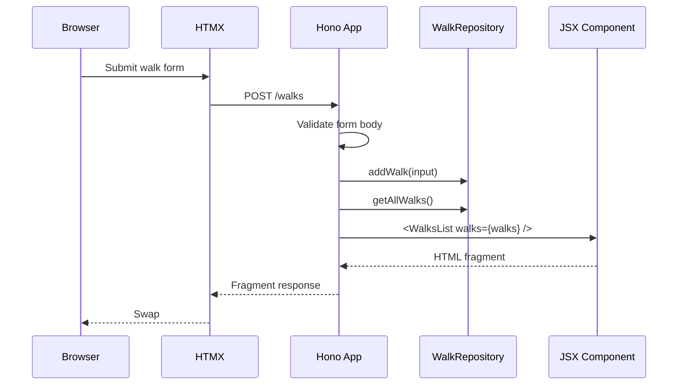

# Walking Pace Tracker

A small Hono + HTMX app for tracking walking pace, built to double as a template for server-rendered front ends with Bun, TypeScript, JSX, and SQLite.

## What It Demonstrates

- Hono routes returning full pages and HTMX fragments
- Server-rendered JSX components with semantic HTML
- HTMX form submission and targeted swaps
- SQLite persistence through Bun's native `bun:sqlite`
- Dependency-injected app construction for testable routes
- Unit tests for components, validation, calculations, repository behavior, and server responses

## Scripts

```bash
bun install
bun run dev
bun run test
bun run typecheck
```

The dev server runs on `http://localhost:3000` by default.

Runtime configuration:

```bash
PORT=3100 DB_PATH=/tmp/walking-pace-db bun run dev
```

## Project Structure

```text
src/
├── app.tsx                    # createApp({ walksRepository }) route factory
├── index.ts                   # Bun runtime entrypoint
├── app.test.tsx               # server/route tests through app.request()
├── components/
│   ├── atoms/                 # small JSX building blocks
│   ├── molecules/             # composed controls and rows
│   ├── organisms/             # form, stats, and list regions
│   ├── pages/                 # full page compositions
│   ├── templates/             # document layout
│   ├── styles.ts              # shared CSS bundle
│   └── components.test.tsx    # component rendering tests
├── db/
│   ├── calculator.ts          # pure pace/speed math
│   ├── model.ts               # domain and repository contracts
│   ├── repository.ts          # SQLite implementation
│   └── *.test.ts              # calculator and repository tests
└── walks/
    └── validation.ts          # shared request validation
```

## Template Pattern

`src/app.tsx` exports `createApp()`, which accepts its dependencies:

```ts
const app = createApp({ walksRepository });
```

Production startup happens separately in `src/index.ts`, where the real SQLite repository is created. Tests can pass an in-memory repository instead:

```ts
const repository = new Repository({ filename: ":memory:" });
const app = createApp({ walksRepository: repository });
```

This keeps HTTP routing, persistence, and runtime configuration separate enough that new HTMX apps can copy the same shape without inheriting global state.

## Testing Strategy

- **Component tests** render JSX to strings and assert semantic markup plus HTMX attributes.
- **Calculator tests** cover pure speed, pace, average, and median behavior.
- **Validation tests** reject invalid form payloads before storage.
- **Repository tests** use SQLite `:memory:` databases and verify CRUD, aggregate stats, and database constraints.
- **App tests** exercise real Hono requests with `app.request()`.

## Data Flow



## Formulas

- **Speed (mph)** = miles / (minutes / 60 + seconds / 3600)
- **Pace (min/mi)** = (minutes + seconds / 60) / miles
- **Average speed** = average of valid walk speeds
- **Median pace** = median of valid walk paces
