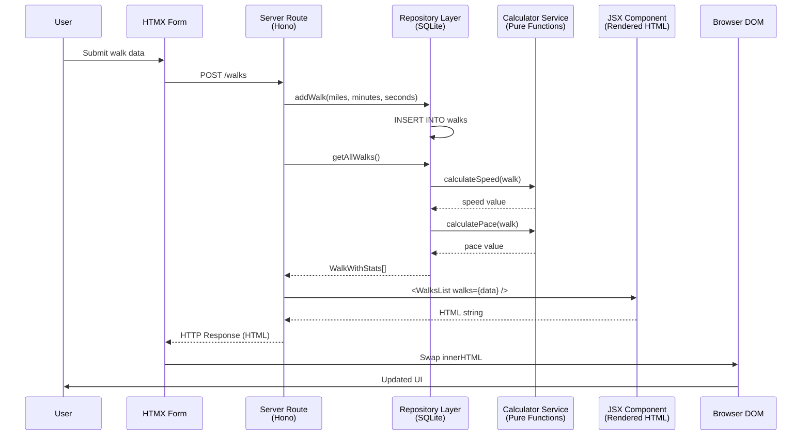

# Walking Pace Tracker

A web-based walking pace tracker built with TypeScript, Hono, HTMX, and SQLite using Bun's native APIs.

## Features

- Track walks with miles, minutes, and seconds
- Automatic calculation of speed (mph) and pace (min/mi)
- Real-time statistics: average speed and median pace
- Mobile-friendly responsive design with Open Props
- HTMX-powered dynamic updates without page reloads
- SQLite database for persistent storage

## Tech Stack

- **Runtime**: Bun (using native JSX and SQLite APIs)
- **Framework**: Hono
- **Frontend**: HTMX + JSX templating
- **Database**: Bun's native SQLite (`bun:sqlite`)
- **Styling**: Open Props
- **Language**: TypeScript

## Installation

```bash
bun install
```

## Usage

```bash
bun run dev
```

Open http://localhost:3000 in your browser

### Using the App

1. Enter your walk data:
   - Miles walked
   - Minutes taken
   - Seconds taken
2. Click "Add" to save the walk
3. View your statistics at the top (average speed and median pace)
4. All calculations happen automatically
5. Delete walks by clicking the "Del" button

## Formulas

- **Speed (mph)** = miles / (minutes/60 + seconds/3600)
- **Pace (min/mi)** = (minutes + seconds/60) / miles
- **Average Speed** = Average of all walk speeds
- **Median Pace** = Median of all walk paces


## Project Structure

```text
├── bun.lock
├── package.json
├── README.md
├── src
│   ├── components/             # JSX components with Open Props styling
│   ├── db/                     # Bun SQLite database and calculations
│   └── index.tsx               # Main Hono server
└── tsconfig.json
```

## Architecture

This project follows clean architecture principles with clear separation of concerns:

### Atomic Design Structure

Components are organised following Brad Frost's [Atomic Design methodology](https://atomicdesign.bradfrost.com/chapter-2/):

```text
src/components/
├── atoms/           # Basic building blocks
│   └── WalkValue.tsx       # Single data display unit
├── molecules/       # Simple component groups
│   ├── InputGroup.tsx      # Label + input field
│   ├── Stat.tsx            # Label + value stat card
│   └── WalkItem.tsx        # Single walk row
├── organisms/       # Complex component assemblies
│   ├── StatsSection.tsx    # Summary statistics grid
│   ├── WalkForm.tsx        # Complete input form
│   └── WalksList.tsx       # Table of walk items
├── pages/           # Full page compositions
│   └── Home.tsx            # Main application page
└── templates/       # Page layouts and shared styles
    ├── Layout.tsx          # HTML wrapper with Open Props
    └── styles.ts           # Shared style utilities
```

**Benefits:**
- **Reusability**: Smaller components can be composed into larger ones
- **Maintainability**: Each component has a single, clear responsibility
- **Testability**: Atomic components are easy to test in isolation
- **Scalability**: New features can be built from existing atoms and molecules

### Database Layer Separation

The database layer is split into focused modules following the repository pattern:

```
src/db/
├── model.ts         # TypeScript interfaces and types
├── calculator.ts    # Pure calculation functions (spreadsheet formulas)
├── repository.ts    # Data access layer (CRUD operations)
└── index.ts         # Public API (exports and initialization)
```

**Benefits:**
- **Testability**: Calculator functions are pure and easily unit-tested
- **Flexibility**: Can swap database implementation without touching business logic
- **Clarity**: Each file has a single responsibility
- **Type Safety**: Models ensure type consistency across layers

### Data Flow



**Benefits**:
- Business logic (calculations) is separated from data access
- Components are small, focused, and composable
- Testing can happen at each layer independently
- Changes to one layer don't cascade through the entire system
