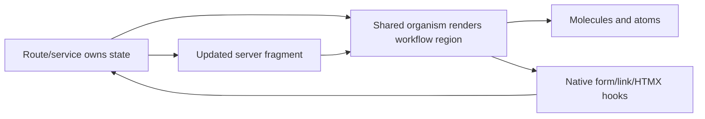

# hd-0082: Promote Shared Stateful App Organisms

## Header

| Field | Value |
| --- | --- |
| Epic | `hd-0082` |
| GitHub issue | [#224](https://github.com/Macavitymadcap/hyper-dank/issues/224) |
| Branch | `hd-0082-stateful-organisms` |
| Status | Planned |
| Theme | Shared organism taxonomy, stateful workflow components, Storybook, and compatibility evidence |
| Ticket Branches | `hd-0083-stateful-organism-audit`, `hd-0084-organism-taxonomy`, `hd-0085-workflow-organisms`, `hd-0086-selection-status-organisms`, `hd-0087-content-app-chrome-organisms`, `hd-0088-organism-storybook-docs`, `hd-0089-organism-compat-review` |
| Owner | `@Macavitymadcap` |
| Target PR | TBD |
| Last updated | 2026-05-31 |

## Summary

Plan and deliver a reusable organism layer for stateful, server-rendered Hyper-Dank app patterns.
The epic should classify which current "molecules" are really workflow organisms, promote only
app-neutral patterns proven across consumers, and add a small set of shared organism components for
live fragments, action panels, selection decks, status/result summaries, content cards, and app
chrome.

## Goals

- Audit shared UI components and consumer app components from Hyper-Dank, Campaign Ledger, Astro
  Blog, and Planning Poker for stateful/workflow patterns.
- Define a public taxonomy for atoms, molecules, organisms, pages, and app-owned feature regions
  without breaking existing imports.
- Add reusable organism components only where repeated consumer evidence proves the pattern.
- Keep product-specific organisms such as planning rooms, dice logic, character sheets, and
  walk/admin domain panels app-owned.
- Document organism contracts through tests, Storybook, package docs, and consumer-style
  compatibility examples.

## Non-Goals

- Do not move every large component from `molecules` to `organisms` in one breaking change.
- Do not add a client-side state framework, hydration layer, router, or global workflow store.
- Do not move Campaign Ledger, Planning Poker, Walking Pace, or blog domain models into
  Hyper-Dank.
- Do not reopen small component polish already tracked by [#195](https://github.com/Macavitymadcap/hyper-dank/issues/195).
- Do not replace Storybook as the canonical rendered component reference.

## Source Evidence

The planning prompt identified that "some of those molecules are organisms - they seem to hold
state". In Hyper-Dank terms, the state is usually app-provided workflow state rather than hidden
client state: current tab, selected choice, revealed result, active participant, copied value,
validation status, filter state, pagination state, or HTMX/SSE fragment identity.

Useful inputs:

- Hyper-Dank shared components currently export many stateful patterns from the molecule layer:
  `Tabs`, `SideNav`, `PopoverMenu`, `Command`, `Combobox`, `Dialog`, `Pagination`,
  `TableFilterSummary`, `ValidationSummary`, and `StagedForm`.
- Planning Poker shows live-room patterns: share link, choice deck, participant status, result
  summary, host actions, and SSE-updated room fragments.
- Campaign Ledger shows stateful feature-region patterns: sheet tabs, tab panels, popover menus,
  dice roller, site header, admin/auth pages, and sheet workspaces.
- Astro Blog shows static content patterns: post summaries, navigation, tags, Markdown post
  layouts, and metadata lists.
- Existing GitHub issues [#134](https://github.com/Macavitymadcap/hyper-dank/issues/134),
  [#149](https://github.com/Macavitymadcap/hyper-dank/issues/149),
  [#152](https://github.com/Macavitymadcap/hyper-dank/issues/152),
  [#183](https://github.com/Macavitymadcap/hyper-dank/issues/183), and
  [#195](https://github.com/Macavitymadcap/hyper-dank/issues/195) are adjacent context and should
  be linked, not duplicated.

## Ticket Plan

| Ticket | Issue | Branch | Scope | Acceptance Criteria |
| --- | --- | --- | --- | --- |
| `hd-0083` | [#225](https://github.com/Macavitymadcap/hyper-dank/issues/225) | `hd-0083-stateful-organism-audit` | Audit stateful molecules and consumer organisms | Promotion matrix classifies keep molecule, document as organism, add shared organism, and leave app-owned |
| `hd-0084` | [#226](https://github.com/Macavitymadcap/hyper-dank/issues/226) | `hd-0084-organism-taxonomy` | Define organism taxonomy and additive export boundary | Docs/source exports explain organisms without breaking existing imports |
| `hd-0085` | [#227](https://github.com/Macavitymadcap/hyper-dank/issues/227) | `hd-0085-workflow-organisms` | Add workflow organisms for copy, actions, and live fragments | `CopyField`, `ActionPanel`, and `LiveRegionPanel`-style components render semantic, HTMX-friendly workflow regions |
| `hd-0086` | [#228](https://github.com/Macavitymadcap/hyper-dank/issues/228) | `hd-0086-selection-status-organisms` | Add selection and status organisms | `ChoiceDeck`, `StatusList`, and `ResultSummary`-style components cover app-provided selection and status state |
| `hd-0087` | [#229](https://github.com/Macavitymadcap/hyper-dank/issues/229) | `hd-0087-content-app-chrome-organisms` | Add content and app chrome organisms | Accepted `ArticleCard`/`PostSummary`, tag, and toolbar/header patterns are generic and backed by audit evidence |
| `hd-0088` | [#230](https://github.com/Macavitymadcap/hyper-dank/issues/230) | `hd-0088-organism-storybook-docs` | Document organism patterns in Storybook and public docs | Storybook/docs explain use, state ownership, HTMX hooks, CSS hooks, accessibility, and theme behaviour |
| `hd-0089` | [#231](https://github.com/Macavitymadcap/hyper-dank/issues/231) | `hd-0089-organism-compat-review` | Add consumer compatibility examples and final review evidence | Compatibility tests and review evidence prove the organism layer against app-neutral consumer shapes |

## Architecture Notes

Hyper-Dank should treat organisms as reusable app-region components that render app-provided
workflow state. They may know about current, selected, disabled, pending, copied, empty, revealed,
or live-updated states. They must not own product schemas, permissions, persistence, calculations,
route orchestration, content models, or client-side state stores.

Initial promotion rules:

- A component can be a shared organism when it represents a reusable workflow region across more
  than one app shape and can be named without product language.
- A component should remain a molecule when it is a small combination of primitives and does not
  represent a feature region.
- A component should remain app-owned when it contains domain nouns, calculations, permissions,
  persistence rules, route paths, or product copy.
- Existing molecule imports should remain stable. Reclassification is a documentation and
  organisation improvement first, with additive exports for new organism components.

Candidate organism groups:

- Workflow: `CopyField`, `ActionPanel`, `LiveRegionPanel`.
- Selection and status: `ChoiceDeck`, `StatusList`, `ResultSummary`.
- Content and chrome: `ArticleCard` or `PostSummary`, `TagList`, `AppToolbar` or `SiteHeader` when
  audit evidence supports them.

Likely app-owned exclusions:

- Planning Poker room orchestration, Fibonacci rules, consensus calculation, participant sessions,
  and host permissions.
- Campaign Ledger dice-roll rules, character sheet routes, sheet tab domain names, and game
  calculations.
- Walking Pace walk/admin domain forms, account permissions, scoring, and route names.
- Blog content collections, Markdown routing, RSS/search decisions, and site voice.

## Integration Plan

- Keep `hd-0082-stateful-organisms` as the planning branch targeting `main` if a durable brief PR is
  opened.
- Branch implementation tickets from the future `hd-0082` epic branch or from `main` according to
  the GitHub issue workflow once active work starts.
- Complete `hd-0083` before implementation tickets so the audit can confirm or narrow the component
  list.
- Keep `hd-0084` ahead of new component implementation so source, docs, and Storybook can agree on
  the organism boundary.
- Do not start `hd-0085` through `hd-0087` until `hd-0083` accepts the relevant candidates.
- Use `hd-0089` as the final compatibility and review gate rather than a place to add new component
  families.

## Verification

- `bun run check`
- `bun test`
- `bun run test:storybook`
- `bun run test:compat`
- `bun run test:a11y` when user-facing docs or Storybook pages change materially
- `bun run verify`
- Light/dark Storybook review for every new organism example
- Screenshot evidence for user-facing docs or Storybook changes

## Acceptance Criteria

- The audit classifies current shared components and consumer patterns as keep molecule, document as
  organism, add shared organism, or app-owned.
- Public docs and Storybook explain the organism boundary and the rules for promotion from molecule
  to organism.
- New organism exports are additive, typed, tested, styled, and covered by Storybook.
- Compatibility examples prove the new organism layer can represent Campaign Ledger, Planning
  Poker, static blog, admin/dashboard, and Walking Pace-style shapes without app-specific nouns.
- Existing public imports and CSS contracts remain backwards-compatible.
- Adjacent issues remain scoped and linked rather than duplicated.
