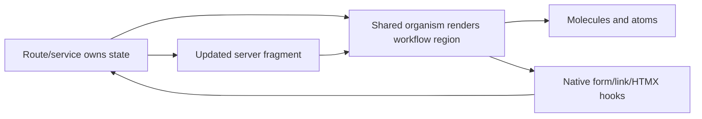

# hd-0082: Promote Shared Stateful App Organisms

## Header

| Field | Value |
| --- | --- |
| Epic | `hd-0082` |
| GitHub issue | [#224](https://github.com/Macavitymadcap/hyper-dank/issues/224) |
| Branch | `hd-0082-stateful-organisms` |
| Status | Planned |
| Theme | Shared organism taxonomy, stateful workflow components, Storybook, and compatibility evidence |
| Ticket Branches | `hd-0083-stateful-organism-audit`, `hd-0084-organism-taxonomy`, `hd-0085-workflow-organisms`, `hd-0086-selection-status-organisms`, `hd-0087-content-app-chrome-organisms`, `hd-0088-organism-storybook-docs`, `hd-0089-organism-compat-review` |
| Owner | `@Macavitymadcap` |
| Target PR | TBD |
| Last updated | 2026-05-31 |

## Summary

Plan and deliver a reusable organism layer for stateful, server-rendered Hyper-Dank app patterns.
The epic should classify which current "molecules" are really workflow organisms, promote only
app-neutral patterns proven across consumers, and add a small set of shared organism components for
live fragments, action panels, selection decks, status/result summaries, content cards, and app
chrome.

## Goals

- Audit shared UI components and consumer app components from Hyper-Dank, Campaign Ledger, the
  Macavitymadcap GitHub Pages site, and Planning Poker for stateful/workflow patterns.
- Define a public taxonomy for atoms, molecules, organisms, pages, and app-owned feature regions
  without breaking existing imports.
- Add reusable organism components only where repeated consumer evidence proves the pattern.
- Keep product-specific organisms such as planning rooms, dice logic, character sheets, and
  walk/admin domain panels app-owned.
- Document organism contracts through tests, Storybook, package docs, and consumer-style
  compatibility examples.

## Non-Goals

- Do not move every large component from `molecules` to `organisms` in one breaking change.
- Do not add a client-side state framework, hydration layer, router, or global workflow store.
- Do not move Campaign Ledger, Planning Poker, Walking Pace, or blog domain models into
  Hyper-Dank.
- Do not reopen small component polish already tracked by [#195](https://github.com/Macavitymadcap/hyper-dank/issues/195).
- Do not replace Storybook as the canonical rendered component reference.

## Source Evidence

The planning prompt identified that "some of those molecules are organisms - they seem to hold
state". In Hyper-Dank terms, the state is usually app-provided workflow state rather than hidden
client state: current tab, selected choice, revealed result, active participant, copied value,
validation status, filter state, pagination state, or HTMX/SSE fragment identity.

Useful inputs:

- Hyper-Dank shared components currently export many stateful patterns from the molecule layer:
  `Tabs`, `SideNav`, `PopoverMenu`, `Command`, `Combobox`, `Dialog`, `Pagination`,
  `TableFilterSummary`, `ValidationSummary`, and `StagedForm`.
- Planning Poker shows live-room patterns: share link, choice deck, participant status, result
  summary, host actions, and SSE-updated room fragments.
- Campaign Ledger shows stateful feature-region patterns: sheet tabs, tab panels, popover menus,
  dice roller, site header, admin/auth pages, and sheet workspaces.
- Macavitymadcap GitHub Pages shows static content patterns: post summaries, side navigation, tag
  search, Markdown post layouts, article navigation, and metadata lists.
- Existing GitHub issues [#134](https://github.com/Macavitymadcap/hyper-dank/issues/134),
  [#149](https://github.com/Macavitymadcap/hyper-dank/issues/149),
  [#152](https://github.com/Macavitymadcap/hyper-dank/issues/152),
  [#183](https://github.com/Macavitymadcap/hyper-dank/issues/183), and
  [#195](https://github.com/Macavitymadcap/hyper-dank/issues/195) are adjacent context and should
  be linked, not duplicated.

## hd-0083 Audit Findings

Audit date: 2026-05-31.

Local evidence inspected:

- Hyper-Dank shared UI exports in `libs/components/src/index.ts` and the current
  `libs/components/src/molecules/*` implementations.
- Walking Pace app organisms in `apps/walking-pace/src/components/organisms/*`.
- Campaign Ledger consumer components under
  `/Users/dank/Code/personal/web/campaign-ledger/src/components`.
- Macavitymadcap GitHub Pages components and content helpers under
  `/Users/dank/Code/personal/web/Macavitymadcap.github.io/src`.

Planning Poker evidence is not available in the local checkout set, so the later compatibility pass
should either locate that project or treat Planning Poker as a design target that must be proven by
a new neutral example inside Hyper-Dank.

### Promotion Matrix

| Candidate | Classification | Evidence | Follow-up |
| --- | --- | --- | --- |
| `StagedForm` | Document as organism, keep existing molecule export for compatibility | It renders route-owned step state, status, validation, actions, and HTMX hooks in `libs/components/src/molecules/StagedForm/StagedForm.tsx`. It is already the clearest example of server-owned workflow state. | `hd-0084` should use it as the reference organism boundary. `hd-0088` should document it as an organism without moving the import path in this epic. |
| `Tabs`, `SideNav`, `Pagination` | Keep molecule, document as low-state navigation patterns | They expose current page/step state, but the component work is navigation affordance rather than a reusable feature region. Campaign Ledger `SheetTabs` proves that app tab workspaces need stronger routing/domain context than shared `Tabs` should own. | `hd-0084` should name these as low-state molecules. Do not promote them in `hd-0085` through `hd-0087`. |
| `Command`, `Combobox`, `RadioGroup`, `SegmentedControl`, `TableFilterSummary` | Keep molecule; use as building blocks for future selection/filter organisms | They model selected/current/query/filter state, but remain generic controls or summaries. Repeated app evidence exists for selection and filter state, not for a single shared feature region yet. | `hd-0086` may compose these into a neutral `ChoiceDeck` or status/selection organism only if the API avoids app routes and domain nouns. |
| `StatusSummary`, `StatBlock`, `LabelledOutput`, `Progress`, `ValidationSummary` | Keep molecule; possible result/status organism building blocks | Walking Pace `Stats` and admin score panels use labelled metrics; Campaign Ledger action/resource panels use compact status sections; shared components already cover the smaller display units. | `hd-0086` should prefer a small `ResultSummary`/`StatusList` wrapper over duplicating the metric atoms. |
| `AppShell`, `Toolbar`, `PageHeader`, `PopoverMenu` | Document as shell/chrome molecules; add organism only if audit-backed | `AppShell` and `Toolbar` are structural. Campaign Ledger `SiteHeader` adds user/session/role logic and menu routing, so it is app-owned. Macavitymadcap `Layout`, `SiteHeader`, `SiteFooter`, and `BlogSideNav` show static site chrome with current page/post state and tag search. | `hd-0087` should narrow "app chrome organisms" to app-neutral layout/chrome slots and static side-navigation patterns, not authenticated navigation logic. |
| `Card`, `Panel`, `CompactList`, `MetadataList`, `TimelineList`, `Prose` | Keep molecule/atom; use for content organisms if needed | Macavitymadcap `PostSummary`, `PostMetadata`, and `PostPage` show reusable content-card, tag metadata, article, and previous/next navigation shapes, while Campaign Ledger compact sections show repeated list/detail regions. | `hd-0087` can add `ArticleCard`/`PostSummary` only after keeping blog routing, collections, Markdown sanitisation, tags, and voice app-owned. |
| `HxForm`, `ButtonGroup`, `Dialog`, `PopoverMenu` | Keep molecule; compose into workflow organisms | These provide progressive enhancement and interaction affordances, but do not own workflow state on their own. Walking Pace delete/clear actions and Campaign Ledger dice/rest forms show repeated action-region needs. | `hd-0085` should focus on neutral action panels and live fragments that accept app-provided copy, actions, status, and HTMX attributes. |
| Walking Pace admin/walk organisms | Leave app-owned, mine for shape evidence | `AdminDashboard`, `WalksTable`, `WalkForm`, invite/user lists, score panels, and stats carry walk/admin nouns, repository state, permissions, and route paths. | Use as compatibility examples in `hd-0089`; do not move them into the shared UI package. |
| Campaign Ledger sheet workspace and tabs | Leave app-owned, mine for state contracts | `SheetTabWorkspace`, `SheetTabs`, and `SheetTabPanel` combine character sheet data, tab routing, HTMX fragments, and campaign-specific rule panels. | Use them to prove tab-panel/live-fragment contracts; keep character sheet tab IDs and rule data outside Hyper-Dank. |
| Campaign Ledger dice roller | Leave app-owned | `DiceRoller` depends on character slug routes, d20 modes, ability modifiers, proficiency, and roll output semantics. | Explicitly exclude from shared organisms. A future generic `ActionPanel` may host an app-owned roller, but should not implement dice logic. |
| Campaign Ledger site header | Leave app-owned, possible chrome evidence | `SiteHeader` combines auth state, campaign roles, admin capabilities, theme toggle, and route-specific menu links. | `hd-0087` should not add role-aware navigation. Shared chrome should accept slots/items, not compute access. |
| Macavitymadcap site navigation, post summaries, and Markdown layout | Mine for content/chrome evidence, leave content model app-owned | `Layout`, `BlogSideNav`, `PostsPage`, `PostPage`, `PostSummary`, and `PostMetadata` show current page/post state, search/tag filtering, article metadata, post summaries, and static chrome without server workflow mutation. | Good evidence for `ArticleCard`/`PostSummary`, tag metadata, article navigation, and static chrome slots; keep content collections, routes, Markdown rendering/sanitisation, tags, RSS/search, and editorial voice app-owned. |

### Repeated State Contracts

- Current/selected: shared `Tabs`, `SideNav`, `Command`, `RadioGroup`, and Campaign Ledger
  `SheetTabs`.
- Available/disabled/unavailable: shared `StagedForm`, `Pagination`, controls, and app action
  panels.
- Error/validation: shared `ValidationSummary`, `StagedForm`, Walking Pace admin notices, and form
  organisms.
- Filtered/paginated: shared `TableFilterSummary`, `Pagination`, and Walking Pace table regions.
- Live-updated fragments: shared HTMX props, `HxForm`, `StagedForm`, Walking Pace `WalksTable`, and
  Campaign Ledger sheet tab panels.
- Role/admin/host-only: Walking Pace admin dashboard and Campaign Ledger site header prove the
  state contract, but the permission decisions must remain app-owned.
- Revealed/hidden/copied: not proven strongly in local consumers. Treat copy/reveal examples in
  `hd-0085` as optional unless Planning Poker or a new compatibility example supplies evidence.

### Ticket Impact

- `hd-0084` should explicitly define organisms as app-region renderers of app-owned state, then
  document `StagedForm` as the existing organism-shaped component while preserving its current
  export.
- `hd-0085` should continue with workflow organisms, but scope them around neutral `ActionPanel`
  and `LiveRegionPanel` shapes. `CopyField` should be conditional on additional evidence.
- `hd-0086` should continue, using `ChoiceDeck`, `StatusList`, and `ResultSummary` as wrappers
  around existing lower-level controls and summaries.
- `hd-0087` should narrow app chrome to slot-based/static chrome, blog-style side navigation, and
  content-summary components. Do not add role-aware headers, character-sheet workspaces, or
  route-generating tab systems.
- `hd-0088` should document the "organism by behaviour, compatible export by path" rule so current
  molecule imports remain valid.
- `hd-0089` must include compatibility examples for Walking Pace admin/table panels, Campaign
  Ledger sheet/live-tab shapes, and Macavitymadcap post-summary/chrome/search shapes. Planning
  Poker remains a gap unless a local source or neutral room example is added.

## Ticket Plan

| Ticket | Issue | Branch | Scope | Acceptance Criteria |
| --- | --- | --- | --- | --- |
| `hd-0083` | [#225](https://github.com/Macavitymadcap/hyper-dank/issues/225) | `hd-0083-stateful-organism-audit` | Audit stateful molecules and consumer organisms | Promotion matrix classifies keep molecule, document as organism, add shared organism, and leave app-owned |
| `hd-0084` | [#226](https://github.com/Macavitymadcap/hyper-dank/issues/226) | `hd-0084-organism-taxonomy` | Define organism taxonomy and additive export boundary | Docs/source exports explain organisms without breaking existing imports |
| `hd-0085` | [#227](https://github.com/Macavitymadcap/hyper-dank/issues/227) | `hd-0085-workflow-organisms` | Add workflow organisms for actions and live fragments; add copy helpers only if further evidence supports them | `ActionPanel` and `LiveRegionPanel`-style components render semantic, HTMX-friendly workflow regions without owning app routes or permissions |
| `hd-0086` | [#228](https://github.com/Macavitymadcap/hyper-dank/issues/228) | `hd-0086-selection-status-organisms` | Add selection and status organisms | `ChoiceDeck`, `StatusList`, and `ResultSummary`-style components cover app-provided selection and status state |
| `hd-0087` | [#229](https://github.com/Macavitymadcap/hyper-dank/issues/229) | `hd-0087-content-app-chrome-organisms` | Add content and static app chrome organisms | Accepted `ArticleCard`/`PostSummary`, tag metadata, article navigation, and slot-based chrome patterns are generic and backed by audit evidence |
| `hd-0088` | [#230](https://github.com/Macavitymadcap/hyper-dank/issues/230) | `hd-0088-organism-storybook-docs` | Document organism patterns in Storybook and public docs | Storybook/docs explain use, state ownership, HTMX hooks, CSS hooks, accessibility, and theme behaviour |
| `hd-0089` | [#231](https://github.com/Macavitymadcap/hyper-dank/issues/231) | `hd-0089-organism-compat-review` | Add consumer compatibility examples and final review evidence | Compatibility tests and review evidence prove the organism layer against app-neutral consumer shapes |

## Architecture Notes

Hyper-Dank should treat organisms as reusable app-region components that render app-provided
workflow state. They may know about current, selected, disabled, pending, copied, empty, revealed,
or live-updated states. They must not own product schemas, permissions, persistence, calculations,
route orchestration, content models, or client-side state stores.

Initial promotion rules:

- A component can be a shared organism when it represents a reusable workflow region across more
  than one app shape and can be named without product language.
- A component should remain a molecule when it is a small combination of primitives and does not
  represent a feature region.
- A component should remain app-owned when it contains domain nouns, calculations, permissions,
  persistence rules, route paths, or product copy.
- Existing molecule imports should remain stable. Reclassification is a documentation and
  organisation improvement first, with additive exports for new organism components.

Candidate organism groups:

- Workflow: `ActionPanel`, `LiveRegionPanel`; `CopyField` only if later evidence supports it.
- Selection and status: `ChoiceDeck`, `StatusList`, `ResultSummary`.
- Content and chrome: `ArticleCard` or `PostSummary`, `TagList` or tag metadata, article
  navigation, and slot-based static chrome when audit evidence supports them.

Likely app-owned exclusions:

- Planning Poker room orchestration, Fibonacci rules, consensus calculation, participant sessions,
  and host permissions.
- Campaign Ledger dice-roll rules, character sheet routes, sheet tab domain names, and game
  calculations.
- Walking Pace walk/admin domain forms, account permissions, scoring, and route names.
- Blog content collections, Markdown rendering/sanitisation, routing, RSS/search decisions, tags,
  and site voice.

## Integration Plan

- Keep `hd-0082-stateful-organisms` as the planning branch targeting `main` if a durable brief PR is
  opened.
- Branch implementation tickets from the future `hd-0082` epic branch or from `main` according to
  the GitHub issue workflow once active work starts.
- Complete `hd-0083` before implementation tickets so the audit can confirm or narrow the component
  list.
- Keep `hd-0084` ahead of new component implementation so source, docs, and Storybook can agree on
  the organism boundary.
- Do not start `hd-0085` through `hd-0087` until `hd-0083` accepts the relevant candidates.
- Use `hd-0089` as the final compatibility and review gate rather than a place to add new component
  families.

## Verification

- `bun run check`
- `bun test`
- `bun run test:storybook`
- `bun run test:compat`
- `bun run test:a11y` when user-facing docs or Storybook pages change materially
- `bun run verify`
- Light/dark Storybook review for every new organism example
- Screenshot evidence for user-facing docs or Storybook changes

## Acceptance Criteria

- The audit classifies current shared components and consumer patterns as keep molecule, document as
  organism, add shared organism, or app-owned.
- Public docs and Storybook explain the organism boundary and the rules for promotion from molecule
  to organism.
- New organism exports are additive, typed, tested, styled, and covered by Storybook.
- Compatibility examples prove the new organism layer can represent Campaign Ledger, Planning
  Poker or a neutral room-style substitute, Macavitymadcap static-site/blog, admin/dashboard, and
  Walking Pace-style shapes without app-specific nouns.
- Existing public imports and CSS contracts remain backwards-compatible.
- Adjacent issues remain scoped and linked rather than duplicated.
