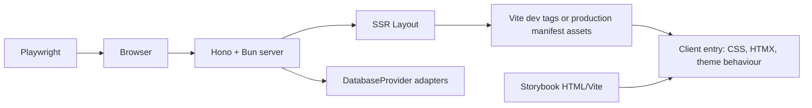

# pace-0005: Template Developer Experience Foundations

## Header

| Field | Value |
| --- | --- |
| Epic | `pace-0005` |
| Branch | `pace-0005` |
| Status | Implemented |
| Theme | Template DX, browser tooling, component workshop, and adapter contracts |
| Ticket Branches | `pace-0006`, `pace-0007`, `pace-0008`, `pace-0009`, `pace-0010`, `pace-0011` |
| Owner | `@Macavitymadcap` |
| Target PR | TBD |
| Last updated | 2026-05-17 |

## Summary

Expand the repository from a compact production app into a richer Hono + HTMX starter template by adding a Vite-managed browser asset pipeline, Playwright E2E tests and PR screenshots, Storybook component states, a generic component-library export boundary, and clearer database adapter contracts.

## Goals

- Use Vite for browser assets, CSS, static files, and Storybook configuration while keeping Hono + Bun as the server-rendered app runtime.
- Replace direct Puppeteer usage with Playwright for E2E workflows and PR screenshot capture.
- Add a Storybook workshop for server-rendered Hono JSX components and important UI states.
- Make app-agnostic components easier to reuse through a deliberate library export boundary.
- Formalize database provider and repository adapter contracts around the existing SQLite and Postgres implementations.
- Document the template development workflow so new projects know where browser assets, stories, E2E tests, and adapters belong.

## Non-Goals

- No SPA rewrite, client-side routing, or hydration framework migration.
- No replacement of Bun's unit, route, component, and repository tests with Vitest.
- No third database adapter in this epic.
- No package publishing or extraction into a separate starter repository.
- No replacement of Pa11y unless a ticket proves it is required; direct app scripts should stop importing Puppeteer, but Pa11y may still depend on Puppeteer internally.

## Ticket Plan

| Ticket | Branch | Scope | Acceptance Criteria |
| --- | --- | --- | --- |
| `pace-0006` | `pace-0006` | Add Vite browser asset pipeline for app CSS, client JS, public assets, and production manifest integration | Hono pages load Vite-built assets in production, Vite dev assets locally, CSS no longer relies on server-injected TS strings, and deployment builds assets before start |
| `pace-0007` | `pace-0007` | Add Playwright E2E tests and port PR screenshot capture from Puppeteer to Playwright | `bun run test:e2e` covers core browser workflows, `bun run screenshots:pr` still updates PR images, and app code no longer directly depends on Puppeteer |
| `pace-0008` | `pace-0008` | Add Storybook with the shared Vite configuration and server-rendered component story helpers | Storybook runs and builds, stories cover generic components and key app states, and story tests pass without changing the app runtime |
| `pace-0009` | `pace-0009` | Create a generic component-library boundary for app-agnostic atoms and molecules | Generic components and prop types are exported from a stable boundary, existing route/page exports keep working, and domain-specific wrappers remain clearly separated |
| `pace-0010` | `pace-0010` | Formalize database adapter contracts and conformance tests for SQLite/Postgres providers | Adapter authoring docs and shared contract tests describe and verify provider/repository expectations without adding a new backend |
| `pace-0011` | `pace-0011` | Update template docs, CI, ignored artifacts, and review workflow for the new tooling | README, architecture docs, CI, PR template, and verification scripts describe and run the new Vite, Playwright, Storybook, and adapter flows |

## Architecture Notes

Vite should be introduced as the browser asset tool, not as the application server. The Hono app continues to render HTML on the server. A new Vite config builds a client entry such as `src/client/main.ts`, a CSS entry such as `src/client/styles.css`, and assets from `public/`. In development, `bun run dev` should start both the Hono server and Vite dev server through a small script so `Layout` can inject Vite client tags. In production, `bun run build` should run `vite build`, and `Layout` should read the generated manifest to render hashed CSS and JS tags.

Component CSS should move from `*.styles.ts` string exports into Vite-managed CSS files imported by the client CSS entry. The existing semantic class names and CSS variable model should remain; this is an asset-pipeline change, not a redesign.

Playwright should become the only browser automation API imported by project-owned scripts. The E2E suite and PR screenshot script can share seeded app-server helpers and screenshot flows. Pa11y remains the accessibility gate for this epic, even if it keeps Puppeteer as a transitive dependency.

Storybook should use the Vite-powered HTML renderer and a local helper that converts Hono JSX output with `String(node)` into story DOM. Stories should document component states and support Storybook tests, but they should not introduce a second app runtime.

Database adapter work should clarify the existing provider boundary instead of expanding storage support. SQLite and Postgres should both satisfy the same conformance checks for migrations, repository factories, lifecycle cleanup, and user-scoped repository behaviour.

## Integration Plan

- Open this epic branch as a draft pull request into `main`.
- Branch each ticket from this epic branch.
- Merge completed ticket branches back into this epic branch.
- Mark the epic pull request ready for review after all planned tickets are merged.

## Verification

- `bun run check`
- `bun run typecheck`
- `bun run test`
- `bun run test:a11y`
- `bun run build`
- `bun run test:e2e`
- `bun run storybook:build`
- `bun run test:storybook`
- `bun run screenshots:pr -- --no-update-pr`

## Assumptions

- Vite is used for browser assets and Storybook, while Bun continues to execute server TypeScript directly.
- Playwright starts with Chromium coverage in CI; additional browser projects can be added later.
- Storybook story tests complement existing Bun tests and do not become the primary route or repository test layer.
- The existing Railway deployment remains the production target and must build Vite assets before startup.
- Direct project-owned Puppeteer imports should be removed, but Pa11y may still include Puppeteer internally.
