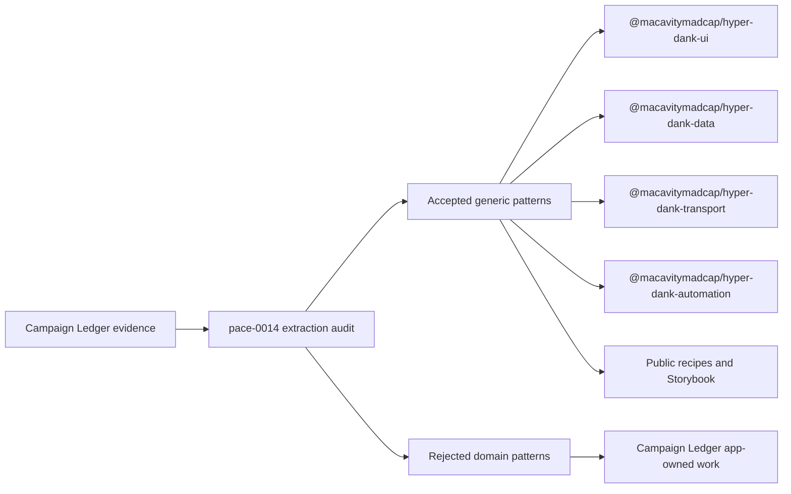

# pace-0013: Campaign Ledger Lessons and Brand Polish

## Header

| Field | Value |
| --- | --- |
| Epic | `pace-0013` |
| Branch | `pace-0013` |
| Status | Implemented |
| Theme | Campaign Ledger lessons, generic extraction, and Hyper-Dank branding |
| Ticket Branches | `pace-0014`, `pace-0015`, `pace-0016` |
| Owner | `@Macavitymadcap` |
| Target PR | [#78](https://github.com/Macavitymadcap/hyper-dank/pull/78) |
| Last updated | 2026-05-21 |

## Summary

Fold the useful lessons from Campaign Ledger back into Hyper-Dank before Campaign Ledger adopts the
shared libraries. This brief epic audits the divergence, extracts only app-neutral patterns and
helpers, and integrates the new stacked Hyper-Dank logo into the docs site and brand surfaces.

## Goals

- Use the skipped `pace-0013` through `pace-0016` numbers for the next epic and its ticket branches.
- Compare Campaign Ledger's app-local patterns against the current Hyper-Dank packages and docs.
- Extract generic reusable components, scripts, or recipes that reduce later Campaign Ledger
  migration friction without importing its domain model.
- Capture lessons learned from Campaign Ledger's hosted rehearsal, auth UI, app shell, protected
  assets, Markdown/wiki rendering, verification, screenshots, and smoke journeys.
- Check every accepted extraction against the next planned app shapes: a blog, a static web book,
  and a choose-your-own-adventure style branching narrative.
- Integrate the stacked Hyper-Dank SVG logo into the docs site and repo branding.
- Add a restrained rune-inspired brand treatment to the docs site where it improves identity without
  harming readability.
- Keep public docs app-neutral. Internal planning docs may reference Campaign Ledger as the source
  of the lesson, but package docs, recipes, Storybook, and public site copy should describe generic
  app patterns.

## Non-Goals

- No Campaign Ledger migration onto Hyper-Dank packages in this epic.
- No dependency from Hyper-Dank source code back to Campaign Ledger.
- No shared D&D, rules, campaign, sheet, dice, faction, character, roster, or table-specific
  component.
- No attempt to wait for Campaign Ledger's active `sheet-0050` work to finish; use the current state
  as a source of broadly proven patterns.
- No broad visual redesign of the docs site beyond brand integration and small typography/token
  adjustments.
- No full blog engine, book publishing engine, choice-game engine, save-state system, or story
  authoring DSL in this epic.
- No external package publication workflow.

## Generic Extraction Rule

Campaign Ledger can provide evidence, but shared Hyper-Dank code must stay app-neutral.

| Campaign Ledger evidence | Allowed Hyper-Dank extraction | Rejected extraction |
| --- | --- | --- |
| `PasswordField` and password setup screens | Generic password field, visibility toggle, confirmation guidance, copy affordance patterns | Account, invite, or reset flows tied to Campaign Ledger routes |
| `SiteHeader`, role-aware navigation, and layout shell | Generic app header/shell recipes, current-user slot, action menu, theme toggle guidance | Campaign roles, Game Master/player labels, hard-coded app routes |
| `DiceRoller` popover and HTMX result swap | Generic popover action panel, submit/result region, compact control styling | Dice rolling, advantage/disadvantage modes, character modifiers |
| Campaign wiki Markdown and image references | Safe Markdown/content rendering boundaries, app-owned asset reference recipe | Campaign wiki page types, private rules content, faction/image schema |
| Protected asset storage and seeded placeholders | Generic asset storage root, relative storage key, placeholder and visibility guidance | Rovnost asset keys, campaign membership checks, D&D-specific data |
| Pa11y, screenshots, smoke journeys, hosted rehearsal scripts | Reusable verification target patterns, local server harness recipes, acceptance checklists | Campaign-specific seeded users, rules imports, sheet workflows |
| Accessibility coverage and public limitations | Accessibility statement data shape, Markdown generator, static statement page builder, reviewed copy prompts | Legal compliance claims, false guarantees, project-specific audit results |
| Lacklustre dashboard examples | Basic app-neutral graph component for simple dashboard examples, with accessible SVG/table fallback guidance | Full charting library, canvas renderer, live analytics, or domain-specific metrics |

## Future App Shape Constraints

This epic should leave Hyper-Dank better prepared for more than Campaign Ledger. The audit and
implementation tickets must test candidate patterns against these future shapes:

| Future app shape | Generic needs to consider | Out of scope for this epic |
| --- | --- | --- |
| Blog | Content collections, route generation, tags/categories, feeds/search policy hooks, prose, cards, pagination, static build checks | A complete blog starter, hosted CMS, comments, analytics, or publishing platform |
| Static web book | Chapters, table of contents, previous/next navigation, footnotes/callouts, stable anchors, print-friendly prose, asset references | A complete book engine, EPUB/PDF export, editorial workflow, or custom book schema |
| Choose-your-own-adventure game | Choice lists, action/result panels, local browser state hooks, progress/history display, static content plus small client behaviour | A full branching-story engine, save system, combat/rules engine, randomiser, or authoring DSL |

Accepted generic patterns should serve at least one of these shapes or the Campaign Ledger adoption
path. If a candidate only serves one domain-specific app, it should be documented as app-owned or
deferred.

## Scope Control

This is intentionally a short bridge epic. `pace-0014` must rank candidates as must-do, useful
follow-up, or reject. `pace-0015` should implement only the smallest set that materially improves
the next app-building slice, expected to be no more than three candidate families plus supporting
docs and compatibility checks. Extra useful ideas should become follow-up tickets rather than
stretching this epic.

## Ticket Plan

| Ticket | Branch | Scope | Acceptance Criteria |
| --- | --- | --- | --- |
| `pace-0014` | `pace-0014` | Audit Campaign Ledger divergence and produce the accepted generic extraction map | Durable notes identify extract, document, defer, and reject decisions with reasons and target packages |
| `pace-0015` | `pace-0015` | Implement the highest-value accepted app-neutral components, helpers, compatibility checks, and docs updates | New exports or recipes are generic, tested, documented, covered through public package paths, and limited to the accepted short-list |
| `pace-0016` | `pace-0016` | Integrate the stacked Hyper-Dank logo and restrained brand typography into the docs site | Logo appears in the docs brand surfaces, light/dark styling remains accessible, and screenshots/a11y checks pass |

## Architecture Notes

This epic should preserve the package boundaries from `pace-0050`:

- UI may own generic JSX components, CSS hooks, accessibility contracts, and Storybook examples.
- Transport may own Hono/HTMX response or form mechanics, but applications own auth, permissions,
  route names, and domain validation.
- Data may own provider, migration, repository, and storage helper contracts, but applications own
  schemas, membership checks, and domain repositories.
- Automation may own local server, Pa11y, screenshot, verification, and static-content mechanics,
  but applications own smoke journeys, fixtures, hosted environments, and release policy.

### Candidate Generic Work

The audit should decide the exact implementation set before `pace-0015` begins. Likely candidates:

- A password input or visibility-control primitive if it improves on the current generic form
  components without making auth assumptions.
- A copy-control primitive or recipe for invite/reset/admin-style handoff surfaces that copy any
  string or URL, not only account links.
- App shell/header refinements that support brand, navigation, user summary, theme toggle, and menu
  slots without embedding role names or route policy.
- A generic popover action/result pattern derived from the dice roller's UI mechanics.
- Asset storage and placeholder guidance for apps that need app-managed files with relative storage
  keys and safe fallbacks.
- Verification recipes for Pa11y target catalogues, smoke journeys, screenshots, and hosted
  rehearsal acceptance.
- Static publishing and authored-content recipes that cover blog posts, chapters, asset references,
  previous/next navigation, and branching choice/result surfaces without becoming a full engine.
- Accessibility statement helpers that let an app describe what it provides, known limitations,
  testing methods, contact or issue-reporting path, and review date, then render that statement as
  Markdown and a static docs page without claiming more compliance than the app can evidence.
- A basic graph/data-visualisation component for dashboard examples, such as a simple bar, line, or
  sparkline-style SVG with labels and accessible summary hooks. This should make examples more
  credible without becoming a charting framework.

### Branding Direction

Use `/Users/dank/Desktop/hyper-dank-stacked-logo.svg` as source artwork. The committed site asset
should keep the logo as SVG and style it through `currentColor` where possible so it works in light
and dark themes. The runic feel belongs primarily in the logo and brand headings; body text, code,
tables, navigation, and package docs must remain highly readable.

## Integration Plan

- Create `pace-0013` from the latest `main` after `pace-0050` has landed.
- Open this epic branch as a draft pull request into `main`.
- Branch `pace-0014`, `pace-0015`, and `pace-0016` from `pace-0013`.
- Merge completed ticket branches back into `pace-0013`.
- Mark the epic pull request ready after the extraction map, generic implementation, branding,
  screenshots, and verification are complete.

## Verification

- `bun run check`
- `bun run test:compat`
- `bun run test:storybook` if UI components or stories change
- `bun run test:a11y` if the docs site or rendered UI changes
- `bun run screenshots:pr -- --no-update-pr` or the current screenshot script for docs branding
- `bun run verify` before the epic is ready for review

## Implementation Notes

- `pace-0014` added `docs/architecture/campaign-ledger-extraction-audit.md`, ranked extraction
  candidates, selected the short implementation list, and deferred app-specific or oversized
  candidates.
- `pace-0015` added `BasicGraph`, accessibility statement helpers, authored-content navigation and
  choice helpers, public docs, Storybook coverage, and consumer compatibility checks.
- `pace-0016` added the stacked Hyper-Dank logo asset and integrated theme-aware logo marks into the
  docs header and home page.
- `bun run verify` passed on 2026-05-21.

## Assumptions

- `pace-0059` and the parent `pace-0050` app-builder epic have landed before this epic starts.
- Campaign Ledger is close enough to its current campaign-companion shape to provide useful
  extraction evidence, even if `sheet-0050` still has a few PRs left.
- `sheet-0040` remains the later Campaign Ledger package-adoption epic.
- The next useful Hyper-Dank branch number is the skipped `pace-0013`, with tickets `pace-0014`
  through `pace-0016`.
