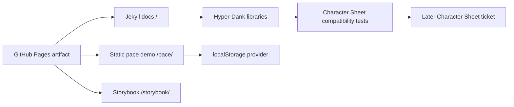

# pace-0020: Hyper-Dank Public Platform And Consumer Contract

## Header

| Field | Value |
| --- | --- |
| Epic | `pace-0020` |
| Branch | `pace-0020` |
| Status | Planned |
| Theme | Public Hyper-Dank platform, static demo, docs, deployment, and consumer package contract |
| Ticket Branches | `pace-0021`, `pace-0022`, `pace-0023`, `pace-0024`, `pace-0025`, `pace-0026`, `pace-0027` |
| Owner | `@Macavitymadcap` |
| Target PR | [#23](https://github.com/Macavitymadcap/hyper-dank/pull/23) |
| Last updated | 2026-05-18 |

## Summary

Turn the repository into the public Hyper-Dank home while preserving the package contract work needed
for Character Sheet adoption. The production surface moves to GitHub Pages with a Jekyll
documentation site at `/`, a static Walking Pace demo at `/pace/`, and the built Storybook at
`/storybook/`.

The existing authenticated Walking Pace Hono app remains the server-side reference implementation.
The public Walking Pace demo is a browser-only example that persists walks to `localStorage` so it
can run from static hosting without Railway, Postgres, Better Auth, or server mutation routes.

## Goals

- Rename the public repository identity from `pace-calculator` to `hyper-dank` in active docs,
  scripts, and deployment references.
- Keep `@macavitymadcap/hyper-dank-components`, `@macavitymadcap/hyper-dank-database`, and
  `@macavitymadcap/hyper-dank-http` stable for external consumers.
- Extend and document the component package contract needed for a later Character Sheet migration.
- Publish Hyper-Dank docs, the static pace demo, and Storybook from one GitHub Pages deployment.
- Support GitHub Pages repository-path hosting under `/hyper-dank`.

## Non-Goals

- No runtime dependency changes in `/Users/dank/Code/personal/web/character-sheet`.
- No external package registry publication.
- No full folder/package rename for `apps/walking-pace`; it remains the template app source.
- No attempt to make Better Auth, admin, invitations, or server-owned sessions work in the static
  demo.
- No Railway production deployment for this repository after this epic lands; Railway-compatible
  server scripts and docs remain supported for downstream apps such as Character Sheet.

## Ticket Plan

| Ticket | Branch | Scope | Acceptance Criteria |
| --- | --- | --- | --- |
| `pace-0021` | `pace-0021` | Add Character Sheet-compatible shared component props for `Button`, `FormField`, and `Switch` | Component tests cover additive props, existing Walking Pace usage still passes, and exports remain backwards compatible |
| `pace-0022` | `pace-0022` | Harden the reusable component CSS and package documentation contract | `libs/components/README.md`, package exports, and style tests describe how consumers load `styles.css` without app-specific assumptions |
| `pace-0023` | `pace-0023` | Expand Character Sheet compatibility coverage and handoff notes | `bun run test:compat` covers representative Character Sheet markup through package imports and documents the later consuming-app migration expectations |
| `pace-0024` | `pace-0024` | Rename public repo identity to Hyper-Dank | Active docs, script defaults, and deploy references point at `Macavitymadcap/hyper-dank`; historical PR links remain unchanged |
| `pace-0025` | `pace-0025` | Add static Walking Pace localStorage demo | `/pace/` runs without server mutation endpoints, persists to `hyper-dank:pace-demo:walks:v1`, and covers add/delete/clear/reload flows |
| `pace-0026` | `pace-0026` | Add Jekyll Hyper-Dank docs site | `site/` documents libraries, framework patterns, verification, the pace demo, Storybook, and Character Sheet adoption |
| `pace-0027` | `pace-0027` | Replace this repository's active Railway production deployment with GitHub Pages | Pages workflow builds Jekyll, the pace demo, and Storybook into one artifact while preserving Railway-compatible server deployment guidance for downstream apps |

## Architecture Notes

`@macavitymadcap/hyper-dank-components` remains a reusable Hono JSX package. Shared UI changes should
prefer additive props and generic CSS hooks over moving Character Sheet-specific behaviour into the
package. Character Sheet currently has active local `sheet-0012` work, so this epic prepares the
package contract first and defers runtime consumption to a later Character Sheet ticket.

The static pace demo is intentionally separate from the authenticated Hono app. It reuses validation,
pace math, styles, and package class contracts, but its persistence provider is browser
`localStorage`, scoped to a single browser profile.

## Integration Plan

- Keep this epic branch as the draft pull request into `main`.
- Branch implementation tickets from `pace-0020` when using the normal branch-flow.
- Merge completed ticket branches back into `pace-0020`.
- After merge to `main`, manually rename the GitHub repository from `pace-calculator` to
  `hyper-dank`.
- Mark the epic pull request ready after all ticket work passes verification and the Pages artifact
  is buildable.

## Verification

- `bun run check`
- `bun run typecheck`
- `bun test`
- `bun run test:compat`
- `bun run test:static-demo`
- `bun run storybook:build`
- `bun run verify`

## Assumptions

- GitHub Pages is the production deployment target.
- Repository-path Pages hosting should work under `/hyper-dank`.
- The static pace demo intentionally omits auth/admin/invites.
- Railway is no longer this repository's production deployment path after this epic, but remains a
  supported server deployment pattern for downstream Hyper-Dank apps.
