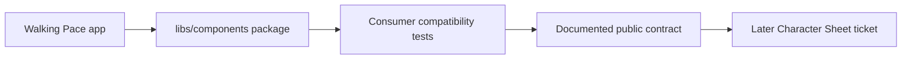

# pace-0020: Hyper-Dank Component Consumer Contract

## Header

| Field | Value |
| --- | --- |
| Epic | `pace-0020` |
| Branch | `pace-0020` |
| Status | Planned |
| Theme | Shared component APIs, CSS contract, and Character Sheet compatibility |
| Ticket Branches | `pace-0021`, `pace-0022`, `pace-0023` |
| Owner | `@Macavitymadcap` |
| Target PR | [#23](https://github.com/Macavitymadcap/pace-calculator/pull/23) |
| Last updated | 2026-05-18 |

## Summary

Prepare the Hyper-Dank component package for real Character Sheet adoption by making the shared
component APIs cover the generic primitives Character Sheet already uses, tightening the package CSS
contract, and expanding consumer compatibility coverage before any consuming-app runtime migration.

## Goals

- Extend shared component props additively for Character Sheet-compatible usage.
- Keep the shared component surface app-agnostic and backwards compatible for Walking Pace.
- Document the component CSS consumption contract for Bun, Vite, and sibling-repo consumers.
- Expand consumer compatibility tests so Character Sheet usage is represented through public package imports.
- Record the handoff expectations for a later Character Sheet ticket without editing that repository in this epic.

## Non-Goals

- No runtime dependency changes in `/Users/dank/Code/personal/web/character-sheet`.
- No database or HTTP package adoption beyond preserving existing compatibility coverage.
- No package publication to an external registry.
- No Storybook, Playwright, or Vite migration inside Character Sheet.
- No redesign of Walking Pace or Character Sheet UI.

## Ticket Plan

| Ticket | Branch | Scope | Acceptance Criteria |
| --- | --- | --- | --- |
| `pace-0021` | `pace-0021` | Add Character Sheet-compatible shared component props for `Button`, `FormField`, and `Switch` | Component tests cover the additive props, existing Walking Pace usage still passes, and exports remain backwards compatible |
| `pace-0022` | `pace-0022` | Harden the reusable component CSS and package documentation contract | `libs/components/README.md`, package exports, and style tests describe how consumers load `styles.css` without app-specific assumptions |
| `pace-0023` | `pace-0023` | Expand Character Sheet compatibility coverage and handoff notes | `bun run test:compat` covers representative Character Sheet markup through package imports and documents the later consuming-app migration expectations |

## Architecture Notes

`@macavitymadcap/hyper-dank-components` remains a reusable Hono JSX package. This epic should prefer
additive props and generic CSS hooks over moving Character Sheet-specific behaviour into the package.
Character Sheet currently has active local `sheet-0012` work, so this epic prepares the package
contract first and defers runtime consumption to a later Character Sheet ticket, likely `sheet-0020`.

The shared API should preserve current imports from Walking Pace and the existing
`e2e/consumer-compat/character-sheet-compat.test.tsx` smoke test. New compatibility assertions should
import from public package paths, not private source files.

## Integration Plan

- Open this epic branch as a draft pull request into `main`.
- Branch each ticket from `pace-0020`.
- Merge completed ticket branches back into `pace-0020`.
- Mark the epic pull request ready after all planned tickets pass verification and docs are complete.

## Verification

- `bun run check`
- `bun run test:compat`
- `bun run verify`

## Assumptions

- `character-sheet` runtime migration is blocked behind its current `sheet-0012` work and should not be touched here.
- Local sibling-repo consumption remains the expected first adoption path; external registry publishing is later work.
- The shared component package should remain small, app-agnostic, and server-rendered.
