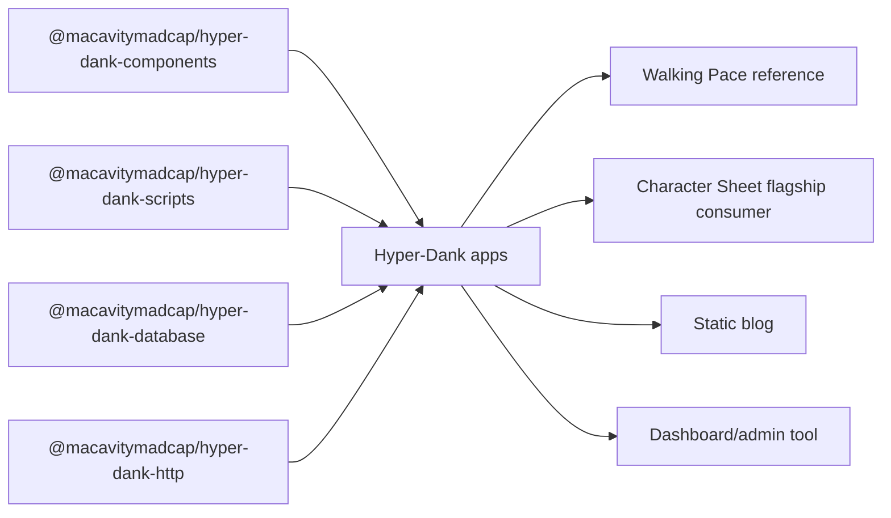

# pace-0030: Broaden Hyper-Dank Platform Primitives

## Header

| Field | Value |
| --- | --- |
| Epic | `pace-0030` |
| Branch | `pace-0030` |
| Status | Planned |
| Theme | Reusable app primitives, script libraries, and consumer validation |
| Ticket Branches | `pace-0031`, `pace-0032`, `pace-0033`, `pace-0034`, `pace-0035`, `pace-0036`, `pace-0037` |
| Owner | `@Macavitymadcap` |
| Target PR | TBD |
| Last updated | 2026-05-18 |

## Summary

Strengthen Hyper-Dank from a pace-demo template into a broader platform for server-rendered Hono,
HTMX, Bun, and JSX apps. Character Sheet remains the flagship consumer and test case, but the shared
packages should also support future static blogs, dashboards, admin tools, and other small
hypermedia apps without copying project-specific scripts or UI scaffolding.

## Goals

- Broaden `@macavitymadcap/hyper-dank-components` with reusable primitives for document/layout,
  navigation, forms, data display, feedback, and dashboard-style app surfaces.
- Rename the public package identities as part of this epic, treating the change as an explicit
  breaking package-contract update.
- Keep shared components app-agnostic while making Character Sheet composition easier through
  additive APIs, CSS contracts, Storybook states, and compatibility tests.
- Extract reusable script helpers into an exportable workspace package so Hyper-Dank apps can share
  GitHub API access, process execution, verification reporting, local server management,
  screenshots, PR image updates, and browser/a11y test orchestration.
- Compare and reconcile script patterns from this repo and `/Users/dank/Code/personal/web/character-sheet`
  before freezing the shared script contracts.
- Document the expected adoption path for static sites, dashboards, server apps, and Character Sheet.

## Non-Goals

- No direct runtime migration inside `/Users/dank/Code/personal/web/character-sheet` in this epic.
- No external npm publication workflow; local workspace packaging and consumer compatibility remain
  the release proxy after package names change.
- No full design-system rewrite or visual rebrand.
- No client-side SPA framework, global client store, or hydration layer.
- No app-specific D&D, walking, blog, or dashboard domain components in shared packages.

## Ticket Plan

| Ticket | Branch | Scope | Acceptance Criteria |
| --- | --- | --- | --- |
| `pace-0031` | `pace-0031` | Audit reusable needs across Walking Pace and Character Sheet | Inventory current app components and scripts, identify shared candidates, and update the epic if the ticket map needs adjustment |
| `pace-0032` | `pace-0032` | Add broader shared component primitives | Shared components cover reusable layout/navigation/data/form/feedback gaps with tests, exports, CSS contracts, and Storybook coverage |
| `pace-0033` | `pace-0033` | Introduce `@macavitymadcap/hyper-dank-scripts` | A new package exports process, GitHub, verification, local-server, screenshot, and browser-test helpers with package docs and tests |
| `pace-0034` | `pace-0034` | Migrate this repo's scripts onto the shared script package | Walking Pace scripts use the shared package where appropriate while preserving current command behaviour and verification output |
| `pace-0035` | `pace-0035` | Expand consumer compatibility for Character Sheet and generic app shapes | Compatibility tests cover Character Sheet-style UI plus blog, dashboard, and static/demo component compositions through public package imports |
| `pace-0036` | `pace-0036` | Document platform adoption patterns | Public docs and package READMEs explain component groups, script-library usage, and app-shape recipes for server apps, static demos, blogs, dashboards, and Character Sheet |
| `pace-0037` | `pace-0037` | Rename public package identities | Package names, imports, docs, compatibility fixtures, and release notes use the new naming convention with an explicit breaking-change note |

## Architecture Notes

The platform should keep the existing Hyper-Dank boundary: reusable packages expose small typed
primitives, while applications own routes, permissions, schemas, persistence, domain copy, and final
composition. Character Sheet can influence the shared package contracts, but it should not leak D&D
or sheet-specific nouns into the library.

Package naming is part of this epic rather than a follow-up. The current package names are planning
placeholders until `pace-0037` records the final convention and updates `package.json` names,
workspace dependencies, package README imports, docs examples, compatibility tests, and any script
package references. That ticket should use Conventional Commit breaking-change syntax when it lands.

### Component Direction

Shared component work should favour composable building blocks:

- document and app shell primitives that help server-rendered apps share page chrome without forcing
  one product layout
- navigation primitives for tabs, breadcrumbs, menu bars, skip links, and account/action regions
- form primitives for grouped fields, validation summaries, fieldsets, segmented controls, and
  progressive HTMX forms
- data-display primitives for cards, tables, definition lists, key-value grids, timeline/list rows,
  empty states, and dense dashboard panels
- feedback primitives for notices, validation errors, loading/progress states, badges, and status
  summaries

Shared CSS remains a baseline contract. Apps may import
`@macavitymadcap/hyper-dank-components/styles.css` and layer app-specific CSS afterwards.

### Script Library Direction

The script package should extract reusable behaviour from these existing script families:

- GitHub helpers: repo parsing, token lookup, REST requests, PR discovery/update, branch-protection
  configuration inputs
- process helpers: sync/async command execution, cwd/env handling, inherited or captured output
- verification helpers: ordered gates, stop-on-failure, Markdown reports, and reusable gate metadata
- local app server helpers: dynamic port selection, health waiting, request helpers, cookie/session
  helpers, and Hono/Bun server adapters
- browser test helpers: Playwright/Puppeteer launch defaults, screenshot capture, viewport presets,
  theme setup, and PR image Markdown updates
- coverage/a11y helpers: coverage report rendering, threshold checks, Pa11y orchestration, and
  named page checks

The first consumer is this repo's script set. Character Sheet should be used as a design input and
later migration target, but this epic should not edit that repo unless a specific ticket is added.

## Integration Plan

- Open this epic branch as a draft pull request into `main`.
- Branch each ticket from `pace-0030`.
- Merge completed ticket branches back into `pace-0030`.
- Keep shared package API changes additive except for the package rename ticket, which is an explicit
  breaking contract change.
- Mark the epic pull request ready for review after all planned tickets are merged and a fresh
  verifier report passes.

## Verification

- `bun run check`
- `bun run typecheck`
- `bun test`
- `bun run test:compat`
- `bun run storybook:build`
- `bun run verify`

## Assumptions

- The next epic number is `pace-0030`.
- Character Sheet remains the flagship consumer, but package contracts should be generic enough for
  blogs, dashboards, static demos, and server apps.
- Reusable scripts should live in a new workspace package rather than remaining under
  `apps/walking-pace/scripts/lib`.
- The shared scripts package may depend on Bun and TypeScript; it does not need to support Node-only
  consumers in this epic.
- The final package naming convention is still to be chosen, but the rename itself is in scope for
  this epic.
