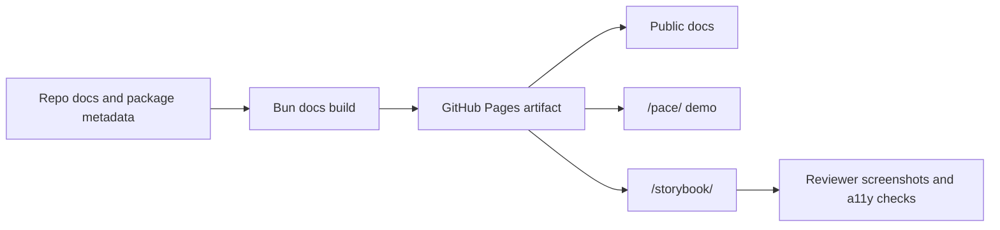

# pace-0041: Improve Public Docs, Storybook, and Demo Review Flow

## Header

| Field | Value |
| --- | --- |
| Epic | `pace-0041` |
| Branch | `pace-0041` |
| Status | Planned |
| Theme | Documentation and demo review experience |
| Ticket Branches | `pace-0042`, `pace-0043`, `pace-0044`, `pace-0045`, `pace-0046`, `pace-0047`, `pace-0048`, `pace-0049` |
| Owner | `@Macavitymadcap` |
| Target PR | TBD |
| Last updated | 2026-05-19 |

## Summary

Rework the public Hyper-Dank documentation, Storybook docs, and Walking Pace demo review path so
they explain the workspace clearly, use repo-owned build tooling, expose each library on its own
page, and let reviewers inspect the full authenticated app without relying on email invitations.

## Goals

- Audit README, architecture, package READMEs, site docs, Storybook docs, tickets, and epics for
  accuracy, useful scope, and stale or irrelevant detail.
- Replace the current Jekyll documentation build with a repo-owned static docs build that can reuse
  Markdown parsing and page-generation scripts for future static blog work.
- Improve the public docs shell: compact the header, use a dropdown for links, reuse the
  character-sheet-style light mode toggle, and prevent wide tables from breaking layouts.
- Split library docs into a libraries home page plus one page per shared package, with a collapsible
  side navigation and a shared-philosophy overview.
- Restructure Storybook so it starts with a component-system introduction and then groups components
  by type with fuller component reference material.
- Expand the floating Storybook switch into a compact utility control with quick links to the docs
  and Walking Pace demo.
- Seed demo review accounts and make demo-mode invitations explain that email delivery is disabled.
- Compare Character Sheet's current SRD epic implementation with Hyper-Dank and capture reusable
  component, script, database, and documentation patterns for shared-package extraction.

## Non-Goals

- No new public package APIs beyond documentation metadata needed for Storybook reference tables.
- No external package publication.
- No redesign of the Walking Pace product beyond review-mode affordances and screenshots requested
  by the ticket work.
- No migration away from GitHub Pages as the public hosting target.

## Ticket Plan

| Ticket | Branch | Scope | Acceptance Criteria |
| --- | --- | --- | --- |
| `pace-0042` | `pace-0042` | Documentation audit, copy pass, and source-of-truth map | Docs review identifies stale Jekyll references, thin pages, inaccurate claims, and copy improvements before implementation starts |
| `pace-0043` | `pace-0043` | Repo-built static docs pipeline | `bun run build:pages-assets` builds docs without Jekyll and keeps `/pace/` plus `/storybook/` in the Pages artifact |
| `pace-0044` | `pace-0044` | Public docs shell, header, navigation, theme toggle, and table overflow | Header is compact, links sit behind a dropdown, theme toggle matches the character-sheet pattern, and screenshots are shared for review |
| `pace-0045` | `pace-0045` | Libraries information architecture | `/libraries/` becomes a home page and each shared package has its own page with collapsible side navigation |
| `pace-0046` | `pace-0046` | Storybook information architecture and component reference depth | Storybook opens with component philosophy, groups components by type, and each component lists inputs, outputs, events, properties, and methods where applicable |
| `pace-0047` | `pace-0047` | Storybook utility switch and cross-site quick links | Floating Storybook control includes theme, docs, and demo links on every page without obscuring stories |
| `pace-0048` | `pace-0048` | Walking Pace demo accounts and demo-mode invitations | Reviewers can sign in as seeded accounts, inspect all app pages, and see clear demo-mode messaging when invites cannot send email |
| `pace-0049` | `pace-0049` | Character Sheet pattern review and extraction plan | Reusable Character Sheet patterns are assessed against Hyper-Dank packages and either queued for extraction or explicitly left app-specific |

## Architecture Notes

The existing public site is Jekyll-backed under `site/`, while the workspace already uses Bun,
Vite, Storybook, Playwright, and shared automation packages. The replacement docs build should stay
inside the Bun workspace and make Markdown parsing reusable rather than embedding docs behaviour in
GitHub Actions. Future static-blog work should be able to import the same Markdown/page helpers.

Documentation content should draw from the repo's current source of truth: `README.md`,
`ARCHITECTURE.md`, package READMEs, deployment docs, existing tickets, and accepted epics. Copy
should use British English, plain wording, and concrete reader benefits.

User-facing UI tickets must provide relevant screenshots before they are treated as review-ready.
For this epic that includes the public docs header/navigation, library pages, Storybook utility
control, and seeded demo review states.

Character Sheet's active `sheet-0020` SRD epic deliberately defers Hyper-Dank package adoption to a
later roadmap slice. Hyper-Dank should therefore use the current Character Sheet work as evidence
for future shared primitives, not as a reason to migrate Character Sheet during the SRD branch.

## Integration Plan

- Open this epic branch as a draft pull request into `main`.
- Branch each ticket from `pace-0041`.
- Merge completed ticket branches back into `pace-0041`.
- Share screenshots with the user for UI tickets before marking them implemented.
- Mark the epic pull request ready after all tickets pass verification and the public docs copy has
  had a final fit-for-purpose review.

## Verification

- `bun run check`
- `bun run build`
- `bun run test:static-demo`
- `bun run test:storybook`
- `bun run test:a11y`
- `bun run screenshots:pr -- --all-flows`
- Manual screenshot review for public docs, libraries, Storybook, and demo review accounts
- Cross-repo compatibility review against Character Sheet patterns before shared package changes

## Assumptions

- `pace-0041` is the next broad planning branch after the `pace-0040` hotfix branch.
- The current Jekyll site remains the content baseline until the repo-owned docs build replaces it.
- Character Sheet's light mode toggle pattern can be copied or adapted after inspecting that repo
  during `pace-0044`.
