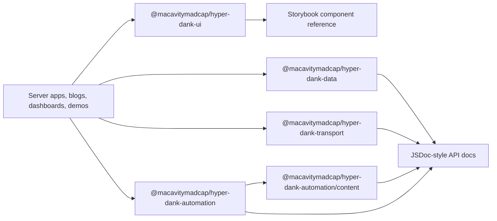

# pace-0050: Make Hyper-Dank App-Builder Ready

## Header

| Field | Value |
| --- | --- |
| Epic | `pace-0050` |
| Branch | `pace-0050` |
| Status | Planned |
| Theme | Public library depth, app-builder primitives, Storybook reference, and docs clarity |
| Ticket Branches | `pace-0051`, `pace-0052`, `pace-0053`, `pace-0054`, `pace-0055`, `pace-0056`, `pace-0057`, `pace-0058`, `pace-0059` |
| Owner | `@Macavitymadcap` |
| Target PR | TBD |
| Last updated | 2026-05-19 |

## Summary

Turn Hyper-Dank from a proven reference workspace into a library-and-docs foundation that other
apps can confidently build from. The epic expands shared UI, data, transport, automation, and
content helpers; makes Storybook the canonical component reference; trims the public docs site into
clear philosophy, recipes, and API documentation; and validates the result against realistic server
app and static blog shapes without mentioning private consuming apps in public docs.

## Goals

- Expand `@macavitymadcap/hyper-dank-ui` towards a useful general component set for server apps,
  static blogs, dashboards, documentation sites, and admin-style tools.
- Use Angular Material and Astro UXDS as quality references for component coverage, accessibility
  notes, API reference shape, density, and Storybook-like discoverability without copying either
  design system's visual language.
- Audit every existing component for naming, props, semantics, CSS contracts, responsive behaviour,
  and alignment with Hyper-Dank's HTML-first design philosophy.
- Document every shared UI component in Storybook, including the existing `Icon` atom, with inputs,
  rendered output, events, accessibility expectations, CSS hooks, and practical examples.
- Expand the icon atom and icon catalogue enough to support common app recipes, static blogs,
  admin tools, dashboards, documentation pages, and fantasy-tabletop-adjacent apps without using
  product-specific names in public docs.
- Deepen `@macavitymadcap/hyper-dank-data` so apps can create providers and repositories with less
  repeated boilerplate, including generic repository contracts, provider wrappers, base classes or
  composable helpers where they genuinely reduce work.
- Add reusable static content helpers under the automation package, derived from the docs build
  work, so a future static blog can parse Markdown, produce routes, render metadata, and share
  code-highlighting/page-generation behaviour without depending on this docs site.
- Improve `@macavitymadcap/hyper-dank-transport` and
  `@macavitymadcap/hyper-dank-automation` where app builders need repeated wrappers for routes,
  form submissions, local servers, a11y targets, screenshots, and static-site checks.
- Tidy the public docs estate so the docs site, package READMEs, `README.md`, `ARCHITECTURE.md`,
  and `CONTRIBUTING.md` are current and fit for their intended audiences; library pages contain
  detailed JSDoc-style descriptions for non-component APIs; Storybook owns component detail; public
  material does not mention Character Sheet; and the system page becomes a clear framework
  philosophy page.

## Non-Goals

- No migration work inside any consuming app during this epic.
- No public docs, package READMEs, Storybook guides, generated docs, recipes, or repo-level public
  docs mention Character Sheet, D&D, private app names, or private roadmap details.
- No external npm publication or package registry workflow.
- No attempt to clone Angular Material, Astro UXDS, or their design language.
- No client-side SPA framework, hydration layer, or global state system.
- No broad visual rebrand of Walking Pace beyond changes needed to keep the reference app consuming
  the updated components safely.
- No domain repositories, blog content model, auth system, dice logic, campaign rules, or product
  data schema inside shared packages.

## Reference Systems

Angular Material is the benchmark for a broad, accessible component catalogue with explicit API
reference pages, native element semantics, variants, keyboard notes, and method/property
documentation. Useful patterns include button variants, form-field wrappers, menus, tabs, icons,
tables, expansion panels, badges/chips, progress, sidenav, toolbar, cards, lists, dialogs, and
pagination.

Astro UXDS is the benchmark for an app-oriented design system with operational density, icons,
layouts, component examples, design guidance, and Storybook-driven discoverability. Hyper-Dank
should borrow the expectation that a design system explains when and why to use a primitive, not
only which props it accepts.

These references are inputs for audit and coverage. Hyper-Dank remains a Hono, HTMX, Bun,
server-rendered JSX system with native HTML fallbacks and restrained shared contracts.

## Ticket Plan

| Ticket | Branch | Scope | Acceptance Criteria |
| --- | --- | --- | --- |
| `pace-0051` | `pace-0051` | Audit current library, docs, and Storybook readiness against app-builder needs and reference systems | Gap report lists missing UI primitives, weak props, docs clutter, Storybook omissions, package API gaps, deferred work, and a fixed accepted component directory for this epic |
| `pace-0052` | `pace-0052` | Improve existing UI primitives and add accepted core atoms, actions, forms, and icons | Existing components are cleaner and better documented; accepted new primitives cover common buttons, links, icon buttons, fields, textareas, selects, checkboxes, radios, toggles, and icon names |
| `pace-0053` | `pace-0053` | Add accepted layout, navigation, dialog, feedback, and data-display primitives | Shared UI covers app shell, page header, toolbar, breadcrumbs, tabs, side nav, native-dialog wrapper, pagination, empty states, notices, progress, lists, stat summaries, and richer tables |
| `pace-0054` | `pace-0054` | Deepen data provider and repository helpers | Data package exposes generic provider/repository contracts, base or wrapper helpers where useful, migration utilities, and conformance tests for app-owned repositories |
| `pace-0055` | `pace-0055` | Extract reusable static content and Markdown helpers under automation | Docs-build Markdown/page helpers move into an automation package subpath suitable for static docs and blog generation, with exports, tests, README coverage, and examples |
| `pace-0056` | `pace-0056` | Expand transport and automation app-builder helpers | Transport and automation packages gain route/form wrappers, server harness helpers, screenshot/a11y target catalogues, and static-site verification helpers where repeated app work is evident |
| `pace-0057` | `pace-0057` | Make Storybook the complete UI component reference | Every shared component has stories, docs, accessibility notes, controls or reference tables, light/dark coverage, and examples built from Hyper-Dank components where practical; Walking Pace domain components remain in a separate reference-app section |
| `pace-0058` | `pace-0058` | Tidy public docs, package READMEs, and repo-level docs | Docs remove private consumer references, trim internal verification material, expand library pages with class/function/method descriptions, turn System into framework philosophy, and audit `README.md`, `ARCHITECTURE.md`, and `CONTRIBUTING.md` for audience fit |
| `pace-0059` | `pace-0059` | Add app-builder recipes and compatibility examples | Recipes demonstrate server app, static blog, dashboard/admin, static demo, and script consumer shapes using public package imports and consumer-style tests |

## Architecture Notes

Hyper-Dank should keep its current package boundary:

- UI owns reusable server-rendered JSX, native semantics, HTMX-friendly props, class contracts, CSS
  variables, and component examples.
- Data owns lifecycle, migration, provider, and repository mechanics, but applications own schemas,
  transactions, queries, domain repository methods, and seed data.
- Transport owns request/response mechanics for Hono and HTMX, but applications own auth,
  permissions, validation, route names, and service orchestration.
- Automation owns repeatable Bun script mechanics, browser harnesses, screenshots, a11y runners,
  reports, GitHub plumbing, and a static-content subpath for docs/blog generation mechanics, but
  applications own fixtures, smoke journeys, deployment targets, release policy, content
  collections, taxonomy, RSS/search decisions, and visual presentation.

### UI Direction

The component library should become useful for common app work without becoming an app framework.
Target groups:

- Actions: `Button`, link button, icon button, button group, segmented control.
- Inputs: text input, textarea, select, checkbox, radio group, switch, fieldset, validation summary.
- Navigation: app shell, skip link, breadcrumbs, tabs, side nav, pagination, popover/menu patterns.
- Feedback: notice/alert, status summary, progress, loading indicator, empty state, badge/chip.
- Data display: scrollable table, definition list, compact list, stat block, metadata row, card,
  panel, timeline or activity list.
- Overlays: native `<dialog>` wrapper with trigger button wiring, close behaviour, focus handling,
  HTMX-friendly forms/actions where useful, and native graceful fallback.
- Content: page header, section header, prose wrapper, code block shell, callout.
- Icons: document, search, filter, edit, delete, add, save, download, upload, settings, user, lock,
  warning, success, info, close, menu, external link, home, calendar, tag, folder, database, chart,
  dice, shield, book, map, star, moon, sun, and app-neutral fantasy/tabletop-adjacent concepts.

Components should prefer native elements, progressive enhancement, HTMX-friendly props, stable class
hooks, explicit labels, and small props. Components should support HTMX where it is useful for
server-rendered interactions and still degrade to native browser behaviour when JavaScript or HTMX
is absent. JavaScript behaviour should be avoided unless the browser lacks a native pattern, a
component such as dialog requires small trigger/focus glue, or the existing Storybook/docs shell
already needs a tiny enhancement.

The accepted component directory from `pace-0051` is the scope control for `pace-0052` and
`pace-0053`. New component requests discovered later should become follow-up tickets unless they
are required to complete an already accepted primitive.

### CSS And Token Direction

Shared UI should keep Open Props as the low-level token source and expose semantic CSS variables for
surfaces, text, borders, focus, status tones, spacing, radii, and density. New components must
support light and dark mode, stable responsive dimensions, compact operational layouts, and app
overrides through class hooks or custom properties rather than product-specific selectors.

### Data Direction

The data package currently provides lifecycle and migration contracts. This epic should explore and
then implement only the abstractions that make new app repositories easier without hiding domain
queries. Candidate exports:

- `Repository<TRecord, TId>` or narrower read/write contracts for common CRUD-like stores.
- `RepositoryHarness<TRepository>` and conformance helpers for app-owned repository tests.
- `BaseDatabaseProvider<TRepositories>` or `createDatabaseProvider()` helpers when they reduce
  repeated lifecycle/repository wiring.
- `MigrationRegistry`, migration validation, duplicate id checks, and dry-run reporting.
- Adapter-neutral transaction or unit-of-work interfaces only if the audit proves they are useful
  across SQLite and Postgres without overpromising.

Prefer interfaces, factories, and composable helpers. Introduce abstract or base classes only when
the audit proves they remove repeated lifecycle code without hiding app-owned queries, SQL, adapter
setup, or transaction policy.

### Public API Direction

Every new public export or subpath must include package export configuration, package README
coverage, public docs or Storybook coverage as appropriate, type-level or consumer-style
compatibility coverage, and an explicit release impact note. Public API additions should be
additive by default. Any breaking contract must be named in the ticket, recorded in docs, and
validated against existing package consumers.

### Docs Direction

Public docs should have a clean split:

- Docs site: framework philosophy, package overview, non-UI API reference, recipes, deployment
  notes, and generated/static content guidance.
- Package READMEs: concise installation, imports, public exports, usage boundaries, and links to
  the richer docs or Storybook reference.
- Repo-level docs: `README.md`, `ARCHITECTURE.md`, and `CONTRIBUTING.md` should stay current and
  aimed at their separate audiences: adopters, maintainers, and contributors.
- Storybook: generic component catalogue, component API details, rendered states, accessibility
  notes, light/dark examples, and composition examples.
- Walking Pace Storybook section: domain/reference-app components in a separate group that shows
  how the generic Hyper-Dank primitives compose into an app without presenting domain components as
  reusable package exports.
- Internal verification details: keep in README, contributing docs, architecture notes, or scripts
  docs unless they help an app builder consume the packages.

Library API docs should use full descriptions for classes, functions, types, parameters, return
values, errors, and examples rather than broad tables. Tables may remain for summaries, but they
should not be the only API reference.

## Integration Plan

- Open `pace-0050` as a draft pull request into `main`.
- Branch each ticket from `pace-0050`.
- Merge completed ticket branches back into `pace-0050`.
- Keep public package changes additive unless a ticket explicitly records a breaking contract.
- Use consumer-style compatibility tests to protect server app, static blog, dashboard/admin, static
  demo, and script consumer shapes.
- Do not start implementation tickets until `pace-0051` has accepted the fixed component directory,
  static-content automation subpath contract, public API policy, and docs-audience audit findings.
- Mark the epic pull request ready after all tickets are merged, Storybook and docs are reviewed,
  screenshots are attached for public UI/docs changes, and verification passes.

## Verification

- `bun run check`
- `bun run typecheck`
- `bun test`
- `bun run build`
- `bun run test:storybook`
- `bun run test:a11y`
- `bun run test:e2e`
- `bun run test:static-demo`
- `bun run screenshots:pr -- --all-flows`
- `bun run verify`
- Storybook `play` or browser tests for interactive shared components, including keyboard
  interaction, focus movement/return, ARIA state changes, HTMX/native fallbacks, and reduced-motion
  safe behaviour where relevant.
- Manual review of docs pages for public/private boundary leaks, especially absence of Character
  Sheet references in the public docs site, package READMEs, Storybook guides, recipes, and
  repo-level public docs.
- Manual light/dark Storybook review for every new or changed shared component.

## Assumptions

- `pace-0050` is the next epic number after the implemented `pace-0041` public docs epic.
- Hyper-Dank should remain small and explicit, but "small" now means app-builder-ready rather than
  minimal reference-app-only coverage.
- Storybook can use Hyper-Dank components inside its docs and utility chrome where the static HTML
  story format allows it; any remaining Storybook-only CSS should be treated as shell styling.
- A future static blog should be able to reuse Markdown/content helpers from this repo without
  importing the Walking Pace app or public docs site, through
  `@macavitymadcap/hyper-dank-automation/content`.
- Private consuming apps can influence compatibility tests and internal planning, but their names
  and roadmaps do not belong in public docs.
- Hyper-Dank will continue with curated inline icons for now unless `pace-0051` proves that an
  external icon dependency or app-provided icon renderer is worth the extra package contract.
