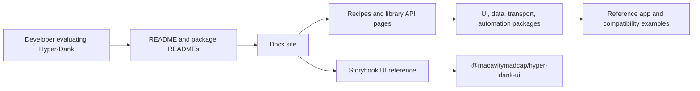

# pace-0060: Make Consumer Docs And Storybook Persuasive

## Header

| Field | Value |
| --- | --- |
| Epic | `pace-0060` |
| Branch | `pace-0060` |
| Status | Planned |
| Theme | Consumer-facing docs, package installation, Storybook clarity, GitHub tracking, and product positioning |
| Ticket Branches | `pace-0061`, `pace-0062`, `pace-0063`, `pace-0064`, `pace-0065`, `pace-0066`, `pace-0067` |
| Owner | `@Macavitymadcap` |
| Target PR | [#77](https://github.com/Macavitymadcap/hyper-dank/pull/77) |
| Last updated | 2026-05-21 |

## Summary

Make the Hyper-Dank packages, docs site, and Storybook useful as a working reference for a developer
building with JSX, Hono, Bun, and HTMX. The work should explain why Hyper-Dank exists, how a
downstream app can install or consume its libraries, which examples are reusable, and what each
public component or helper guarantees. It should also make the public copy sell the advantages of
Hyper-Dank without turning the docs into vague marketing material.

## Goals

- Explain the practical problem Hyper-Dank solves: building server-rendered, hypermedia-first apps
  with reusable UI, transport, data, automation, and content helpers instead of repeating the same
  app scaffolding in each project.
- Make the public docs answer the first adopter questions in order: what Hyper-Dank is, whether it
  is installable, which package to start with, how the packages compose, and where the limits are.
- Add clear installation and consumption guidance for the libraries, including whether they are
  published to npm, consumed from GitHub, or intended to be installed another way.
- Establish a real installation path for downstream apps before implementation work depends on
  Hyper-Dank packages. If npm publication remains deferred, the epic must provide a tested
  alternative such as GitHub Packages, GitHub release tarballs, or local package tarballs with clear
  limits.
- Turn package READMEs into compact adoption pages with install or pack guidance, import examples,
  export summaries, limits, and links to deeper API or Storybook reference.
- Make Storybook read as a consumer component reference rather than an internal demo shelf.
- Ensure Storybook pages use Hyper-Dank components where practical, react to theme or mode changes,
  and document accessibility expectations.
- Make component docs explain the full developer contract: props, public types, variants, slots or
  children, events or HTMX hooks, CSS hooks, accessibility requirements, theme behaviour, examples,
  and known limits.
- Improve docs-site navigation so recipes and libraries have comparable depth and structure.
- Add full library API documentation, including JSDoc-style breakdowns for exported functions,
  classes, variables, types, parameters, return values, and examples.
- Add a repeatable docs-quality check for broken internal links, stale package export references,
  private/internal leakage, and mismatches between package exports, docs pages, and Storybook
  coverage.
- Move project tracking towards GitHub Issues and GitHub Projects so day-to-day ticket state,
  assignees, labels, dependencies, and review workflow live in GitHub, while repository Markdown
  keeps durable epics, architecture decisions, and implementation records.
- Reconcile the historical ticket sequence before migrating tracking so skipped-looking IDs,
  parallel branches, implemented epics, and hotfix branches are explicitly accounted for.
- Tighten copy for a reasonably savvy developer who knows some JSX, Hono, Bun, and HTMX and wants
  to build a Hyper-Dank app.

## Captured Questions And Scope Notes

- Check whether the Testing Pipelines Storybook page is relevant to users of the Hyper-Dank
  libraries. If it is internal maintainer material, move it or reframe it.
- Check whether the reference map in Component Philosophy is useful to consumers of the library. If
  it stays, explain how a developer should use it.
- Explain what App Builder Reuse is for, or rename it to match the developer task it supports.
- Improve the icon catalogue format so icons are easier to scan, compare, and copy into examples.
- Explain the purpose of Surfaces and Metadata, Disclosure and Menu, and Second Wave Primitives. If
  they demonstrate useful primitives or composition patterns, add signposting and docs pages that
  say when to use them.
- Decide whether the About page is still needed. If it stays, make it serve a clear adopter-facing
  purpose rather than project history alone.
- Restructure recipes so they behave like library docs and show all required libraries for the
  recipe, not only UI.
- Make the libraries sidebar span the left-hand side and support expand/collapse behaviour.
- Review every docs page and Storybook docs page for theme/mode response, accessible semantics,
  useful headings, and task-oriented examples.
- Use the copywriting pass to make advantages explicit: why a developer would choose Hyper-Dank,
  what it saves them from rebuilding, and where its constraints are deliberate.

## Non-Goals

- Do not add new domain-specific primitives while improving examples.
- Do not turn public docs into private project archaeology.
- Do not overpromise package distribution until the actual publication or GitHub consumption route
  is verified and tested from outside the workspace.
- Do not make Storybook a replacement for package README installation guidance.
- Do not hide limitations. Hyper-Dank should be presented as an opinionated hypermedia-first
  framework layer, not a general SPA framework or a finished enterprise design system.
- Do not add a starter CLI or template repository in this epic. Capture those as follow-up
  candidates after the installable package contract is clear.
- Do not build broad release automation unless the selected downstream-app installation route
  requires a small, explicit publishing or packing step.
- Do not require GitHub Issues to replace all Markdown immediately. The migration should define the
  source of truth for future work, then leave historical docs intact unless a ticket explicitly
  archives or cross-links them.

## Improvement Themes

This epic should make Hyper-Dank easier to evaluate without changing its core architecture.

1. **Installable packages**: make Hyper-Dank consumable from another app through a tested,
   documented route, even if the final public npm publishing workflow is deferred.
2. **Adopter trust**: state the package status plainly, show what is stable, and document limits
   before readers have to infer them from source.
3. **Reference depth**: give each package a proper public contract, including exported types,
   helper behaviour, examples, errors, CSS hooks, and accessibility expectations where applicable.
4. **Navigation clarity**: make docs and Storybook feel like two connected surfaces: docs for
   framework and API guidance, Storybook for rendered UI behaviour.
5. **Reviewability**: add checks that keep the public docs from drifting away from package exports,
   Storybook stories, recipes, and README claims.
6. **Positioning**: explain the value of server-rendered JSX, Hono, HTMX, Bun scripts, and shared
   package boundaries in practical terms instead of generic productivity language.
7. **GitHub-native planning**: make GitHub Issues and Projects the operational system for tickets,
   status, dependencies, labels, and review flow, with Markdown docs serving as durable planning
   and architectural records.

## Ticket Plan

| Ticket | Branch | Scope | Acceptance Criteria |
| --- | --- | --- | --- |
| `pace-0061` | `pace-0061` | Audit consumer docs, Storybook, package READMEs, and package metadata | Findings classify every public surface, answer the captured questions, verify package consumption status, and produce an accepted docs/navigation/API coverage map |
| `pace-0062` | `pace-0062` | Establish package installation, distribution, and README contracts | A downstream app has a tested way to consume Hyper-Dank packages; root and package READMEs explain current npm/GitHub/package-tarball status, imports, CSS/subpath exports, peer dependencies, package limits, and links to docs/Storybook |
| `pace-0063` | `pace-0063` | Build full library API reference and docs consistency checks | Docs include JSDoc-style API pages for UI, data, transport, automation, and content helpers; checks catch stale exports, broken internal links, and private/internal leakage |
| `pace-0064` | `pace-0064` | Rework Storybook into a persuasive consumer component reference | Storybook docs use Hyper-Dank primitives where practical, component pages show contracts and accessibility notes, icons are easy to scan, and maintainer-only pages are moved or reframed |
| `pace-0065` | `pace-0065` | Improve docs navigation, libraries, recipes, and sidebar behaviour | Docs navigation makes libraries and recipes comparable, the library sidebar expands/collapses accessibly, recipes show all required libraries, and mobile/desktop docs remain usable |
| `pace-0066` | `pace-0066` | Complete positioning, copy, and public evidence review | Public copy explains the value and limits of Hyper-Dank in British English, and evidence screenshots/checks are attached where useful |
| `pace-0067` | `pace-0067` | Move project and ticket management towards GitHub Issues and Projects | Ticket history gaps are reconciled; issue/project templates, labels, status fields, cross-links, and migration rules are documented; future tickets have a GitHub-native source of truth |

## Architecture Notes

The docs should keep a clear split between public surfaces:

- `README.md` introduces the repository, installation, package availability, local development, and
  where to go next.
- Package READMEs explain install or consumption commands, imports, public exports, examples, and
  package-specific limits.
- The docs site explains framework philosophy, recipes, API reference, and app-building guidance.
- Storybook explains reusable UI components and composition patterns with rendered examples,
  controls, accessibility notes, and theme/mode states.
- Internal verification or maintainer-only material should live in contributor docs unless it helps
  a consumer build an app.

The copy should be concrete rather than ornamental. Prefer examples such as "build a Hono route that
returns an accessible HTMX fragment" over broad claims such as "ship faster".

## Public Surface Map

The implementation tickets should preserve the following ownership split:

- `pace-0062`, `README.md`, and package READMEs answer installation, package status, imports,
  compatibility, and next-link questions.
- `site/` explains why the system exists, how the packages compose, the API contract for non-UI
  helpers, and recipe-level adoption paths.
- Storybook documents rendered UI, component props, semantic output, accessibility expectations,
  theme behaviour, icons, and composition examples.
- Compatibility tests prove examples through public package paths, but public docs should not read
  like test implementation notes.
- Maintainer workflow and branch protection details stay in contributor docs unless they help an
  adopter understand a reusable helper.

## Ticket History Reconciliation

The docs-first branch flow has used a mixture of full epics, ticket branches, hotfix branches, and
parallel branches. Before moving ticket tracking to GitHub, `pace-0067` should account for these
facts:

- `pace-0001` has no local planning doc in this repository history.
- `pace-0002` is an implemented early production-foundations ticket without a parent epic field.
- `pace-0003` through `pace-0012` are represented in the current docs history.
- `pace-0013` through `pace-0016` were completed by the generic extraction and branding epic in
  PR #78, then merged before this epic moved to implementation.
- `pace-0017`, `pace-0018`, `pace-0019`, `pace-0028`, `pace-0029`, `pace-0039`, and `pace-0040`
  are implemented single-branch hotfix or cleanup epics with `None` or `N/A` ticket branches.
- `pace-0030` is not represented by a local doc and should be recorded as an unused/reserved number
  unless git/GitHub history proves otherwise.
- `pace-0050` through `pace-0059` are the implemented app-builder epic and tickets.
- `pace-0060` through `pace-0067` belong to this consumer docs, Storybook, and GitHub planning
  epic.

## Follow-Up Candidates

These are good Hyper-Dank improvements, but they should not block this epic unless the audit proves
one is required for truthful docs.

- Add a small starter template or generator once the docs can state the package contract clearly.
- Add generated API documentation from TypeScript source if hand-maintained API pages become too
  expensive to keep current.
- Add visual regression baselines for the Storybook component catalogue after the reference shape
  stabilises.
- Extract a reusable docs-site shell if another Hyper-Dank consumer needs the same navigation,
  Markdown, code highlighting, and theme behaviour.
- Add benchmark or bundle-size notes only if future consumers need objective comparison data.
- Automate GitHub issue/project creation from Markdown only after the desired GitHub workflow is
  proven manually.

## Integration Plan

- Keep `pace-0060` as the temporary epic branch targeting `main`.
- Branch `pace-0061` through `pace-0067` from `pace-0060`.
- Open ticket pull requests into `pace-0060`, then merge them back into the epic branch after
  checks pass.
- Do not start source-heavy polish tickets until `pace-0061` has accepted the docs surface map,
  package consumption truth, and Storybook classification.
- Mark the epic PR ready only after the docs site, package READMEs, Storybook reference, GitHub
  workflow plan, checks, screenshots where useful, and copy pass are complete.

## Verification

- `bun run check`
- `bun run typecheck`
- `bun test`
- `bun run build`
- `bun run test:storybook`
- `bun run test:a11y`
- `bun run test:compat`
- `bun run verify`
- Test the selected downstream-app installation route from outside the Hyper-Dank workspace, using
  public package names and the same package manager flow a consuming app will use.
- Run formatting, typechecking, unit tests, Storybook checks, and accessibility checks once
  implementation tickets make source changes.
- Review docs in light and dark mode.
- Check generated or manual API reference links.
- Check keyboard navigation for sidebar, menus, disclosure examples, and Storybook docs pages.
- Check GitHub issue/project templates, labels, milestones or project fields, and branch-to-issue
  cross-linking guidance before the GitHub workflow is adopted.
- Perform a copy pass with the `copywriting-style` skill before the epic is marked ready.

## Acceptance Criteria

- The root README and every package README clearly state package status, install or consumption
  route, public imports, CSS/subpath exports, peer dependencies, and package boundaries.
- A downstream app has a tested installation path for all Hyper-Dank packages it needs before it
  starts depending on this epic's outputs.
- Docs-site library pages provide full API reference coverage for exported non-UI helpers, types,
  classes, functions, parameters, return values, errors, and examples.
- Storybook reads as the consumer UI reference, with component contracts, theme behaviour,
  accessibility notes, examples, and an improved icon catalogue.
- Recipes name all required Hyper-Dank packages and make app-owned responsibilities explicit.
- Docs navigation and the library sidebar are accessible, responsive, and easy to scan.
- Automated or scripted checks catch broken docs links, stale package export references, and
  public/private boundary leaks where practical.
- GitHub Issues and Projects have a documented workflow for future epics/tickets, including labels,
  templates, status fields, branch naming, PR links, migration rules, and the remaining role of
  Markdown planning docs.
- Historical ticket numbering is reconciled so future GitHub tracking can distinguish active
  branches, implemented docs, hotfix epics, unused numbers, and parallel work.
- Public copy explains why Hyper-Dank exists, what it saves from being rebuilt, where it is
  intentionally constrained, and what remains unfinished.
- `bun run verify` passes before the epic PR is marked ready.

## Assumptions

- The intended reader is a capable developer who may not know this repository but is at least
  somewhat familiar with JSX, Hono, Bun, and HTMX.
- Installation guidance must be discovered from the actual package publication state before final
  copy is written.
- `pace-0013` completed the generic extraction and branding slice; this epic owns the broader docs,
  installation, GitHub workflow, and Storybook reference overhaul.
