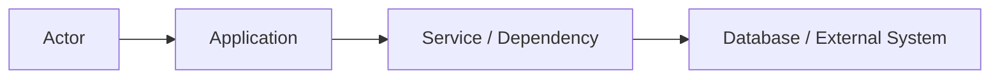
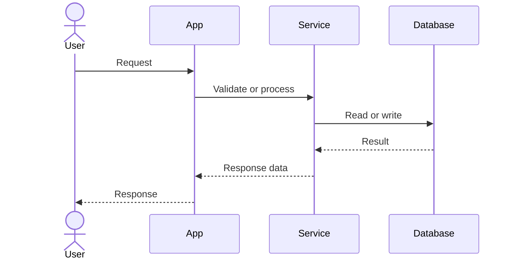
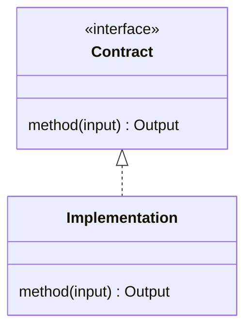

# <ticket-id>: <title>

## Header

| Field | Value |
| --- | --- |
| Ticket | `<ticket-id>` |
| Branch | `<branch-name>` |
| Parent Epic | `<epic-id>` |
| Base Branch | `<epic-branch>` |
| Status | Planned |
| Theme | <short theme> |
| Milestones | <count or summary> |
| Primary stack | <stack/tools> |
| Owner | <owner> |
| Target PR | <link or TBD> |
| Last updated | <YYYY-MM-DD> |

## Summary

<One short paragraph describing the intended outcome.>

## Goals

- <Goal>
- <Goal>
- <Goal>

## Non-Goals

- <Explicitly out-of-scope item>
- <Explicitly out-of-scope item>

## Milestones

| # | Commit Theme | Scope | Acceptance Criteria |
| --- | --- | --- | --- |
| 1 | `<type(scope): summary>` | <scope> | <criteria> |
| 2 | `<type(scope): summary>` | <scope> | <criteria> |

## Affected Components

Use this section when a change touches runtime code, UI components, data models, scripts, deployment, or docs that reviewers should inspect deliberately. For docs-only or tiny tooling changes, mark non-applicable areas as `N/A`.

| Component / Area | Change Type | Notes | Verification |
| --- | --- | --- | --- |
| App composition | Modified / Added / N/A | <entrypoint, dependency injection, route factory impact> | <tests/checks> |
| Data layer | Modified / Added / N/A | <repositories, providers, migrations, schemas> | <tests/checks> |
| UI components | Modified / Added / N/A | <pages, forms, tables, admin screens> | <tests/checks> |
| Auth / permissions | Modified / Added / N/A | <guards, sessions, roles> | <tests/checks> |
| Scripts / tooling | Modified / Added / N/A | <package scripts, migrations, seeds, CI> | <tests/checks> |
| Deployment | Modified / Added / N/A | <Docker, hosting, env vars, health checks> | <tests/checks> |
| Documentation | Modified / Added / N/A | <README, architecture, ticket docs> | <review/checks> |

## System Data Flow

## Sequence Flow

## Class / Interface Diagram

## Data Tables

### Environment Variables

| Variable | Required | Purpose |
| --- | --- | --- |
| `<ENV_NAME>` | Yes / No | <purpose> |

### Routes

| Route | Access | behaviour |
| --- | --- | --- |
| `<METHOD /path>` | <public/auth/admin> | <behaviour> |

### Permissions

| Capability | User | Admin |
| --- | --- | --- |
| <Capability> | Yes / No | Yes / No |

### Database Tables

| Table | Purpose | Ownership Notes |
| --- | --- | --- |
| `<table>` | <purpose> | <ownership/scope> |

## Test Matrix

| Area | Test Layer | Expected Coverage |
| --- | --- | --- |
| <area> | <unit/integration/app/a11y/manual> | <coverage> |

## Rollout Notes

- <Migration or deployment note>
- <Seed/setup note>
- <Rollback or monitoring note>

## Assumptions

- <Assumption>
- <Assumption>
