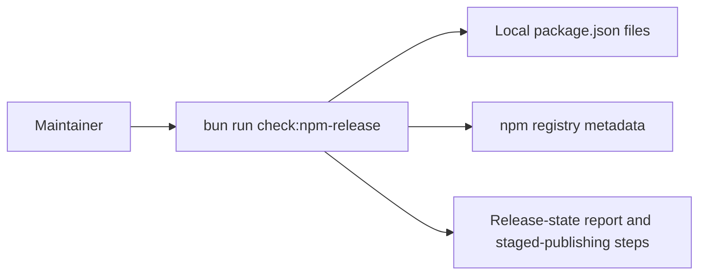

# hd-0041: Check npm Release State

## Header

| Field | Value |
| --- | --- |
| Ticket | `hd-0041` |
| Branch | `hd-0041-check-npm-release-state` |
| Parent Epic | `hd-0040` |
| Base Branch | `hd-0040-package-release-evidence` |
| Status | Implemented |
| Theme | npm release-state script and staged publication runbook |
| Milestones | 3 implementation slices |
| Primary stack | Bun script, npm registry metadata, package scripts, Markdown docs |
| Owner | `@Macavitymadcap` |
| Target PR | TBD |
| Last updated | 2026-05-24 |

## Summary

Add a repeatable maintainer command that compares local Hyper-Dank package versions with npm and
prints the staged publication process when a local package set has not reached the public registry.

## Goals

- Add `bun run check:npm-release` as the release-state command.
- Compare `libs/components`, `libs/database`, `libs/http`, and `libs/scripts` package versions
  against npm latest versions.
- Exit non-zero when local package versions are ahead of npm or behind npm.
- Print the existing staged-publishing process rather than publishing from a local machine.
- Capture the 2026-05-24 finding that local `0.3.0` packages are ahead of npm `0.2.0`.

## Non-Goals

- No token handling, local publish command, or registry mutation.
- No automatic GitHub Actions dispatch.
- No package version bump.
- No changes to Release Please configuration.

## Milestones

| # | Commit Theme | Scope | Acceptance Criteria |
| --- | --- | --- | --- |
| 1 | `build(release): check npm package versions` | Add a Bun script that reads package manifests and npm registry metadata | The command reports package, local version, npm latest, and status for each public package |
| 2 | `docs(release): capture package publication runbook` | Add epic and ticket notes for the repeatable staged publication process | The planning docs describe when to run the check, how to publish, and how to confirm completion |
| 3 | `test(release): verify release-state command` | Run the new command against npm and existing package checks | The command identifies local `0.3.0` packages as needing release while npm latest is `0.2.0` |

## Affected Components

| Component / Area | Change Type | Notes | Verification |
| --- | --- | --- | --- |
| App composition | N/A | No app route or runtime entrypoint changes | N/A |
| Data layer | N/A | No repository, provider, migration, or schema changes | N/A |
| UI components | N/A | No rendered component changes | N/A |
| Auth / permissions | N/A | No auth changes | N/A |
| Scripts / tooling | Added | `apps/walking-pace/scripts/check-npm-release.ts` and `check:npm-release` package script | `bun run check:npm-release` |
| Deployment | Reviewed | Existing `.github/workflows/publish-npm.yml` remains the publication mechanism | Workflow review |
| Documentation | Added | `docs/epics/hd-0040.md` and this ticket | Markdown review |

## System Data Flow

## Test Matrix

| Area | Test Layer | Expected Coverage |
| --- | --- | --- |
| Registry comparison | Manual command | Local versions ahead of npm latest are reported as `release needed` |
| Package metadata | Existing script | Publishing metadata still passes `bun run check:publishing` |
| Tarball consumption | Existing script | Package tarballs still install and import through `bun run test:packages` |

## Rollout Notes

- Run `bun run check:npm-release` before starting a package release.
- If the command reports `release needed`, run `bun run check:publishing` and `bun run test:packages`.
- Publish through the existing GitHub Actions `Publish npm packages` workflow with
  `release_mode=stage-unpublished-packages`, or publish the Release Please GitHub release that
  triggers that workflow.
- Approve the staged npm packages in npm, then re-run `bun run check:npm-release`.

## Assumptions

- npm latest is the maintainer-facing signal that the public package pages have caught up.
- The publish workflow can skip exact package versions that already exist on npm.
- The script may require network access and should not be folded into offline verification.
