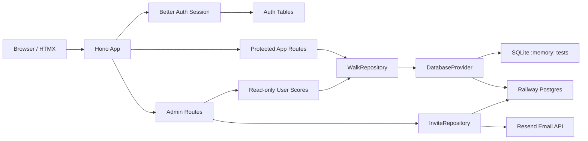
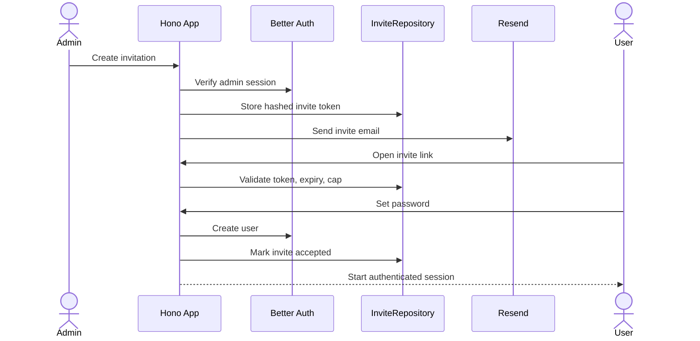
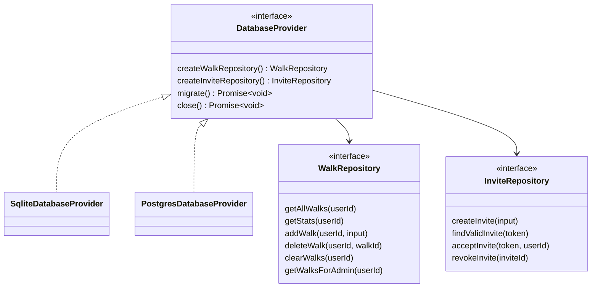
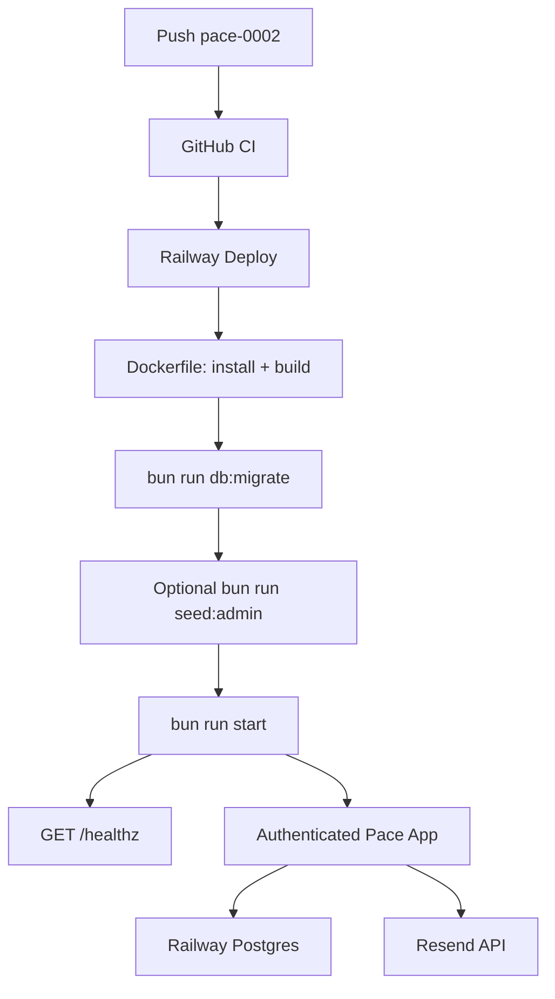

# pace-0002: Production Foundations

## Header

| Field | Value |
| --- | --- |
| Ticket | `pace-0002` |
| Branch | `pace-0002` |
| Status | Planned |
| Theme | Quality gates, Postgres, auth, Railway deployment |
| Milestones | 4 commits |
| Primary stack | Bun, Hono, HTMX, Better Auth, Postgres, Railway |
| Owner | `@Macavitymadcap` |
| Target PR | TBD |
| Last updated | 2026-05-16 |

## Summary

Add production-ready foundations: Biome linting/formatting, a database provider layer with SQLite for tests and Postgres for production, Better Auth with invitations and user-scoped walk data, and Railway deployment support.

## Goals

- Add Biome as formatter/linter and wire it into CI.
- Add database providers for SQLite tests and Postgres production.
- Move production persistence to Railway Postgres.
- Add Better Auth login, sessions, roles, admin users, and Resend invitations.
- Scope walk data by user.
- Allow admins to manage accounts and read other users' scores without editing them.
- Add first-admin seeding and Railway deployment docs.

## Non-Goals

- No social login.
- No public self-signup.
- No admin editing of other users' walks.
- No advanced reporting dashboard.
- No multi-tenant organizations.

## Milestones

| # | Commit Theme | Scope | Acceptance Criteria |
| --- | --- | --- | --- |
| 1 | `build: add biome quality checks` | Add Biome config, scripts, formatting pass, CI check | `bun run check`, typecheck, tests pass |
| 2 | `feat(db): add database providers and postgres` | Add provider interface, async repositories, migrations, Postgres implementation | SQLite tests still work; Postgres supports production |
| 3 | `feat(auth): add better auth and invitations` | Add Better Auth, sessions, roles, custom invites, Resend, user-scoped walks | Users can log in, accept invites, and only mutate own walks |
| 4 | `chore(deploy): add railway deployment support` | Add Dockerfile, health route, env docs, Railway start flow, admin seed command | App deploys to Railway with Postgres migrations |

## Affected Components

| Component / Area | Change Type | Notes | Verification |
| --- | --- | --- | --- |
| App composition | Modified | `createApp` gains auth/session dependencies and async route handling | App and HTMX tests |
| Data layer | Modified | Database provider interface, SQLite provider, Postgres provider, async repositories | SQLite and Postgres repository tests |
| Walk UI | Modified | Walks become user-scoped; admin read-only views omit mutation controls | Component and route tests |
| Auth / permissions | Added | Better Auth sessions, roles, invite acceptance, protected routes | Auth and permission tests |
| Admin UI | Added | Invite users, manage accounts, view read-only scores | Admin route/component tests |
| Scripts / tooling | Modified | Biome scripts, migrations, seed command, CI checks | `bun run check`, tests, CI |
| Deployment | Added | Railway Dockerfile/start flow, env docs, health route | Docker/Railway smoke checks |
| Documentation | Modified | Ticket docs, README/architecture/deployment notes | Markdown review |

## System Data Flow

## Sequence Flow

## Class / Interface Diagram

## Railway Deployment Flow

## Data Tables

### Environment Variables

| Variable | Required | Purpose |
| --- | --- | --- |
| `PORT` | Yes | HTTP port supplied by Railway |
| `DATABASE_URL` | Production | Railway Postgres connection string |
| `BETTER_AUTH_SECRET` | Production | Auth signing/encryption secret |
| `BETTER_AUTH_URL` | Production | Public app URL |
| `RESEND_API_KEY` | Production | Send invitation/password emails |
| `EMAIL_FROM` | Production | Verified sender address |
| `USER_LIMIT` | Yes | Defaults to `10` |
| `ADMIN_EMAIL` | Seed only | First admin email |
| `ADMIN_PASSWORD` | Seed only | First admin password |
| `NODE_ENV` | Production | Enables production auth/email behavior |

### Routes

| Route | Access | Behavior |
| --- | --- | --- |
| `GET /login` | Public | Render login form |
| `/api/auth/*` | Public/Auth-managed | Better Auth endpoints |
| `GET /invite/:token` | Public | Render invite acceptance form |
| `POST /invite/:token` | Public | Accept invitation and create account |
| `GET /` | Authenticated | Current user dashboard |
| `GET /stats` | Authenticated | Current user stats fragment |
| `POST /walks` | Authenticated | Add current user walk |
| `DELETE /walks/:id` | Authenticated | Delete current user walk only |
| `DELETE /walks` | Authenticated | Clear current user walks only |
| `GET /admin` | Admin | Manage accounts and view read-only scores |
| `POST /admin/invites` | Admin | Create invitation |
| `POST /admin/invites/:id/revoke` | Admin | Revoke pending invitation |
| `POST /admin/users/:id/role` | Admin | Change user/admin role |
| `POST /admin/users/:id/ban` | Admin | Ban user |
| `POST /admin/users/:id/unban` | Admin | Unban user |
| `GET /healthz` | Public | Deployment health check |

### Permissions

| Capability | User | Admin |
| --- | --- | --- |
| Log in/out | Yes | Yes |
| Add own walks | Yes | Yes |
| Delete own walks | Yes | Yes |
| View own stats | Yes | Yes |
| View other users' stats | No | Yes |
| Edit other users' walks | No | No |
| Invite users | No | Yes |
| Revoke invitations | No | Yes |
| Ban/unban users | No | Yes |
| Change roles | No | Yes |

### Database Tables

| Table | Purpose | Ownership Notes |
| --- | --- | --- |
| `walks` | Stores miles, duration, created date | Includes `user_id`; normal queries filter by it |
| Better Auth tables | Users, accounts, sessions | Managed through Better Auth schema |
| `invitations` | Custom invite tokens and metadata | Stores hashed token, email, role, expiry, status |
| `schema_migrations` | Migration bookkeeping | Used by `bun run db:migrate` |

## Test Matrix

| Area | Test Layer | Expected Coverage |
| --- | --- | --- |
| Biome | CI/script | Check fails on lint or format drift |
| SQLite provider | Repository tests | In-memory CRUD and stats still pass |
| Postgres provider | Integration tests | Same repository contract works against Postgres |
| User scoping | Route/repository tests | Users cannot read/delete/clear other users' walks |
| Auth guard | App tests | Protected routes reject unauthenticated requests |
| Invitations | App/repository tests | Valid, expired, revoked, used, and over-cap invites |
| Admin | App tests | Admin can manage accounts and read scores only |
| Railway | Smoke/manual | Docker build, migrations, `/healthz`, app boot |

## Rollout Notes

- Run Biome formatting before other implementation commits to reduce diff noise.
- Convert repository methods to async before adding Postgres.
- Keep SQLite provider for fast local and test usage.
- Run migrations before app start in Railway.
- Seed the first admin with `bun run seed:admin`.
- Use Railway usage limits/alerts manually in the dashboard.
- Keep `USER_LIMIT=10` as an env-controlled limit so the template can scale later.

## Assumptions

- The 10-user cap includes admins and pending invitations.
- Resend is the production email provider.
- Better Auth owns sessions and core auth tables.
- Custom app tables own invitations and walk data.
- Admins can view scores but cannot mutate another user's walk history.
