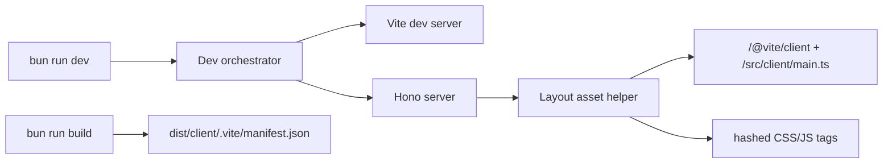

# pace-0006: Add Vite Browser Asset Pipeline

## Header

| Field | Value |
| --- | --- |
| Ticket | `pace-0006` |
| Branch | `pace-0006` |
| Parent Epic | `pace-0005` |
| Base Branch | `pace-0005` |
| Status | Implemented |
| Theme | Vite-managed CSS, client JS, and public assets |
| Milestones | 3 commits |
| Primary stack | Bun, Hono, Vite, TypeScript, CSS |
| Owner | `@Macavitymadcap` |
| Target PR | TBD |
| Last updated | 2026-05-17 |

## Summary

Introduce Vite as the browser asset pipeline for the server-rendered app, replacing server-injected CSS strings and CDN-loaded client assets with local, buildable CSS and JavaScript while keeping Hono + Bun as the app runtime.

## Goals

- Add `vite.config.ts`, `public/`, a client entry, and a CSS entry.
- Move component and layout styles from TS string aggregation into Vite-managed CSS imports.
- Update `Layout` to inject Vite dev-server assets locally and manifest assets in production.
- Add build and dev scripts that run Vite alongside the Bun/Hono server.
- Update Docker/Railway build flow so production assets exist before `bun run start`.

## Non-Goals

- No SPA shell, client-side route ownership, or hydration layer.
- No Storybook setup in this ticket.
- No migration from Bun's test runner to Vitest.
- No visual redesign beyond preserving current styles in CSS files.

## Milestones

| # | Commit Theme | Scope | Acceptance Criteria |
| --- | --- | --- | --- |
| 1 | `build(vite): add browser asset pipeline` | Add Vite config, `src/client/main.ts`, `src/client/styles.css`, `public/`, `build`, `dev:assets`, and app/dev orchestration scripts | Local dev serves Hono pages with Vite client assets and production build emits `dist/client/.vite/manifest.json` |
| 2 | `style(css): move component styles to vite` | Convert colocated `*.styles.ts` modules into CSS files imported by the client CSS entry; remove `appStyles` injection | Existing component and route tests pass, and rendered pages keep current class contracts |
| 3 | `chore(deploy): build vite assets for production` | Add manifest helper/static serving, update `Layout`, Dockerfile, Railway docs, and ignored generated artifacts | `bun run build`, `bun run start`, and deployment smoke checks can serve hashed assets |

## Affected Components

| Component / Area | Change Type | Notes | Verification |
| --- | --- | --- | --- |
| App composition | Modified | `Layout` renders Vite dev tags or production manifest tags instead of inline `appStyles` | App route tests, manual local dev |
| Data layer | N/A | No database changes | N/A |
| UI components | Modified | Styles move to CSS files while markup/class names stay stable | Component tests, app screenshots |
| Auth / permissions | N/A | No auth behaviour changes | N/A |
| Scripts / tooling | Added | Add Vite scripts and a dev script that starts Vite plus Hono together | `bun run build`, `bun run dev` |
| Deployment | Modified | Dockerfile must install build dependencies, run Vite build, and retain `dist/client` | Docker/Railway smoke |
| Documentation | Modified | README and architecture notes explain browser asset ownership | Markdown review |

## System Data Flow

## Data Tables

### Environment Variables

| Variable | Required | Purpose |
| --- | --- | --- |
| `VITE_DEV_SERVER_URL` | Dev only | URL used by the Hono layout to inject Vite dev assets |
| `VITE_PORT` | No | Optional Vite dev server port, defaulting to `5173` |

### Routes

| Route | Access | behaviour |
| --- | --- | --- |
| `/assets/*` | Public | Serves Vite-built production assets from `dist/client/assets` |
| `/<public-file>` | Public | Serves selected public root files copied from `public/` where needed |

## Test Matrix

| Area | Test Layer | Expected Coverage |
| --- | --- | --- |
| Asset tags | App tests | Development and production branches render correct script/link tags |
| CSS migration | Component/app tests | Markup contracts remain stable after style files move |
| Production build | Script check | `bun run build` emits manifest and assets |
| Runtime smoke | Manual/script | `bun run start` serves pages and built assets after build |

## Rollout Notes

- Preserve current class names to keep existing tests and screenshots meaningful.
- Keep a tiny inline theme bootstrap if needed to prevent theme flash before bundled JS loads.
- Update `.gitignore` for generated Vite output only if current `dist` ignore is insufficient.

## Assumptions

- Vite builds only browser assets; Bun still runs the server TypeScript source.
- HTMX should become a local package import through the client entry instead of a CDN script.
- Open Props CSS should be imported through the Vite CSS entry where practical.
