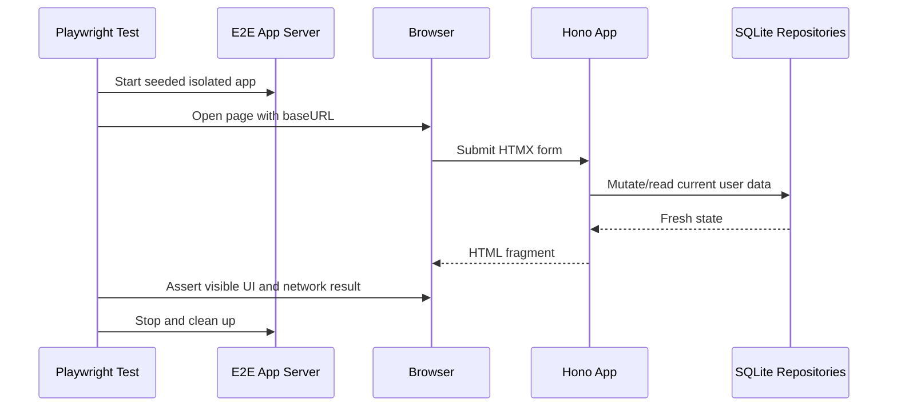

# pace-0007: Add Playwright E2E And Screenshot Consolidation

## Header

| Field | Value |
| --- | --- |
| Ticket | `pace-0007` |
| Branch | `pace-0007` |
| Parent Epic | `pace-0005` |
| Base Branch | `pace-0005` |
| Status | Implemented |
| Theme | Browser E2E tests and one automation stack |
| Milestones | 3 commits |
| Primary stack | Playwright, Bun, Hono, HTMX |
| Owner | `@Macavitymadcap` |
| Target PR | TBD |
| Last updated | 2026-05-17 |

## Summary

Add Playwright as the first-class browser automation layer, cover core app workflows with E2E tests, and port PR screenshot capture away from direct Puppeteer usage.

## Goals

- Add Playwright configuration, scripts, reports, and ignored artifacts.
- Start deterministic E2E app servers with seeded users and an isolated database.
- Cover login, walk creation, HTMX stats refresh, row deletion, clear-all, and admin read-only score review in browser tests.
- Port `scripts/add-pr-screenshots.ts` and screenshot flow helpers from Puppeteer APIs to Playwright APIs.
- Remove direct `puppeteer` imports and the direct `puppeteer` dev dependency if no project-owned code needs it.

## Non-Goals

- No full visual regression baseline system.
- No replacement of Pa11y in this ticket.
- No cross-browser CI matrix beyond Chromium unless it is effectively free.
- No changes to app permissions or route behaviour.

## Milestones

| # | Commit Theme | Scope | Acceptance Criteria |
| --- | --- | --- | --- |
| 1 | `test(e2e): add playwright foundation` | Add `@playwright/test`, `playwright.config.ts`, `test:e2e`, `test:e2e:ui`, and deterministic server startup | `bun run test:e2e` launches the app and runs a passing smoke test |
| 2 | `test(e2e): cover core htmx workflows` | Add browser tests for auth, walk mutations, stats refresh, and admin score review | Tests assert visible UI, fragment updates, and current-user scoping through browser interactions |
| 3 | `chore(screenshots): port pr screenshots to playwright` | Replace Puppeteer screenshot code with Playwright while keeping existing CLI flags and output paths | `bun run screenshots:pr -- --no-update-pr` writes the same flow/state image set |

## Affected Components

| Component / Area | Change Type | Notes | Verification |
| --- | --- | --- | --- |
| App composition | Modified | Add E2E server script or config using existing app harness patterns | `bun run test:e2e` |
| Data layer | N/A | E2E server uses isolated SQLite but does not change repositories | E2E setup/teardown |
| UI components | N/A | Tests exercise existing UI without changing component contracts | Browser assertions |
| Auth / permissions | N/A | Tests seed auth users and verify browser-visible permission boundaries | E2E admin/user tests |
| Scripts / tooling | Modified | Screenshot script switches to Playwright; Puppeteer direct dependency removed when possible | Screenshot command |
| Deployment | N/A | No production deploy change | N/A |
| Documentation | Modified | README and PR template describe E2E and screenshot commands | Markdown review |

## Sequence Flow

## Data Tables

### Environment Variables

| Variable | Required | Purpose |
| --- | --- | --- |
| `E2E_PORT` | No | Port for Playwright-managed app server |
| `PLAYWRIGHT_BASE_URL` | No | Allows tests to target an already-running app instead of starting one |
| `PR_SCREENSHOT_PORT` | No | Port for PR screenshot app server |
| `PR_SCREENSHOT_DIR` | No | Overrides screenshot output directory |

## Test Matrix

| Area | Test Layer | Expected Coverage |
| --- | --- | --- |
| Auth | E2E | User can sign in and protected pages redirect when unauthenticated |
| Walk workflows | E2E | Add/delete/clear walks update the table and stats in browser |
| Admin review | E2E | Admin can view another user's scores without mutation controls |
| Screenshots | Script smoke | Existing screenshot flows write light/dark images with Playwright |
| Tooling | Static/check | No project-owned Puppeteer imports remain |

## Rollout Notes

- Keep existing screenshot flow names and output paths so PR template image tables continue to work.
- Use Playwright traces on first retry or retain-on-failure for CI debugging.
- Keep Chromium as the required CI browser; document how to run other browsers locally.

## Assumptions

- Direct Puppeteer removal means no project-owned script imports Puppeteer. Pa11y may still install Puppeteer internally.
- The current screenshot dimensions and user agent should be preserved during the port unless Playwright device presets provide an exact or better match.
