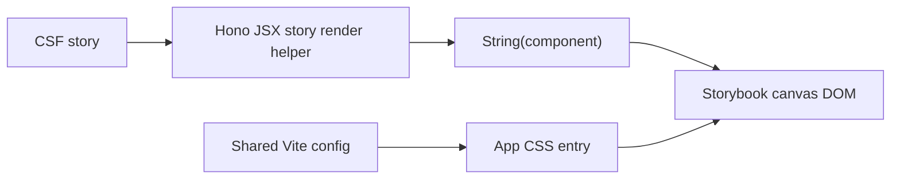

# pace-0008: Add Storybook Component Workshop

## Header

| Field | Value |
| --- | --- |
| Ticket | `pace-0008` |
| Branch | `pace-0008` |
| Parent Epic | `pace-0005` |
| Base Branch | `pace-0005` |
| Status | Implemented |
| Theme | Storybook for server-rendered component states |
| Milestones | 2 commits |
| Primary stack | Storybook, Vite, Hono JSX, TypeScript |
| Owner | `@Macavitymadcap` |
| Target PR | TBD |
| Last updated | 2026-05-17 |

## Summary

Add a Storybook workshop that renders Hono JSX components in isolation using the shared Vite asset pipeline, giving the template a browsable component and page-state catalogue without changing app runtime behaviour.

## Goals

- Add Storybook with the Vite-powered HTML renderer and shared Vite config.
- Add a story render helper that converts Hono JSX nodes into DOM with `String(node)`.
- Load the same app CSS entry and light/dark theme globals in Storybook preview.
- Add stories for reusable atoms/molecules and important app states.
- Add Storybook build and story test scripts suitable for CI.

## Non-Goals

- No React migration for components or stories.
- No Chromatic or hosted visual review service in this ticket.
- No replacement for Playwright E2E tests.
- No app data fetching or live database dependency inside stories.

## Milestones

| # | Commit Theme | Scope | Acceptance Criteria |
| --- | --- | --- | --- |
| 1 | `build(storybook): add hono jsx workshop` | Add Storybook config, preview, render helper, scripts, and CSS/theme wiring | `bun run storybook:build` succeeds and displays server-rendered components |
| 2 | `test(storybook): document component states` | Add stories for generic primitives, walk UI, auth forms, admin states, and story tests | `bun run test:storybook` passes and stories cover light/dark review states |

## Affected Components

| Component / Area | Change Type | Notes | Verification |
| --- | --- | --- | --- |
| App composition | N/A | Storybook does not alter app route registration | N/A |
| Data layer | N/A | Stories use static fixtures only | Story review |
| UI components | Added | Stories render existing components and states in isolation | Storybook build/tests |
| Auth / permissions | N/A | Auth state is represented through fixture props only | Story review |
| Scripts / tooling | Added | Add `storybook`, `storybook:build`, and `test:storybook` scripts | Commands pass |
| Deployment | N/A | Storybook is local/CI tooling, not deployed by Railway | N/A |
| Documentation | Modified | README explains story workflow and scope | Markdown review |

## System Data Flow

## Test Matrix

| Area | Test Layer | Expected Coverage |
| --- | --- | --- |
| Story rendering | Storybook build | All stories render without runtime errors |
| Story tests | Storybook/Vitest | Render tests pass for documented states |
| Theme globals | Storybook manual/test | Light and dark previews apply the same CSS variable model as the app |
| Fixture safety | Static review | Stories do not require real auth, email, or database providers |

## Rollout Notes

- Prefer stories colocated with components unless a shared `stories/` directory is clearer for page-state fixtures.
- Reuse local dev fixture data from `src/envs/local` where it helps keep screenshots, stories, and E2E states aligned.
- Keep story controls modest for server-rendered components; fixed named states are more valuable than broad arg surfaces.

## Assumptions

- Storybook uses the shared Vite CSS entry introduced in `pace-0006`.
- Story tests complement Bun component tests and Playwright E2E tests rather than replacing them.
