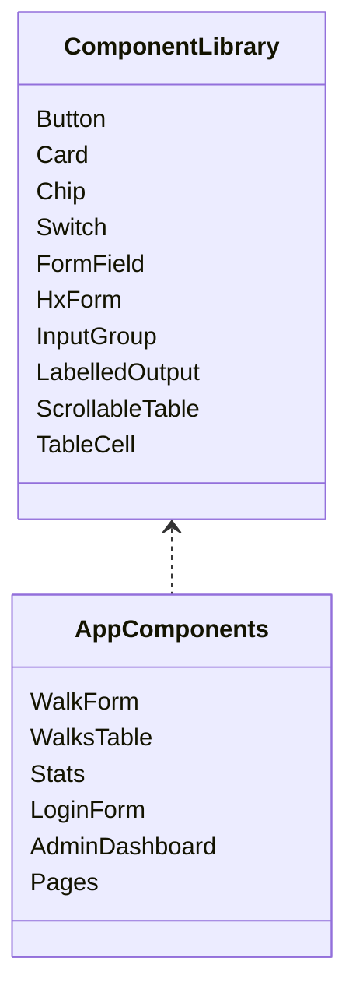

# pace-0009: Create Generic Component Library Boundary

## Header

| Field | Value |
| --- | --- |
| Ticket | `pace-0009` |
| Branch | `pace-0009` |
| Parent Epic | `pace-0005` |
| Base Branch | `pace-0005` |
| Status | Implemented |
| Theme | Reusable component exports and generic primitives |
| Milestones | 2 commits |
| Primary stack | Hono JSX, TypeScript, CSS |
| Owner | `@Macavitymadcap` |
| Target PR | TBD |
| Last updated | 2026-05-17 |

## Summary

Separate app-agnostic components from route/page-facing exports so the template has a clearer reusable component library without publishing a separate package.

## Goals

- Add a stable component-library export boundary for generic atoms and molecules.
- Export useful prop types for reusable components.
- Introduce a generic table cell component and keep domain-specific walk table code as a consumer.
- Keep existing page and organism exports available for app routes.
- Document what belongs in atoms, molecules, organisms, pages, templates, and the library boundary.

## Non-Goals

- No npm package publishing or monorepo split.
- No redesign of component visuals.
- No Storybook setup in this ticket.
- No broad renaming of every domain component.

## Milestones

| # | Commit Theme | Scope | Acceptance Criteria |
| --- | --- | --- | --- |
| 1 | `refactor(components): add library export boundary` | Add a generic component export module, exported prop types, and update imports where useful | App routes keep working and reusable components have a stable import path |
| 2 | `refactor(table): genericise table cell primitive` | Add `TableCell` and keep or migrate `WalksCell` as a compatibility/domain wrapper | Existing table tests pass and generic table pieces appear in Storybook/docs |

## Affected Components

| Component / Area | Change Type | Notes | Verification |
| --- | --- | --- | --- |
| App composition | N/A | No route factory changes | N/A |
| Data layer | N/A | No persistence changes | N/A |
| UI components | Modified | Exports and generic primitives are clarified without changing rendered semantics | Component tests |
| Auth / permissions | N/A | No auth changes | N/A |
| Scripts / tooling | N/A | No new scripts | Existing checks |
| Deployment | N/A | No deployment changes | N/A |
| Documentation | Modified | Architecture docs explain component library boundary | Markdown review |

## Class / Interface Diagram

## Test Matrix

| Area | Test Layer | Expected Coverage |
| --- | --- | --- |
| Export boundary | Typecheck | Reusable components and prop types import cleanly |
| Markup stability | Component tests | Existing HTML/class contracts stay stable |
| Table primitive | Component tests | Generic cell renders expected table markup |
| Docs | Review | Component placement rules are clear for future template users |

## Rollout Notes

- Keep `src/components/index.ts` as the app-facing export boundary.
- Add a separate library-facing boundary such as `src/components/library.ts`.
- Avoid import churn in unrelated files unless it clarifies the intended boundary.

## Assumptions

- App-specific organisms and pages remain in this repository; only generic primitives are prepared for reuse.
- Compatibility aliases are acceptable where they reduce churn.
