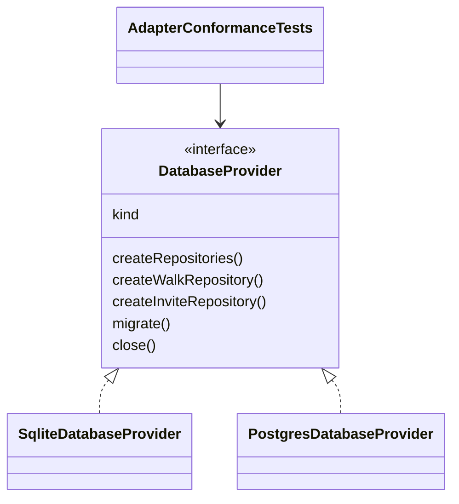

# pace-0010: Formalize Database Adapter Contract

## Header

| Field | Value |
| --- | --- |
| Ticket | `pace-0010` |
| Branch | `pace-0010` |
| Parent Epic | `pace-0005` |
| Base Branch | `pace-0005` |
| Status | Implemented |
| Theme | Database provider contracts and adapter authoring |
| Milestones | 2 commits |
| Primary stack | Bun, TypeScript, SQLite, Postgres |
| Owner | `@Macavitymadcap` |
| Target PR | TBD |
| Last updated | 2026-05-17 |

## Summary

Clarify the database adapter model so SQLite and Postgres are obvious examples of the same provider contract, and future templates can add new adapters without rediscovering repository lifecycle rules.

## Goals

- Document the required `DatabaseProvider`, repository, migration, and cleanup behaviours.
- Add shared adapter conformance checks used by SQLite and Postgres provider tests.
- Keep environment-based provider selection simple and explicit.
- Add adapter authoring docs for future database backends.
- Preserve existing SQLite local/test and Postgres production behaviour.

## Non-Goals

- No MySQL, libSQL, D1, or other third adapter in this epic.
- No schema migration rewrite.
- No repository method expansion unless required for contract clarity.
- No production data migration.

## Milestones

| # | Commit Theme | Scope | Acceptance Criteria |
| --- | --- | --- | --- |
| 1 | `test(db): add adapter conformance checks` | Add reusable provider/repository contract tests for lifecycle, factories, migrations, and user scoping | SQLite and Postgres provider tests both exercise the shared contract |
| 2 | `docs(db): document adapter contract` | Add adapter authoring docs and update architecture notes around provider selection | Docs explain how to add an adapter and what behaviour must be verified |

## Affected Components

| Component / Area | Change Type | Notes | Verification |
| --- | --- | --- | --- |
| App composition | N/A | Provider selection remains env based | Existing app tests |
| Data layer | Modified | Contract tests and docs clarify provider expectations | DB provider/repository tests |
| UI components | N/A | No UI changes | N/A |
| Auth / permissions | N/A | Auth storage behaviour unchanged | Existing auth tests |
| Scripts / tooling | N/A | Migration command remains the same | `bun run db:migrate` review |
| Deployment | N/A | Railway still uses `DATABASE_URL` for Postgres | Existing deploy docs |
| Documentation | Added | Add adapter authoring guide | Markdown review |

## Class / Interface Diagram

## Test Matrix

| Area | Test Layer | Expected Coverage |
| --- | --- | --- |
| Provider factories | Unit/integration | Env selection and repository factories remain correct |
| Migrations | Provider tests | Providers create migration bookkeeping and skip applied migrations |
| Lifecycle | Provider tests | Providers close resources without leaking handles |
| Repository contract | Shared tests | Walk and invite repositories satisfy user-scoped expectations |
| Docs | Review | Adapter guide is enough to plan a future third adapter |

## Rollout Notes

- Prefer shared test helpers over duplicating SQLite/Postgres expectations.
- Use fake/stub Postgres pools where live Postgres is not already required.
- Keep concrete SQL differences in adapter implementations, not in app routes.

## Assumptions

- The current `DatabaseProvider` shape is broadly correct and needs formalizing more than redesigning.
- Future adapters should prove compatibility through tests before being wired into env selection.
