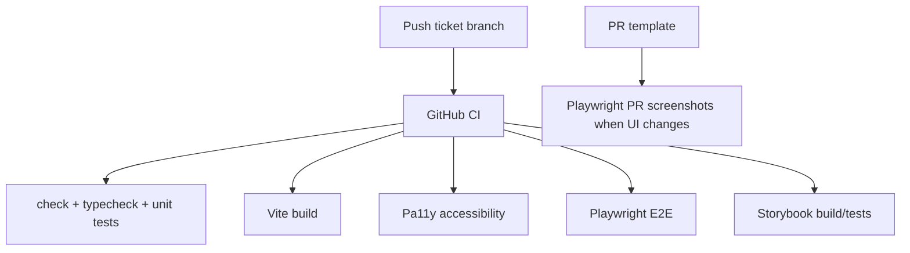

# pace-0011: Update Template Docs And CI Polish

## Header

| Field | Value |
| --- | --- |
| Ticket | `pace-0011` |
| Branch | `pace-0011` |
| Parent Epic | `pace-0005` |
| Base Branch | `pace-0005` |
| Status | Implemented |
| Theme | Documentation, CI, and review workflow for template DX |
| Milestones | 2 commits |
| Primary stack | GitHub Actions, Markdown, Bun scripts |
| Owner | `@Macavitymadcap` |
| Target PR | TBD |
| Last updated | 2026-05-17 |

## Summary

Update repository documentation, CI, ignored artifacts, and review templates so the new Vite, Playwright, Storybook, component-library, and database-adapter workflows are easy to discover and consistently verified.

## Goals

- Update README setup, scripts, testing, screenshots, Storybook, Vite asset, and adapter sections.
- Update architecture docs with the new browser asset pipeline and component-library boundaries.
- Update CI to run the appropriate new quality gates.
- Update PR template verification and screenshot guidance.
- Keep generated reports and build artifacts ignored.

## Non-Goals

- No new runtime capability beyond documenting and wiring completed tickets.
- No branch-flow policy change.
- No release-please behaviour change.

## Milestones

| # | Commit Theme | Scope | Acceptance Criteria |
| --- | --- | --- | --- |
| 1 | `docs(template): document dx tooling` | Update README, architecture notes, adapter docs links, and local workflow guidance | New template users can find commands and understand asset/test/story boundaries |
| 2 | `ci(template): run browser tooling gates` | Update CI and PR template for build, E2E, Storybook, screenshots, and ignored artifacts | CI runs the chosen gates and PR checklist matches actual commands |

## Affected Components

| Component / Area | Change Type | Notes | Verification |
| --- | --- | --- | --- |
| App composition | N/A | Docs only for app runtime shape | Existing checks |
| Data layer | N/A | Link to adapter contract docs | Markdown review |
| UI components | N/A | Link to component-library and Storybook docs | Markdown review |
| Auth / permissions | N/A | No auth changes | Existing tests |
| Scripts / tooling | Modified | CI and PR template include new scripts | GitHub Actions, local commands |
| Deployment | Modified | Docs mention Vite build requirement before start | Build/start smoke |
| Documentation | Modified | README, architecture, and review docs updated | Markdown review |

## System Data Flow

## Test Matrix

| Area | Test Layer | Expected Coverage |
| --- | --- | --- |
| Core checks | CI/local | `bun run check`, `bun run typecheck`, `bun run test` |
| Accessibility | CI/local | `bun run test:a11y` remains green |
| Browser workflows | CI/local | `bun run test:e2e` passes |
| Assets | CI/local | `bun run build` passes |
| Storybook | CI/local | `bun run storybook:build` and `bun run test:storybook` pass |
| Screenshots | Local/review | PR screenshot command documented and smoke-tested |

## Rollout Notes

- Keep CI runtime reasonable by starting with Chromium-only Playwright E2E.
- Add `playwright-report`, `test-results`, and Storybook static output to ignored artifacts as needed.
- Main branch protection should be updated only after the new CI check names are stable.

## Assumptions

- CI can absorb the additional browser and Storybook checks.
- Screenshot generation remains a review aid rather than a required CI artifact.
