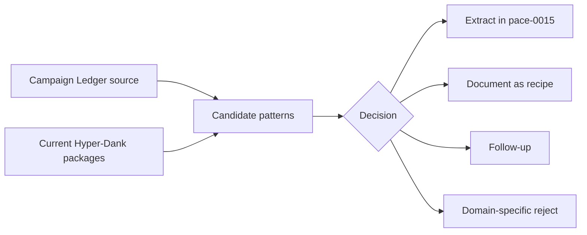

# pace-0014: Audit Campaign Ledger Generic Extraction Candidates

## Header

| Field | Value |
| --- | --- |
| Ticket | `pace-0014` |
| Branch | `pace-0014` |
| Parent Epic | `pace-0013` |
| Base Branch | `pace-0013` |
| Status | Implemented |
| Theme | Campaign Ledger divergence and generic extraction audit |
| Milestones | 4 discovery and decision slices |
| Primary stack | Markdown docs, Hyper-Dank packages, Campaign Ledger source review |
| Owner | `@Macavitymadcap` |
| Target PR | TBD |
| Last updated | 2026-05-21 |

## Summary

Audit Campaign Ledger's current app-local implementation against Hyper-Dank's public packages and
produce the accepted extraction map for this epic. The output should decide what becomes generic
Hyper-Dank work, what becomes public docs or recipes only, what is deferred, and what must remain
Campaign Ledger domain code.

Implementation output: `docs/architecture/campaign-ledger-extraction-audit.md`.

## Goals

- Review Campaign Ledger's components, scripts, auth UI, app shell, asset handling, Markdown/wiki
  rendering, verification, screenshots, and hosted rehearsal docs.
- Compare those patterns with Hyper-Dank UI, data, transport, automation, content helpers, Storybook,
  package READMEs, recipes, and compatibility tests.
- Assess whether current dashboard examples need a small generic graph component so they can show
  realistic data without pulling in a full charting dependency.
- Assess whether Hyper-Dank should provide an accessibility statement contract and generator for
  sites that need to publish accessibility support, testing coverage, and known limitations.
- Mark each candidate as extract, document, defer, or reject.
- Rank extracted candidates as must-do, useful follow-up, or reject so `pace-0015` stays brief.
- Apply the generic extraction rule from `pace-0013` to avoid shared dice, campaign, sheet, rules,
  character, roster, or private-content APIs.
- Evaluate each candidate against future blog, static web book, and choose-your-own-adventure
  shapes, not only Campaign Ledger adoption.
- Produce a durable audit note that gates `pace-0015` and `pace-0016`.

## Non-Goals

- No source implementation.
- No Campaign Ledger migration.
- No package export changes.
- No full blog, book, or branching-story engine design.
- No public docs changes beyond linking or creating the internal audit note if needed.

## Milestones

| # | Commit Theme | Scope | Acceptance Criteria |
| --- | --- | --- | --- |
| 1 | `docs(platform): audit ledger divergence` | Review Campaign Ledger components, scripts, docs, routes, and verification patterns | Candidate list cites source paths and names the repeated pattern behind each candidate |
| 2 | `docs(platform): compare shared package coverage` | Map candidates to current Hyper-Dank UI, data, transport, automation, content, Storybook, and recipes | Each candidate has a current Hyper-Dank status and likely target package or docs surface |
| 3 | `docs(platform): test candidates against future app shapes` | Check candidates against blog, static web book, and branching narrative needs | Each accepted candidate names which future shape it supports or explains why it is Campaign Ledger adoption-only |
| 4 | `docs(platform): scope implementation tickets` | Rank candidates, pick the brief implementation short-list, and update or confirm `pace-0015` and `pace-0016` scope from the audit | Implementation tickets can begin without re-deciding source scope or expanding past the agreed short-list |

## Affected Components

| Component / Area | Change Type | Notes | Verification |
| --- | --- | --- | --- |
| App composition | Reviewed | Campaign Ledger shell, route composition, and runtime setup | Audit notes |
| Data layer | Reviewed | Asset storage, relative storage keys, placeholders, hosted rehearsal boundaries | Audit notes |
| UI components | Reviewed | Password field, site header, popover action/result pattern, copy controls, compact surfaces | Audit notes |
| Auth / permissions | Reviewed | Only extract UI/control patterns, not auth or role policy | Audit notes |
| Scripts / tooling | Reviewed | Pa11y targets, screenshots, smoke journey, hosted acceptance, local server harness use | Audit notes |
| Deployment | Reviewed | Hosted rehearsal lessons only; no deployment implementation | Audit notes |
| Documentation | Added / Modified | Add durable extraction audit under `docs/architecture/` or equivalent, including accessibility statement helper scope | `bun run check` |

## Audit Flow

## Candidate Review Matrix

The audit note should include at least these fields:

| Field | Purpose |
| --- | --- |
| Candidate | Short neutral name, such as password visibility field |
| Evidence | Campaign Ledger paths or docs proving the pattern exists |
| Current Hyper-Dank coverage | Existing component/helper/docs, if any |
| Future app support | Dashboard, blog, static web book, branching narrative, Campaign Ledger adoption, or none |
| Decision | Extract, document, defer, or reject |
| Priority | Must-do in `pace-0015`, useful follow-up, or reject |
| Target | Package, docs surface, Storybook, compatibility test, or N/A |
| Generic boundary | What app-owned concerns must stay out |
| Required evidence | Tests, Storybook, docs, compatibility, screenshots, or a11y |

## Accessibility Statement Review

The audit should decide whether to add reusable accessibility statement support under the automation
or static-content package surface. The review should cover:

- A generic statement data shape for provided accessibility features, testing methods, known
  limitations, unsupported content, contact or issue-reporting route, and last review date.
- A Markdown generator that produces plain, app-neutral statement copy from app-owned inputs.
- A static page builder or recipe that lets docs sites include an accessibility statement page.
- Boundaries that keep legal/compliance claims, audit evidence, and remediation commitments
  app-owned.
- How the helper connects to Pa11y target catalogues, manual review notes, screenshots, and public
  docs without pretending automated checks prove full accessibility.

## Future App Shape Review

The audit should include a compact section that answers:

- Which accepted patterns help dashboard/admin examples: simple metric visualisation, graph
  labelling, accessible data summaries, empty states, and static example data.
- Which accepted patterns help a blog: content collections, tags/categories, listing pages,
  pagination, prose rendering, metadata, static build checks, or feeds/search hooks.
- Which accepted patterns help a static web book: chapters, table of contents, previous/next
  navigation, anchors, callouts, footnotes, asset references, and print-friendly prose.
- Which accepted patterns help a choose-your-own-adventure style game: choice lists, action/result
  panels, local browser state hooks, progress/history display, and static content plus small client
  behaviour.
- Which tempting ideas are too large for this slice and should become a later real-project-driven
  epic, such as a full story engine, book compiler, save system, or authoring DSL.

## Test Matrix

| Area | Test Layer | Expected Coverage |
| --- | --- | --- |
| Audit documentation | Static review | Candidate decisions are concrete, source-linked, and mapped to later tickets |
| Generic boundary | Planning review | Dice, campaign, sheet, character, rules, and role-specific concepts are rejected or reduced to generic patterns |
| Future app shapes | Planning review | Dashboard, blog, static web book, and branching narrative needs are considered without expanding into full engines or frameworks |
| Accessibility statement | Planning review | Statement helpers describe support, testing, limitations, contact, and review date without making unsupported compliance claims |
| Ticket readiness | Planning review | `pace-0015` and `pace-0016` have enough detail to implement without redoing discovery, with `pace-0015` limited to the agreed short-list |

## Rollout Notes

- This ticket gates implementation. If the audit decides a candidate is not generic, do not add it
  to Hyper-Dank source in `pace-0015`.
- Use Campaign Ledger as evidence, not as a dependency.
- Keep public-facing wording app-neutral even if the internal audit references Campaign Ledger.

## Implementation Notes

- Added `docs/architecture/campaign-ledger-extraction-audit.md` as the durable audit output.
- Ranked candidates as must-do, useful follow-up, or reject.
- Selected the `pace-0015` short-list: basic graph component, accessibility statement helper, and
  authored-content metadata/navigation patterns.
- Deferred password visibility, copy controls, app header extraction, asset placeholder helpers,
  and richer verification target catalogues unless a short-list item is intentionally dropped.
- Rejected dice, D&D rules/source models, campaign roles, sheet semantics, and domain-specific
  metrics as shared package exports.

## Assumptions

- Campaign Ledger is available locally at `/Users/dank/Code/personal/web/campaign-ledger`.
- The active Campaign Ledger epic may still be moving, so the audit should focus on stable patterns
  already present in source and docs.
