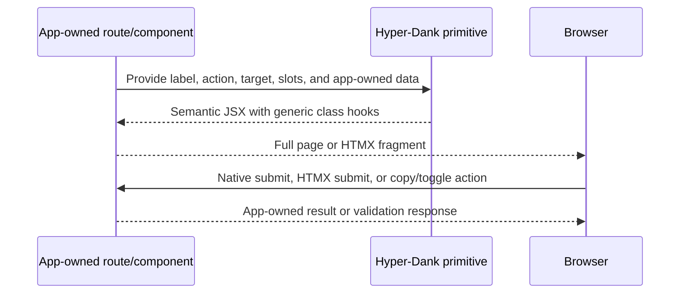

# pace-0015: Extract Generic App Patterns From Campaign Ledger Lessons

## Header

| Field | Value |
| --- | --- |
| Ticket | `pace-0015` |
| Branch | `pace-0015` |
| Parent Epic | `pace-0013` |
| Base Branch | `pace-0013` |
| Status | Implemented |
| Theme | Generic reusable components, helpers, recipes, and compatibility checks |
| Milestones | 5 implementation slices |
| Primary stack | Hono JSX components, CSS, Bun tests, Storybook, compatibility tests, Markdown docs |
| Owner | `@Macavitymadcap` |
| Target PR | TBD |
| Last updated | 2026-05-21 |

## Summary

Implement the app-neutral extraction decisions accepted by `pace-0014`. The work should make
Hyper-Dank more ready for Campaign Ledger adoption without adding Campaign Ledger's domain model,
routes, roles, dice logic, private content policy, or D&D concepts to shared packages.

## Goals

- Add or improve only the generic components, helpers, scripts, and recipes accepted by the
  `pace-0014` audit.
- Limit implementation to the `pace-0014` must-do short-list, expected to cover no more than three
  candidate families plus supporting docs and compatibility checks.
- Keep every new export available through public package paths and covered by tests.
- Use Storybook for UI component detail and package READMEs or public docs for non-UI helpers.
- Preserve native HTML, HTMX-friendly contracts, light/dark styling, and app-owned validation.
- Turn domain-heavy examples into neutral examples, such as admin handoff, dashboard action panels,
  asset placeholders, or local-server verification targets.
- Add a basic graph component if accepted by `pace-0014`, keeping it suitable for static dashboard
  examples rather than a general-purpose charting framework.
- Include generic examples or recipes for blog, static web book, and branching narrative use cases
  when the accepted extraction map says a component or helper supports them.
- Add accessibility statement helpers if accepted by `pace-0014`, including Markdown generation and
  a static statement page recipe or builder.

## Non-Goals

- No `DiceRoller`, character sheet, campaign wiki, faction, rule, roster, table-play, or D&D-specific
  export.
- No shared authentication service, session model, invite flow, password reset flow, or role policy.
- No direct import from Campaign Ledger source.
- No breaking changes to existing Hyper-Dank public package exports unless `pace-0014` explicitly
  accepted them and the epic is updated.
- No public docs that name Campaign Ledger as a consumer.
- No full charting library, dashboard analytics engine, canvas renderer, live data layer, animation
  system, or domain-specific metrics.
- No full blog starter, static book compiler, choice-game engine, save-state system, randomiser, or
  branching-story authoring DSL.
- No legal compliance certification, automated accessibility guarantee, or app-specific remediation
  promise generated by shared helpers.

## Milestones

| # | Commit Theme | Scope | Acceptance Criteria |
| --- | --- | --- | --- |
| 1 | `test(ui): cover accepted generic components` | Add failing render tests for accepted UI candidates such as password visibility, copy controls, app header slots, or popover action/result patterns | Tests describe generic semantics, labels, ARIA, states, and HTMX/native attributes |
| 2 | `feat(ui): add generic app interaction primitives` | Implement accepted UI components or improvements in `@macavitymadcap/hyper-dank-ui` | Components are exported, styled, light/dark safe, and documented in Storybook where applicable |
| 3 | `test(platform): cover accepted helper contracts` | Add tests for accepted data, transport, automation, content, asset, or verification helpers | Helper tests use app-neutral fixtures and do not depend on Campaign Ledger |
| 4 | `feat(platform): add generic helper contracts` | Implement accepted non-UI helpers and package exports | Package READMEs and library docs explain app-owned responsibilities and public import paths |
| 5 | `docs(recipes): document app-shape patterns` | Update recipes, package docs, Storybook, and compatibility examples for accepted Campaign Ledger, blog, static book, and branching narrative patterns | Public docs describe reusable app patterns without private consumer names, hidden engines, or domain leakage |

## Affected Components

| Component / Area | Change Type | Notes | Verification |
| --- | --- | --- | --- |
| App composition | Modified if accepted | Generic app shell/header slots or recipes only | Component tests, Storybook, compatibility |
| Data layer | Modified if accepted | Asset storage or placeholder guidance only if generic and accepted | Unit tests, README/docs |
| UI components | Modified / Added | Accepted primitives such as password visibility, copy controls, popover action/result, or shell refinements | Render tests, Storybook, a11y |
| Auth / permissions | N/A | Auth services and permission policy remain app-owned | N/A |
| Scripts / tooling | Modified if accepted | Verification target, screenshot, local server, or hosted acceptance helpers | Unit tests, package docs |
| Deployment | N/A / Docs only | Hosted rehearsal remains a recipe/checklist pattern, not deployment config | Docs review |
| Documentation | Modified | Recipes, package READMEs, Storybook, compatibility notes | `bun run check`, `bun run test:compat` |

## Generic Pattern Flow

## Candidate Implementation Boundaries

The final set comes from `pace-0014`, but each accepted candidate must obey these boundaries:

| Candidate family | Shared package may own | Application must own |
| --- | --- | --- |
| Password visibility | Field markup, label wiring, visibility toggle attributes, docs | Password policy, reset flow, invite flow, validation rules |
| Copy controls | Copy button markup, fallback-select guidance, status text hooks | Token generation, URL construction, access control |
| App header/shell | Brand slot, nav/menu slots, user summary slot, theme-toggle placement | Route map, role labels, permission decisions |
| Popover action/result | Trigger, popover panel, form/result layout, HTMX target props | Action semantics, dice/rules/math/domain state |
| Basic graph component | Small labelled SVG chart, accessible title/summary hooks, optional table fallback guidance, static dashboard examples | Charting framework, live data fetching, analytics model, domain metrics, animation |
| Asset helpers | Relative key and placeholder helper contracts, docs, tests | Storage backend, membership checks, private/public visibility |
| Verification helpers | Target catalogue shape, local server harness, report/screenshot recipes | Seeded users, smoke journey steps, hosted environment values |
| Authored-content helpers | Content metadata, prose/navigation patterns, action/result UI, static verification examples | Blog schema, book compiler, story graph engine, save rules, publishing workflow |
| Accessibility statement helpers | Statement data shape, Markdown renderer, static page builder or recipe, example limitations/testing copy | Legal claims, conformance level assertions without evidence, contact handling, remediation policy |

## Test Matrix

| Area | Test Layer | Expected Coverage |
| --- | --- | --- |
| UI components | Render/unit | Labels, ARIA, native fallback, HTMX attributes, disabled/error states, light/dark class hooks |
| Storybook | Story/test | Accepted UI components have stories, docs, and generic examples |
| Package exports | Compatibility | New exports import through public package paths |
| Basic graph component | Render/Storybook/a11y | Graph examples render labelled SVG and accessible summary text from neutral static data |
| Non-UI helpers | Unit | App-neutral fixtures cover success, failure, and boundary cases |
| Accessibility statement | Unit/docs | Statement generator renders provided support, testing, limitations, contact, and review date from app-owned inputs |
| Public docs | Static/docs | Recipes and package docs are app-neutral and match implemented APIs |
| Future app examples | Compatibility/docs | Blog, static web book, and branching narrative examples use public package imports and stay intentionally small |
| Full verification | Repo scripts | `bun run verify` passes before ready for review |

## Rollout Notes

- Start from tests and compatibility imports so shared boundaries stay explicit.
- If an accepted candidate grows too domain-specific during implementation, stop and move it to a
  follow-up or app-owned note rather than forcing it into Hyper-Dank.
- If the accepted short-list feels too large once source work starts, preserve the highest-value
  generic family and move the rest to follow-up tickets rather than lengthening this epic.
- Prefer improving existing components such as `AppShell`, `PopoverMenu`, `InputGroup`, `HxForm`,
  or automation helpers over adding duplicate primitives.

## Implementation Notes

- Added `BasicGraph` to `@macavitymadcap/hyper-dank-ui` with accessible SVG title/description
  wiring, bar and line rendering, package exports, CSS hooks, render tests, Storybook coverage, and
  dashboard compatibility coverage.
- Added accessibility statement helpers under `@macavitymadcap/hyper-dank-automation/content`:
  `renderAccessibilityStatementMarkdown()` and `buildAccessibilityStatementPage()`.
- Added authored-content helpers under the same content subpath:
  `createContentNavigation()` and `renderChoiceListMarkdown()`.
- Updated package README and public library docs for the new graph and content helper exports.
- Extended consumer compatibility coverage so dashboard, static-content, accessibility statement,
  static book navigation, and branching choice examples import through public package paths.
- Deferred password visibility, copy controls, app header extraction, asset placeholder helpers,
  and role-aware verification catalogues as planned follow-ups.

## Assumptions

- `pace-0014` has produced an accepted extraction map.
- `pace-0050` has already delivered the app-builder package and docs baseline this ticket builds on.
