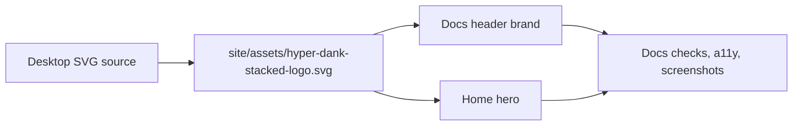

# pace-0016: Integrate Hyper-Dank Logo and Docs Brand Polish

## Header

| Field | Value |
| --- | --- |
| Ticket | `pace-0016` |
| Branch | `pace-0016` |
| Parent Epic | `pace-0013` |
| Base Branch | `pace-0013` |
| Status | Implemented |
| Theme | Stacked logo integration and restrained docs-site brand polish |
| Milestones | 4 implementation slices |
| Primary stack | SVG assets, Jekyll docs site, CSS, accessibility, screenshots |
| Owner | `@Macavitymadcap` |
| Target PR | TBD |
| Last updated | 2026-05-21 |

## Summary

Add the new stacked Hyper-Dank SVG logo to the docs site and related brand surfaces, then tune the
docs typography and theme tokens so the rune-inspired identity is visible without reducing
readability or making the site feel ornamental.

## Goals

- Commit the stacked Hyper-Dank SVG as a site/repo asset with accessible title or alt text.
- Use the logo in the docs header and home page hero.
- Preserve light and dark theme support by using `currentColor` or theme-aware CSS.
- Introduce a restrained rune-inspired brand treatment for the logo area or major brand headings.
- Keep body copy, tables, code, navigation, package docs, and recipes readable and professional.
- Refresh screenshots and accessibility checks for the visibly changed docs site.

## Non-Goals

- No generated bitmap logo.
- No broad redesign of the docs site layout.
- No decorative background or gradient-heavy visual system.
- No novelty font for body copy, code, tables, or dense documentation.
- No change to package APIs unless needed to reference the brand asset from docs.

## Milestones

| # | Commit Theme | Scope | Acceptance Criteria |
| --- | --- | --- | --- |
| 1 | `test(docs): cover logo asset references` | Add or extend docs/static checks for the logo asset and layout references where practical | Broken links or missing assets fail local checks |
| 2 | `docs(brand): add stacked logo asset` | Add the SVG under the docs assets path and reference it from the site layout/home page | Logo has accessible text, scales responsively, and works in light/dark modes |
| 3 | `style(docs): polish brand typography` | Add restrained brand typography/token updates for logo and heading surfaces | Runic feel is limited to brand surfaces; docs copy remains readable |
| 4 | `test(docs): verify brand screenshots` | Run docs checks, a11y, and screenshot review for changed pages | Evidence shows header/home page in light and dark without overlap or contrast regressions |

## Affected Components

| Component / Area | Change Type | Notes | Verification |
| --- | --- | --- | --- |
| App composition | N/A | No runtime app changes | N/A |
| Data layer | N/A | No data changes | N/A |
| UI components | N/A / Docs only | Shared UI package unchanged unless docs examples need updates | Docs checks |
| Auth / permissions | N/A | No auth changes | N/A |
| Scripts / tooling | Modified if needed | Screenshot/docs checks may need asset coverage | `bun run check`, screenshot script |
| Deployment | N/A | Static docs asset only | Static site build/check |
| Documentation | Modified | Site layout, home page, CSS, assets, possibly README image references | A11y and screenshots |

## Brand Asset Flow

## Typography Boundary

| Surface | Allowed treatment |
| --- | --- |
| Logo SVG | Rune-inspired stacked wordmark, theme-aware colour |
| Home hero brand heading | Slightly sharper display style that echoes the logo |
| Section headings | Minor weight or letter-shape adjustment only if readable |
| Body copy | Existing readable sans-serif stack |
| Code and API docs | Existing monospace treatment |
| Tables and navigation | Existing readable operational typography |

## Test Matrix

| Area | Test Layer | Expected Coverage |
| --- | --- | --- |
| Asset references | Static/docs | Logo file exists and referenced paths resolve |
| Accessibility | A11y/manual | Header and hero logo have accessible names or hidden decorative treatment with equivalent text |
| Visual review | Screenshots | Light/dark docs header and home page show the logo clearly with no overlap |
| Responsive layout | Screenshot/manual | Header and hero work on mobile and desktop widths |
| Full verification | Repo scripts | `bun run verify` passes before ready for review |

## Rollout Notes

- Start from `/Users/dank/Desktop/hyper-dank-stacked-logo.svg`, but commit a repo-owned copy under
  the docs assets directory.
- Keep the SVG simple and theme-aware; avoid embedding colours that break dark mode.
- If an external font is considered, prefer a self-hosted or system-safe approach and keep it
  limited to brand surfaces.

## Implementation Notes

- Added `site/assets/hyper-dank-stacked-logo.svg` as the repo-owned stacked logo asset.
- Added theme-aware logo marks to the docs header and home page hero using the SVG as a CSS mask so
  the mark follows light and dark theme colours.
- Limited the runic feel to the logo and heavier brand heading treatment; body copy, navigation,
  tables, and code retain the readable existing type stack.

## Assumptions

- The source SVG is approved as the intended Hyper-Dank stacked logo.
- The docs site remains the primary public brand surface for this epic.
