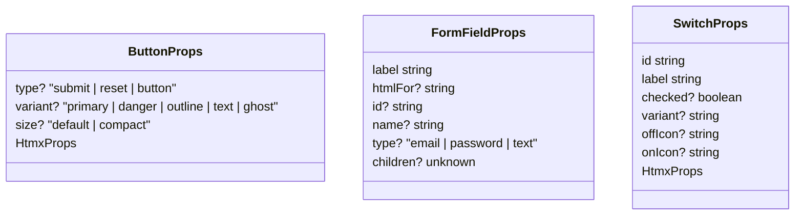

# pace-0021: Add Character Sheet-Compatible Component Props

## Header

| Field | Value |
| --- | --- |
| Ticket | `pace-0021` |
| Branch | `pace-0021` |
| Parent Epic | `pace-0020` |
| Base Branch | `pace-0020` |
| Status | Planned |
| Theme | Additive shared component API compatibility |
| Milestones | 1 implementation slice |
| Primary stack | Bun, TypeScript, Hono JSX |
| Owner | `@Macavitymadcap` |
| Target PR | TBD |
| Last updated | 2026-05-18 |

## Summary

Extend the shared component APIs so generic Character Sheet primitives can be represented through
`@macavitymadcap/hyper-dank-ui` without breaking current Walking Pace usage.

## Goals

- Make `Button` support Character Sheet's current default button usage and `ghost` variant.
- Make `FormField` support both child-rendered fields and simple input generation.
- Make `Switch` support generic HTMX attributes, icon choices, visual variants, and CSS custom-property styling.
- Preserve existing public exports, prop names, and Walking Pace behaviour.

## Non-Goals

- No Character Sheet import migration.
- No new domain-specific component names or props.
- No visual redesign beyond generic style hooks needed by the new props.

## Milestones

| # | Commit Theme | Scope | Acceptance Criteria |
| --- | --- | --- | --- |
| 1 | `feat(components): add consumer-compatible component props` | Additive prop support, component tests, and export/type preservation | Component and compatibility tests prove old and new prop shapes render correctly |

## Affected Components

| Component / Area | Change Type | Notes | Verification |
| --- | --- | --- | --- |
| UI components | Modified | `Button`, `FormField`, and `Switch` in `libs/components` gain additive generic props | Component render tests and compatibility smoke tests |
| App composition | N/A | No Walking Pace route or page changes intended | Existing app tests |
| Data layer | N/A | No database changes | N/A |
| Auth / permissions | N/A | No auth changes | N/A |
| Scripts / tooling | N/A | No script changes expected | Existing verification |
| Deployment | N/A | No deployment changes | N/A |
| Documentation | Modified | Update package-facing docs only if new props need examples | `bun run check` |

## Class / Interface Diagram

## Test Matrix

| Area | Test Layer | Expected Coverage |
| --- | --- | --- |
| Button compatibility | Component unit | Default `type`, `ghost` variant, existing variants, HTMX attributes |
| FormField compatibility | Component unit | `htmlFor` child mode and generated input mode with `id`, `name`, `required`, `type`, `autocomplete` |
| Switch compatibility | Component unit | Existing theme toggle, HTMX props, icon names, variant and style hooks |
| Consumer smoke | Compatibility | Character Sheet-like markup imports and renders through package path |

## Rollout Notes

- Prefer additive props and defaults over changing current call sites.
- Keep generated HTML semantic and close to the existing Character Sheet component contracts.

## Assumptions

- Character Sheet's current primitive component needs are generic enough for the shared package.
- Any app-specific sheet behaviour remains in Character Sheet wrappers or future consuming-app code.
