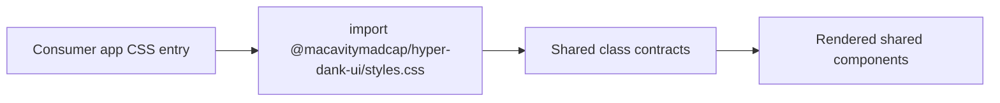

# pace-0022: Harden Shared Component CSS Contract

## Header

| Field | Value |
| --- | --- |
| Ticket | `pace-0022` |
| Branch | `pace-0022` |
| Parent Epic | `pace-0020` |
| Base Branch | `pace-0020` |
| Status | Implemented |
| Theme | Component package CSS consumption contract |
| Milestones | 1 implementation slice |
| Primary stack | CSS, Bun workspace packages, TypeScript package exports |
| Owner | `@Macavitymadcap` |
| Target PR | TBD |
| Last updated | 2026-05-18 |

## Summary

Clarify and test how external consumers should load the shared component CSS so the component package
can be used by Vite-backed apps without relying on Walking Pace-specific styles.

## Goals

- Keep `@macavitymadcap/hyper-dank-ui/styles.css` as the public CSS side-effect import.
- Ensure the CSS file covers the baseline class contracts used by shared components.
- Document Vite and Bun consumer expectations in `libs/components/README.md`.
- Keep CSS generic and free of Walking Pace or Character Sheet domain selectors.

## Non-Goals

- No Character Sheet CSS pipeline implementation.
- No movement of Walking Pace page, organism, or domain CSS into the shared package.
- No external package publication.

## Milestones

| # | Commit Theme | Scope | Acceptance Criteria |
| --- | --- | --- | --- |
| 1 | `docs(components): document shared css consumption` | CSS contract checks, README examples, and package export validation | Consumers can identify the import path and the package test suite protects the style contract |

## Affected Components

| Component / Area | Change Type | Notes | Verification |
| --- | --- | --- | --- |
| UI components | Modified | Shared CSS may gain generic selectors for new component props from `pace-0021` | CSS contract tests and component tests |
| Scripts / tooling | N/A | No new scripts expected | Existing verification |
| Documentation | Modified | `libs/components/README.md` documents CSS import paths and consumer expectations | `bun run check` |
| App composition | N/A | No Walking Pace runtime change expected | Existing app tests |
| Data layer | N/A | No database changes | N/A |
| Auth / permissions | N/A | No auth changes | N/A |
| Deployment | N/A | No deployment changes | N/A |

## System Data Flow

## Test Matrix

| Area | Test Layer | Expected Coverage |
| --- | --- | --- |
| CSS export | Package/static | `package.json` exposes `./styles.css` and README documents it |
| Shared selectors | Unit/static | Style tests confirm baseline selectors for adopted components exist |
| App safety | Verification | Walking Pace build and Storybook still consume app CSS normally |

## Rollout Notes

- Treat the package CSS as a baseline contract, not a full design system.
- Consumers may layer app-specific styling after the package CSS.

## Assumptions

- Vite-backed consumers can import the CSS side effect from a browser CSS or JS entry.
- Inline-style consumers remain out of scope for this ticket.
