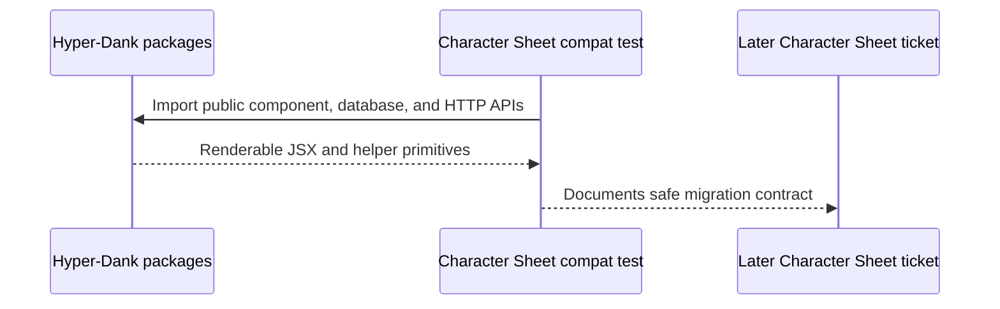

# pace-0023: Expand Character Sheet Compatibility And Handoff

## Header

| Field | Value |
| --- | --- |
| Ticket | `pace-0023` |
| Branch | `pace-0023` |
| Parent Epic | `pace-0020` |
| Base Branch | `pace-0020` |
| Status | Planned |
| Theme | Consumer compatibility and staged adoption notes |
| Milestones | 1 implementation slice |
| Primary stack | Bun tests, workspace package packing, Markdown docs |
| Owner | `@Macavitymadcap` |
| Target PR | TBD |
| Last updated | 2026-05-18 |

## Summary

Expand the Character Sheet compatibility smoke test so it represents the package contract needed for
the later consuming-app migration, and document the handoff without touching Character Sheet while
its `sheet-0012` work is active.

## Goals

- Exercise Character Sheet-like component markup through `@macavitymadcap/hyper-dank-ui`.
- Preserve existing database and HTTP compatibility smoke coverage.
- Document that the Character Sheet runtime dependency belongs in a later explicit ticket.
- Identify the expected later consuming-app work: package dependency, CSS pipeline, import migration, and verification.

## Non-Goals

- No edits to `/Users/dank/Code/personal/web/character-sheet`.
- No new database or HTTP package APIs.
- No CI changes in the consuming repository.
- No publication workflow changes.

## Milestones

| # | Commit Theme | Scope | Acceptance Criteria |
| --- | --- | --- | --- |
| 1 | `test(compat): expand character sheet package contract` | Compatibility tests and handoff notes | `bun run test:compat` protects the intended consumer-facing component surface |

## Affected Components

| Component / Area | Change Type | Notes | Verification |
| --- | --- | --- | --- |
| Scripts / tooling | Modified | Existing `test:compat` gate covers a broader consumer scenario | `bun run test:compat` |
| UI components | Modified | Compatibility coverage exercises package-level component composition | Compatibility test and component tests |
| Documentation | Modified | Handoff notes live in the epic or package docs, not Character Sheet | `bun run check` |
| App composition | N/A | No Walking Pace runtime changes expected | Existing app tests |
| Data layer | N/A | Existing database compatibility smoke remains | `bun run test:compat` |
| Auth / permissions | N/A | No auth changes | N/A |
| Deployment | N/A | No deployment changes | N/A |

## Sequence Flow

## Test Matrix

| Area | Test Layer | Expected Coverage |
| --- | --- | --- |
| Component composition | Compatibility | Character Sheet-style page fragment renders shared primitives through package imports |
| Helper primitives | Compatibility | Database migration and HTTP helpers remain importable through public paths |
| Handoff docs | Static review | Later Character Sheet adoption path is explicit and does not imply current runtime dependency |

## Rollout Notes

- Run this after `pace-0021` and `pace-0022` so the test can cover the final package contract.
- The later Character Sheet ticket should wait until current `sheet-0012` work is clean or merged.

## Assumptions

- Character Sheet adoption will use a future explicit ticket, likely `sheet-0020`.
- The pace repo remains the source of truth for the shared package contract until a registry release exists.
