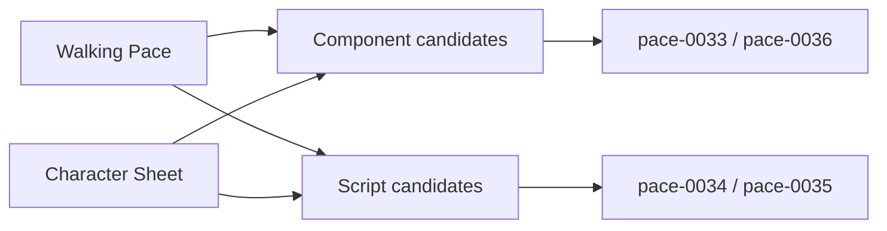

# pace-0032: Audit Platform Primitives And Script Candidates

## Header

| Field | Value |
| --- | --- |
| Ticket | `pace-0032` |
| Branch | `pace-0032` |
| Parent Epic | `pace-0031` |
| Base Branch | `pace-0031` |
| Status | Implemented |
| Theme | Cross-repo platform discovery |
| Milestones | 1 discovery slice |
| Primary stack | Markdown, Bun workspace, Hono JSX |
| Owner | `@Macavitymadcap` |
| Target PR | [#36](https://github.com/Macavitymadcap/pace-calculator/pull/36) |
| Last updated | 2026-05-18 |

## Summary

Inventory reusable UI and script needs across Hyper-Dank and Character Sheet before implementation
locks in the shared component and script package contracts.

## Goals

- Compare current Walking Pace shared/app components with Character Sheet component and page shapes.
- Compare current Walking Pace scripts with Character Sheet scripts for GitHub, verification,
  screenshots, a11y, smoke tests, local servers, branch protection, and database bootstrapping.
- Produce a concise discovery note that confirms or adjusts tickets `pace-0033` through `pace-0038`.
- Record any immediate component fit-and-finish issues that should be folded into follow-on ticket
  acceptance rather than treated as standalone hotfixes.

## Non-Goals

- No source migration in Character Sheet.
- No new public package API in this ticket.
- No design-system implementation beyond documenting candidate primitives.

## Milestones

| # | Commit Theme | Scope | Acceptance Criteria |
| --- | --- | --- | --- |
| 1 | `docs(platform): audit reusable app primitives` | Discovery note and any epic/ticket refinements | Shared component and script candidates are named, grouped, and mapped to follow-up tickets |

## Affected Components

| Component / Area | Change Type | Notes | Verification |
| --- | --- | --- | --- |
| App composition | N/A | Discovery only | N/A |
| Data layer | N/A | Discovery only | N/A |
| UI components | Reviewed | Compare app and shared component shapes | `bun run check` |
| Auth / permissions | Reviewed | Note only where scripts need auth/session helpers | `bun run check` |
| Scripts / tooling | Reviewed | Compare both repos' scripts and helpers | `bun run check` |
| Deployment | Reviewed | Note Pages/Railway branch-protection implications | `bun run check` |
| Documentation | Added / Modified | Add discovery notes under `docs/` or refine this epic | `bun run check` |

## Discovery Findings

### Shared table sizing ergonomics

The current reusable `ScrollableTable` shell preserves semantics and scroll behaviour, but mixed
content tables still rely on brittle hand-tuned column template strings. The Walking Pace
walk-history table shows the gap most clearly: the date/time cell becomes cramped, the action
column competes with metric columns, and row rhythm feels uneven when the first cell wraps.

### Follow-on for `pace-0033`

Ticket `pace-0033` should include a focused refinement slice for table sizing and consumer tuning:

- extend the shared table shell with additive sizing controls so consumers can express deliberate
  desktop and mobile column widths without changing the existing semantic contract
- retune Walking Pace walk-history column widths and row heights for both desktop and mobile
- make the date/time cell hold a stable two-line layout and keep the action column wide enough for
  compact buttons without distorting the rest of the row
- verify the final layout through component tests, static demo smoke coverage, and browser checks

## Discovery Map

## Test Matrix

| Area | Test Layer | Expected Coverage |
| --- | --- | --- |
| Docs consistency | Static review | Ticket map and discovery notes agree |
| Repo terminology | Static checks | Branch numbers, package names, and British English remain consistent |

## Assumptions

- Character Sheet can be inspected locally for discovery, but runtime changes there remain out of
  scope.
