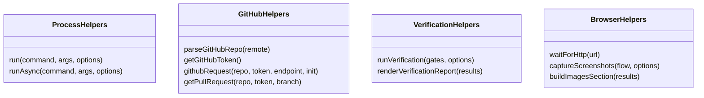

# pace-0034: Introduce Hyper-Dank Scripts Package

## Header

| Field | Value |
| --- | --- |
| Ticket | `pace-0034` |
| Branch | `pace-0034` |
| Parent Epic | `pace-0031` |
| Base Branch | `pace-0031` |
| Status | In Review |
| Theme | Exportable script helper library |
| Milestones | 2 implementation slices |
| Primary stack | Bun, TypeScript, GitHub REST, Playwright/Puppeteer helpers |
| Owner | `@Macavitymadcap` |
| Target PR | TBD |
| Last updated | 2026-05-18 |

## Summary

Add a new workspace package, `@macavitymadcap/hyper-dank-automation`, for reusable automation helpers
currently duplicated or implied by Walking Pace and Character Sheet scripts.

## Goals

- Export stable helpers for process execution, GitHub repo/token/API access, verification gates,
  local test servers, browser test orchestration, screenshots, PR image Markdown, and Pa11y runners.
- Keep app-specific entrypoint scripts small and configurable.
- Provide README examples for both this repo and Character Sheet-style consumers.
- Cover the helpers with unit tests that do not require live GitHub or browser network access.

## Non-Goals

- No direct migration of existing Walking Pace scripts in this ticket.
- No Character Sheet edits.
- No support for non-Bun runtimes.
- No public CLI contract beyond importable TypeScript helpers unless a later ticket adds it.

## Milestones

| # | Commit Theme | Scope | Acceptance Criteria |
| --- | --- | --- | --- |
| 1 | `feat(scripts): add reusable automation package` | Package scaffold, exports, process/GitHub/verification helpers | Package builds, tests pass, README documents import paths |
| 2 | `feat(scripts): add browser and local-server helpers` | Local server, wait, screenshots, PR images, and Pa11y helpers | Browser-helper tests cover configuration and generated Markdown without live GitHub writes |

## Affected Components

| Component / Area | Change Type | Notes | Verification |
| --- | --- | --- | --- |
| App composition | N/A | Helpers only | N/A |
| Data layer | N/A | No database APIs | N/A |
| UI components | N/A | No UI component changes | N/A |
| Auth / permissions | N/A | Local-server helpers may support caller-provided cookies/session setup | Unit tests |
| Scripts / tooling | Added | New `libs/scripts` package and package scripts | `bun test`, `bun run build:packages` |
| Deployment | N/A | No workflow changes in this ticket | N/A |
| Documentation | Added | Package README and root docs mention scripts package | `bun run check` |

## Public Interface Groups

## Test Matrix

| Area | Test Layer | Expected Coverage |
| --- | --- | --- |
| GitHub helpers | Unit | Remote parsing, token fallback behaviour with mocked command output, request error formatting |
| Process helpers | Unit | Captured output, inherited stdio, allow-failure behaviour |
| Verification helpers | Unit | Gate ordering, stop-on-failure, Markdown report output |
| Screenshot helpers | Unit | Image section generation, branch/path escaping, flow selection |
| Local server helpers | Unit/integration | Dynamic port selection and health waiting with a tiny test app |

## Assumptions

- Existing app scripts can keep their current names while delegating common behaviour to this
  package in later tickets.
