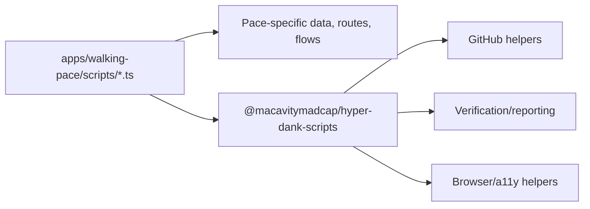

# pace-0034: Migrate Walking Pace Scripts To Shared Helpers

## Header

| Field | Value |
| --- | --- |
| Ticket | `pace-0034` |
| Branch | `pace-0034` |
| Parent Epic | `pace-0030` |
| Base Branch | `pace-0030` |
| Status | Planned |
| Theme | Internal script adoption |
| Milestones | 2 implementation slices |
| Primary stack | Bun scripts, TypeScript, Playwright, Pa11y |
| Owner | `@Macavitymadcap` |
| Target PR | TBD |
| Last updated | 2026-05-18 |

## Summary

Refactor this repo's existing scripts to use `@macavitymadcap/hyper-dank-scripts` where the shared
package covers current behaviour, keeping command names and outputs stable.

## Goals

- Replace local copies of process, GitHub, verification-report, local-server, screenshot/PR image,
  and browser/a11y orchestration helpers with package imports where appropriate.
- Keep app-specific knowledge in `apps/walking-pace/scripts`, especially seed data, route-specific
  screenshot flows, static demo checks, and app database migrations.
- Preserve current root `package.json` script names and verifier gates.
- Prove the migrated scripts still pass the full repo verifier.

## Non-Goals

- No Character Sheet migration.
- No command renames.
- No behaviour changes to release, Pages, seed, or deployment flows unless required by package
  extraction.

## Milestones

| # | Commit Theme | Scope | Acceptance Criteria |
| --- | --- | --- | --- |
| 1 | `refactor(scripts): consume shared automation helpers` | Update process/GitHub/verification/local-server imports | Existing script tests and `bun run check` pass |
| 2 | `test(scripts): verify migrated browser automation` | Re-run screenshot, storybook, E2E, a11y, and full verifier paths | `bun run verify` passes with migrated scripts |

## Affected Components

| Component / Area | Change Type | Notes | Verification |
| --- | --- | --- | --- |
| App composition | N/A | No app route changes | Existing app tests |
| Data layer | N/A | Migration and seed entrypoints retain app-specific behaviour | `bun run db:migrate` where practical |
| UI components | N/A | No component changes | N/A |
| Auth / permissions | N/A | Test server auth setup remains app-owned | E2E/a11y scripts |
| Scripts / tooling | Modified | `apps/walking-pace/scripts` delegates common helpers to package | `bun run verify` |
| Deployment | Reviewed | Pages preparation scripts keep current behaviour | `bun run build:pages-assets`, `bun run prepare:pages` where practical |
| Documentation | Modified | README/architecture update any helper paths | `bun run check` |

## Script Boundary

## Test Matrix

| Area | Test Layer | Expected Coverage |
| --- | --- | --- |
| Static scripts | Unit/static | Imports resolve from package exports |
| Verification | Script integration | Report format and ordered gates remain stable |
| Screenshots | Script integration | Flow selection and PR image Markdown still work |
| Browser checks | Script integration | Storybook, E2E, static demo, and Pa11y still run |

## Assumptions

- Some helpers may remain local if they are tightly coupled to Walking Pace data or routes.
