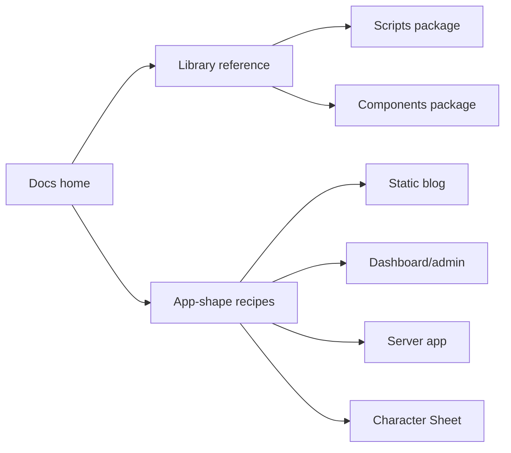

# pace-0036: Document Hyper-Dank Platform Adoption Patterns

## Header

| Field | Value |
| --- | --- |
| Ticket | `pace-0036` |
| Branch | `pace-0036` |
| Parent Epic | `pace-0030` |
| Base Branch | `pace-0030` |
| Status | Planned |
| Theme | Public platform docs and recipes |
| Milestones | 1 documentation slice |
| Primary stack | Markdown, Jekyll, Storybook docs |
| Owner | `@Macavitymadcap` |
| Target PR | TBD |
| Last updated | 2026-05-18 |

## Summary

Update the public Hyper-Dank docs and package READMEs so future apps can understand which libraries
to use, how to combine them, and where app-specific code should remain.

## Goals

- Document component groups and recommended composition patterns for server apps, static blogs,
  dashboards/admin tools, static demos, and Character Sheet.
- Document `@macavitymadcap/hyper-dank-scripts` with examples for verification, screenshots, GitHub
  PR updates, local servers, and a11y/smoke checks.
- Keep the public docs aligned with Storybook and compatibility tests.
- Make deferred Character Sheet runtime migration explicit.

## Non-Goals

- No marketing homepage redesign.
- No consumer app code changes.
- No external package publication guide beyond current local/workspace consumption unless the
  package workflow changes earlier in the epic.

## Milestones

| # | Commit Theme | Scope | Acceptance Criteria |
| --- | --- | --- | --- |
| 1 | `docs(platform): document reusable app patterns` | Jekyll docs, package READMEs, architecture notes | Public docs explain components, scripts, app-shape recipes, and Character Sheet adoption path |

## Affected Components

| Component / Area | Change Type | Notes | Verification |
| --- | --- | --- | --- |
| App composition | N/A | Docs only | N/A |
| Data layer | Reviewed | Database package usage appears in app recipes where relevant | `bun run check` |
| UI components | Documented | New component groups and Storybook links | `bun run storybook:build` |
| Auth / permissions | Documented | Server-app recipes explain app-owned auth/permissions | `bun run check` |
| Scripts / tooling | Documented | Scripts package examples and migration guidance | `bun run check` |
| Deployment | Documented | Pages/static and server-app deployment boundaries | `bun run check` |
| Documentation | Modified | `site/`, README, architecture, package READMEs | `bun run check` |

## Documentation Map

## Test Matrix

| Area | Test Layer | Expected Coverage |
| --- | --- | --- |
| Static docs | Static checks | Markdown and links are reviewable |
| Storybook | Build | Referenced stories exist and compile |
| Package docs | Static review | READMEs match package exports and compatibility imports |

## Assumptions

- The public docs site remains Jekyll-based and deployed through GitHub Pages.
