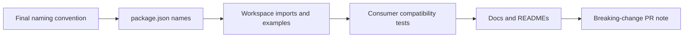

# pace-0037: Rename Public Package Identities

## Header

| Field | Value |
| --- | --- |
| Ticket | `pace-0037` |
| Branch | `pace-0037` |
| Parent Epic | `pace-0030` |
| Base Branch | `pace-0030` |
| Status | Planned |
| Theme | Breaking package identity rename |
| Milestones | 1 implementation slice |
| Primary stack | Bun workspaces, TypeScript package exports, Markdown docs |
| Owner | `@Macavitymadcap` |
| Target PR | TBD |
| Last updated | 2026-05-18 |

## Summary

Rename the public Hyper-Dank package identities during this epic so the reusable libraries have the
right long-term names before downstream apps adopt them more deeply.

## Goals

- Choose and record the final package naming convention for components, database, HTTP, and scripts.
- Update package `name` fields, workspace dependencies, import examples, docs, compatibility tests,
  and package README references.
- Treat the rename as an intentional breaking contract change.
- Keep source folder names stable unless changing them clearly improves package clarity.

## Non-Goals

- No external registry publication.
- No consuming-app runtime migration.
- No unrelated API redesign beyond import/package identity changes.

## Milestones

| # | Commit Theme | Scope | Acceptance Criteria |
| --- | --- | --- | --- |
| 1 | `feat!: rename Hyper-Dank packages` | Package names, docs, imports, compatibility fixtures, and release notes | Local package packing and `bun run test:compat` use the new package names throughout |

## Affected Components

| Component / Area | Change Type | Notes | Verification |
| --- | --- | --- | --- |
| App composition | Modified | Workspace imports may need updates if the app imports packages by public name | `bun test` |
| Data layer | Modified | Database package name and README examples change | Package build and compatibility tests |
| UI components | Modified | Components package name, CSS import path, and examples change | Component tests and compatibility tests |
| Auth / permissions | N/A | No auth behaviour changes | N/A |
| Scripts / tooling | Modified | Scripts package name and helper imports change | Script package tests |
| Deployment | N/A | No hosting changes | N/A |
| Documentation | Modified | Site, README, architecture, package READMEs, and ticket docs use final names | `bun run check` |

## Rename Flow

## Test Matrix

| Area | Test Layer | Expected Coverage |
| --- | --- | --- |
| Package builds | Build | All renamed packages emit declarations |
| Compatibility | Integration | Packed packages import through the new names |
| Docs | Static checks | Public docs and READMEs no longer mention old package names as current imports |
| Release semantics | PR review | PR title or footer marks the rename as breaking |

## Assumptions

- The final package names are not decided in this ticket document yet.
- Backwards-compatible alias packages are out of scope unless explicitly added before implementation.
