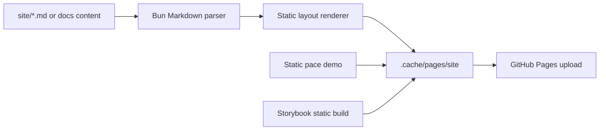

# pace-0043: Build Public Docs with Repo Tooling

## Header

| Field | Value |
| --- | --- |
| Ticket | `pace-0043` |
| Branch | `pace-0043` |
| Parent Epic | `pace-0041` |
| Base Branch | `pace-0041` |
| Status | Planned |
| Theme | Repo-owned docs build |
| Milestones | 3 implementation slices |
| Primary stack | Bun, TypeScript, Markdown, GitHub Pages |
| Owner | `@Macavitymadcap` |
| Target PR | TBD |
| Last updated | 2026-05-19 |

## Summary

Replace the Jekyll documentation build with a Bun-owned static docs pipeline that can reuse Markdown
parsing and page rendering for future docs and static-blog work.

## Goals

- Add a repo-owned Markdown parsing and static page generation path.
- Preserve the existing public routes: `/`, `/libraries/`, `/recipes/`, `/system/`,
  `/verification/`, `/demo/`, `/storybook/`, and `/pace/` where applicable.
- Update `prepare:pages`, CI deployment, README, and architecture docs to describe the new build.
- Keep static demo and Storybook artifact placement unchanged for public visitors.

## Non-Goals

- No blog feature in this ticket.
- No visual redesign beyond what is required to preserve the current docs output.
- No hosting migration away from GitHub Pages.

## Milestones

| # | Commit Theme | Scope | Acceptance Criteria |
| --- | --- | --- | --- |
| 1 | `build(docs): add markdown page generator` | Markdown parser, layout renderer, assets copy, route output | Docs build emits static HTML without Jekyll |
| 2 | `ci(docs): publish repo-built pages` | Pages prep script and workflow updates | Pages artifact includes docs, `/pace/`, and `/storybook/` |
| 3 | `docs(docs): document repo-built pages` | README and architecture deployment updates | Docs no longer describe Jekyll as the active build path |

## Affected Components

| Component / Area | Change Type | Notes | Verification |
| --- | --- | --- | --- |
| App composition | N/A | No Hono runtime change | N/A |
| Data layer | N/A | No persistence change | N/A |
| UI components | N/A | Docs layout rendering may reuse shared conventions but not app components | Build output review |
| Auth / permissions | N/A | No auth changes | N/A |
| Scripts / tooling | Modified | `prepare:pages`, build scripts, docs generation helpers | `bun run build:pages-assets` |
| Deployment | Modified | GitHub Pages workflow stops depending on Jekyll | CI workflow review |
| Documentation | Modified | README and architecture describe repo-built docs | `bun run check` |

## Build Flow

## Test Matrix

| Area | Test Layer | Expected Coverage |
| --- | --- | --- |
| Markdown parsing | Unit | Front matter, headings, code blocks, links, and raw HTML blocks |
| Page generation | Script/integration | Expected routes and assets are emitted |
| Pages artifact | Build | `/`, `/pace/`, and `/storybook/` all exist in the upload directory |
| Deployment docs | Static review | README and architecture match the new build |

## Rollout Notes

- Keep the old `site/` content as source content unless the ticket deliberately renames it.
- Remove Jekyll-only workflow steps once the Bun build is verified.

## Assumptions

- Existing Markdown pages are the content seed for the new generator.
