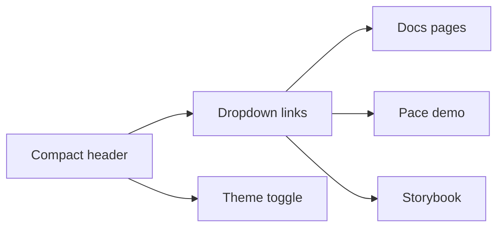

# pace-0044: Compact Public Docs Header and Fix Table Overflow

## Header

| Field | Value |
| --- | --- |
| Ticket | `pace-0044` |
| Branch | `pace-0044` |
| Parent Epic | `pace-0041` |
| Base Branch | `pace-0041` |
| Status | Planned |
| Theme | Public docs shell |
| Milestones | 3 implementation slices |
| Primary stack | Static HTML, CSS, browser checks, screenshots |
| Owner | `@Macavitymadcap` |
| Target PR | TBD |
| Last updated | 2026-05-19 |

## Summary

Make the public docs shell more compact and resilient by replacing the wide header links with a
dropdown, matching the character-sheet light mode toggle pattern, and fixing wide table overflow.

## Goals

- Inspect the character-sheet repo's theme toggle and adapt its light/dark control pattern.
- Replace the public docs header link row with a compact dropdown menu.
- Keep the brand and primary actions visible without crowding mobile or desktop widths.
- Make all docs tables scroll or wrap cleanly without clipping content.
- Share relevant light and dark screenshots for user review before completion.

## Non-Goals

- No full visual redesign of the docs site.
- No changes to library page information architecture; that belongs to `pace-0045`.
- No Storybook utility control changes; that belongs to `pace-0047`.

## Milestones

| # | Commit Theme | Scope | Acceptance Criteria |
| --- | --- | --- | --- |
| 1 | `test(docs): cover docs shell layout` | Add or extend static docs smoke checks | Header controls and table overflow are detectable in browser checks |
| 2 | `feat(docs): compact header navigation` | Dropdown links and character-sheet-style theme toggle | Header is compact across mobile and desktop |
| 3 | `fix(docs): contain wide tables` | Responsive table wrappers/styles | Long documentation tables no longer overflow the viewport |

## Affected Components

| Component / Area | Change Type | Notes | Verification |
| --- | --- | --- | --- |
| App composition | N/A | No Hono runtime change | N/A |
| Data layer | N/A | No data changes | N/A |
| UI components | Modified | Public docs shell, nav menu, theme toggle, table styling | Screenshots, browser checks, a11y |
| Auth / permissions | N/A | No auth changes | N/A |
| Scripts / tooling | Modified | May add docs screenshot or smoke coverage | `bun run test:static-demo` or docs-specific check |
| Deployment | N/A | Uses docs build from `pace-0043` | Pages artifact review |
| Documentation | Modified | Update docs shell notes if needed | `bun run check` |

## Header Flow

## Test Matrix

| Area | Test Layer | Expected Coverage |
| --- | --- | --- |
| Header layout | Browser/screenshot | Mobile and desktop show a compact, non-overlapping header |
| Theme toggle | Browser/a11y | Toggle is keyboard reachable and reflects light/dark state |
| Tables | Browser/screenshot | Wide tables scroll within the content area |
| Copy | Manual review | Labels are concise and clear |

## Rollout Notes

- Include screenshots in the ticket PR or chat review before marking the work ready.
- Preserve readable no-JavaScript behaviour for the docs navigation where practical.

## Assumptions

- Character Sheet is available locally for inspecting the preferred toggle pattern.
