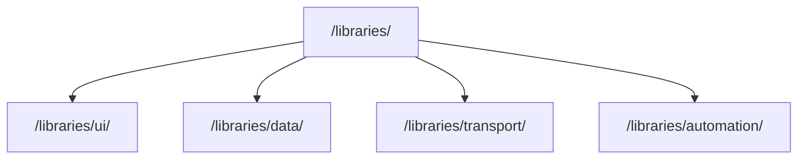

# pace-0045: Split Library Docs into Package Pages

## Header

| Field | Value |
| --- | --- |
| Ticket | `pace-0045` |
| Branch | `pace-0045` |
| Parent Epic | `pace-0041` |
| Base Branch | `pace-0041` |
| Status | Implemented |
| Theme | Library docs information architecture |
| Milestones | 3 documentation slices |
| Primary stack | Markdown docs, static docs layout, package READMEs |
| Owner | `@Macavitymadcap` |
| Target PR | TBD |
| Last updated | 2026-05-19 |

## Summary

Turn the current single libraries page into a libraries home page plus one focused page per shared
package, with collapsible side navigation and clearer shared philosophy.

## Goals

- Add a libraries home page that explains the shared package philosophy.
- Create separate pages for `@macavitymadcap/hyper-dank-ui`,
  `@macavitymadcap/hyper-dank-data`, `@macavitymadcap/hyper-dank-transport`, and
  `@macavitymadcap/hyper-dank-automation`.
- Crib accurate details from package READMEs, README, architecture docs, tickets, and epics.
- Add collapsible side navigation for library docs.
- Ensure tables, API lists, and examples stay readable at mobile widths.

## Non-Goals

- No package API changes.
- No Storybook restructuring.
- No docs build migration; this ticket consumes the repo-built docs foundation from `pace-0043`.

## Milestones

| # | Commit Theme | Scope | Acceptance Criteria |
| --- | --- | --- | --- |
| 1 | `docs(libraries): add package page structure` | Library home, package routes, side nav | Each shared package has a dedicated page linked from `/libraries/` |
| 2 | `docs(libraries): expand package reference copy` | Purpose, install/import examples, API summaries, usage rules | Package pages are accurate and more thorough than the current tabbed page |
| 3 | `test(docs): verify library page layout` | Responsive table and navigation checks | Side nav and tables work on mobile and desktop screenshots |

## Affected Components

| Component / Area | Change Type | Notes | Verification |
| --- | --- | --- | --- |
| App composition | N/A | No runtime app change | N/A |
| Data layer | Reviewed | Data package docs only | Static review |
| UI components | Modified | Docs layout side navigation | Screenshots and a11y |
| Auth / permissions | N/A | No auth changes | N/A |
| Scripts / tooling | Modified | Docs route generation may need library route metadata | Build checks |
| Deployment | N/A | Same Pages artifact | Pages artifact review |
| Documentation | Modified | Library pages and package README cross-links | `bun run check` |

## Library Navigation

## Test Matrix

| Area | Test Layer | Expected Coverage |
| --- | --- | --- |
| Library routes | Build | All package pages emit stable URLs |
| Side navigation | Browser/a11y | Collapsible nav is keyboard reachable and labels current page |
| Tables/examples | Browser/screenshot | API tables and code examples do not overflow |
| Copy | Manual review | Pages explain why and when to use each package |

## Rollout Notes

- Keep package examples aligned with exported package names and CSS import paths.
- Prefer examples that a downstream app can copy into a Hono/HTMX app.

## Implementation Notes

- Replaced the tabbed `/libraries/` page with a shared library overview and package cards.
- Added dedicated package pages at `/libraries/ui/`, `/libraries/data/`, `/libraries/transport/`,
  and `/libraries/automation/`.
- Added a collapsible side navigation pattern for the library docs and kept API tables inside the
  existing responsive table wrapper.
- Added a docs-build regression test that proves nested library permalink routes emit stable output.

## Assumptions

- The current packages remain the public library set for this epic.
