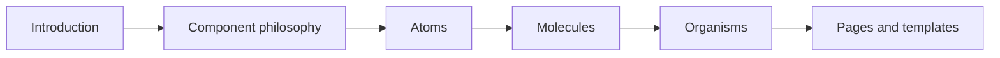

# pace-0046: Restructure Storybook Docs and Component References

## Header

| Field | Value |
| --- | --- |
| Ticket | `pace-0046` |
| Branch | `pace-0046` |
| Parent Epic | `pace-0041` |
| Base Branch | `pace-0041` |
| Status | Implemented |
| Theme | Storybook documentation depth |
| Milestones | 4 implementation slices |
| Primary stack | Storybook, TypeScript, JSDoc, component stories |
| Owner | `@Macavitymadcap` |
| Target PR | TBD |
| Last updated | 2026-05-19 |

## Summary

Rework Storybook so it starts with the Hyper-Dank component philosophy, then moves through
components by type with fuller reference material for inputs, outputs, events, properties, and
methods.

## Goals

- Add an introductory Storybook flow that explains component philosophy, composition rules, and how
  shared primitives relate to Walking Pace app components.
- Group stories by component type before individual components.
- Add JSDoc or equivalent source metadata where it improves generated docs.
- Ensure each component docs page lists relevant inputs, outputs, events, properties, methods, HTMX
  contracts, and accessibility expectations.
- Review existing docs text for usefulness and remove shallow or misleading descriptions.

## Non-Goals

- No large component API redesign.
- No visual redesign of every story.
- No floating utility control changes; those belong to `pace-0047`.

## Milestones

| # | Commit Theme | Scope | Acceptance Criteria |
| --- | --- | --- | --- |
| 1 | `docs(storybook): add component-system introduction` | Intro and philosophy stories | Storybook starts with clear context before component pages |
| 2 | `docs(storybook): group components by type` | Story title hierarchy and navigation order | Atoms, molecules, organisms, pages, and templates are easy to scan |
| 3 | `docs(components): add component reference metadata` | JSDoc/description data and docs tables | Component docs list relevant contracts and behaviours |
| 4 | `test(storybook): cover docs smoke paths` | Storybook build and browser smoke checks | `bun run test:storybook` passes with the new structure |

## Affected Components

| Component / Area | Change Type | Notes | Verification |
| --- | --- | --- | --- |
| App composition | N/A | No app runtime change | N/A |
| Data layer | N/A | No persistence changes | N/A |
| UI components | Modified | Component source comments and stories | Component tests and Storybook tests |
| Auth / permissions | N/A | No auth behaviour change | N/A |
| Scripts / tooling | Modified | Storybook docs generation or smoke tests may change | `bun run test:storybook` |
| Deployment | N/A | Storybook still publishes under `/storybook/` | Build artifact review |
| Documentation | Modified | Storybook docs, source JSDoc, README references if needed | `bun run check` |

## Storybook Flow

## Test Matrix

| Area | Test Layer | Expected Coverage |
| --- | --- | --- |
| Story hierarchy | Manual/browser | Navigation starts with introduction and groups components by type |
| Component docs | Static review | Public components document inputs, outputs, events, properties, and methods where applicable |
| Source comments | Type/static | JSDoc helps docs without duplicating stale prose |
| Storybook build | Browser | `bun run test:storybook` passes |

## Rollout Notes

- Keep docs generated from component metadata where practical, but do not force automation where a
  small explicit table is clearer.
- Treat HTMX attributes as component inputs because they are part of the rendered HTML contract.

## Implementation Notes

- Added a first-class Storybook introduction flow with component philosophy and reference-map
  stories.
- Sorted Storybook navigation so introduction, component groups, and guides appear in the intended
  review order.
- Added source metadata and richer docs descriptions for representative shared contracts: `Button`,
  `HxForm`, `ScrollableTable`, and the Walking Pace `WalkForm`.
- Added responsive reference tables for component inputs, outputs, events, and accessibility
  expectations.

## Assumptions

- Storybook's current autodocs can be improved incrementally without changing Storybook framework.
