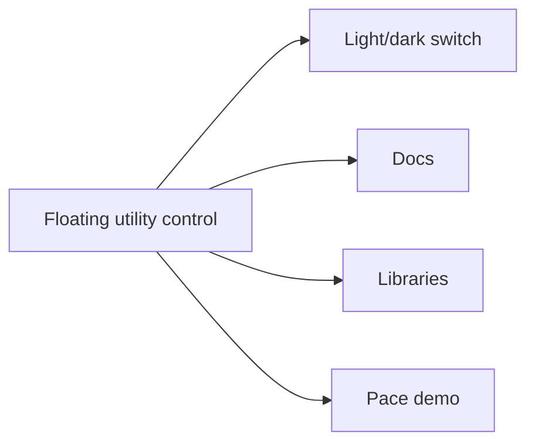

# pace-0047: Add Storybook Quick Links to the Floating Utility Control

## Header

| Field | Value |
| --- | --- |
| Ticket | `pace-0047` |
| Branch | `pace-0047` |
| Parent Epic | `pace-0041` |
| Base Branch | `pace-0041` |
| Status | Planned |
| Theme | Storybook utility navigation |
| Milestones | 2 implementation slices |
| Primary stack | Storybook preview, shared Switch, CSS, browser checks |
| Owner | `@Macavitymadcap` |
| Target PR | TBD |
| Last updated | 2026-05-19 |

## Summary

Expand the floating Storybook theme switch into a compact utility control that also links to the
public docs and the Walking Pace demo from every Storybook page.

## Goals

- Keep the shared theme switch available on every story.
- Add quick links to the docs home, library docs, and Walking Pace demo.
- Ensure the floating control does not cover story content, controls, or docs navigation.
- Share screenshots for light and dark Storybook pages before marking the ticket complete.

## Non-Goals

- No Storybook information architecture rewrite; that belongs to `pace-0046`.
- No public docs header changes; that belongs to `pace-0044`.
- No demo seeding changes; that belongs to `pace-0048`.

## Milestones

| # | Commit Theme | Scope | Acceptance Criteria |
| --- | --- | --- | --- |
| 1 | `feat(storybook): add utility quick links` | Floating control markup and links | Docs and demo links are available from every story |
| 2 | `test(storybook): verify utility control layout` | Browser checks and screenshots | Control is keyboard reachable and does not obscure content |

## Affected Components

| Component / Area | Change Type | Notes | Verification |
| --- | --- | --- | --- |
| App composition | N/A | No Hono runtime change | N/A |
| Data layer | N/A | No persistence changes | N/A |
| UI components | Modified | Storybook preview utility control | Screenshots and a11y checks |
| Auth / permissions | N/A | No auth changes | N/A |
| Scripts / tooling | Modified | Storybook smoke checks may inspect quick links | `bun run test:storybook` |
| Deployment | N/A | Storybook remains under `/storybook/` | Build review |
| Documentation | Modified | Storybook docs note the utility links if useful | `bun run check` |

## Utility Control Flow

## Test Matrix

| Area | Test Layer | Expected Coverage |
| --- | --- | --- |
| Quick links | Browser | Links point to correct public routes under the configured base URL |
| Theme switch | Browser | Light/dark state still applies to stories |
| Layout | Screenshot | Control does not overlap important story content |
| Accessibility | Browser/a11y | Links and toggle have clear names and keyboard focus |

## Rollout Notes

- Prefer compact icon-plus-label links where they remain readable.
- Keep the control small enough for mobile Storybook viewports.

## Assumptions

- The docs and demo URLs are stable once `pace-0043` lands.
