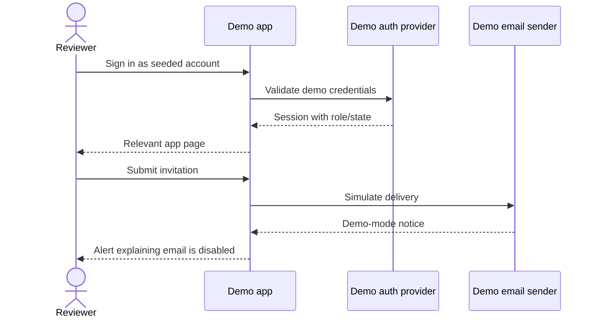

# pace-0048: Seed Demo Review Accounts and Disable Demo Email Invites

## Header

| Field | Value |
| --- | --- |
| Ticket | `pace-0048` |
| Branch | `pace-0048` |
| Parent Epic | `pace-0041` |
| Base Branch | `pace-0041` |
| Status | Implemented |
| Theme | Demo review accounts |
| Milestones | 3 implementation slices |
| Primary stack | Hono, auth providers, SQLite/local presets, Storybook/demo docs |
| Owner | `@Macavitymadcap` |
| Target PR | TBD |
| Last updated | 2026-05-19 |

## Summary

Make the Walking Pace app easier to review by seeding demo accounts that cover the important pages
and replacing demo-mode email invitation attempts with clear in-app messaging.

## Goals

- Confirm whether the public static demo can expose authenticated review states, or whether this
  should be a local/server demo mode documented for reviewers.
- Seed accounts for admin, regular walker, long-history walker, empty account, banned account, and
  invitation-related states where useful.
- Let reviewers sign in and inspect the main user page, admin accounts, invitation flows, score
  review, error states, and empty states.
- Disable outbound email in demo mode and show a clear alert that invitations are simulated.
- Document the seeded credentials and demo-mode limits.

## Non-Goals

- No production weakening of invitation or auth behaviour.
- No public exposure of real credentials outside demo/local review mode.
- No replacement of Better Auth production persistence.

## Milestones

| # | Commit Theme | Scope | Acceptance Criteria |
| --- | --- | --- | --- |
| 1 | `test(demo): cover demo review accounts` | Tests for seed presets, login states, and demo invitation messaging | Demo-mode behaviour is specified before implementation |
| 2 | `feat(demo): add review account mode` | Seed data, auth/demo composition, invite email suppression | Reviewers can reach all important app pages without email delivery |
| 3 | `docs(demo): document review credentials` | README/docs updates and screenshots | Demo accounts and limitations are clear |

## Affected Components

| Component / Area | Change Type | Notes | Verification |
| --- | --- | --- | --- |
| App composition | Modified | Demo/local review mode may alter dependency wiring | Route and E2E tests |
| Data layer | Modified | Seed presets and local SQLite review data | Seed tests |
| UI components | Modified | Demo-mode alert and invitation messaging | Component tests and screenshots |
| Auth / permissions | Modified | Demo accounts must preserve admin/user/banned boundaries | Auth route tests and E2E |
| Scripts / tooling | Modified | Seed scripts and screenshot flows may grow | `bun run seed:dev`, screenshots |
| Deployment | Reviewed | Ensure production email/invite behaviour is unchanged | Config review |
| Documentation | Modified | README, public docs, Storybook/demo docs | `bun run check` |

## Demo Review Flow

## Test Matrix

| Area | Test Layer | Expected Coverage |
| --- | --- | --- |
| Seed presets | Unit/script | Expected users, roles, banned state, and walk histories are created |
| Auth pages | Route/E2E | Seeded users can sign in and reach the correct pages |
| Admin pages | Route/E2E | Admin can view accounts, invitations, and score review |
| Demo invitations | Route/component | Email is suppressed only in demo mode and the alert is clear |
| Screenshots | Browser | Relevant account states are captured for user review |

## Rollout Notes

- Keep production invitation delivery controlled by existing email configuration.
- Reuse `apps/walking-pace/src/envs/local/local-presets.ts` where possible so tests, screenshots,
  and manual review share fixtures.

## Implementation Notes

- Reused the local dev preset accounts for demo review credentials and documented
  `WALKING_PACE_DEMO_MODE=true` for local reviewers.
- Added demo-mode invitation handling to `InvitationService` so admin-created invites are stored
  but no email sender is called.
- Rendered a visible admin notice with the manual invite link when delivery is simulated.
- Added a PR screenshot state for the demo invite notice alongside the seeded account review flow.

## Assumptions

- Existing `seed:dev` accounts are a useful starting point but may need clearer UI exposure for
  public or local reviewers.
