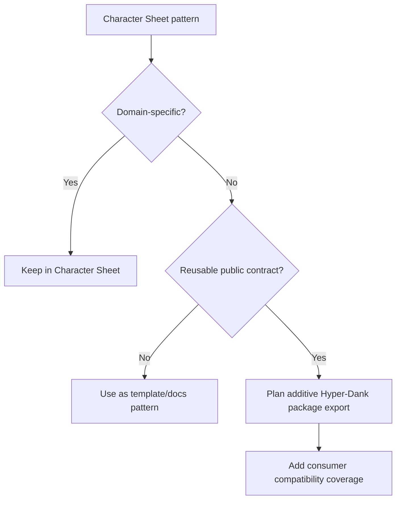

# pace-0049: Review Character Sheet Patterns for Hyper-Dank Extraction

## Header

| Field | Value |
| --- | --- |
| Ticket | `pace-0049` |
| Branch | `pace-0049` |
| Parent Epic | `pace-0041` |
| Base Branch | `pace-0041` |
| Status | Planned |
| Theme | Cross-repo shared package extraction |
| Milestones | 2 discovery and planning slices |
| Primary stack | Hyper-Dank libraries, Character Sheet, Bun scripts, Hono/HTMX components |
| Owner | `@Macavitymadcap` |
| Target PR | TBD |
| Last updated | 2026-05-19 |

## Summary

Compare the current Character Sheet SRD roadmap branch with Hyper-Dank and identify which proven
components, scripts, database helpers, and design patterns should move into shared Hyper-Dank
packages or replace weaker Hyper-Dank analogues.

## Goals

- Review Character Sheet's active `sheet-0020` epic and `sheet-0029` hardening ticket for reusable
  patterns.
- Compare Character Sheet components against `@macavitymadcap/hyper-dank-ui`, especially `Switch`,
  `PopoverMenu`, site/header composition, tab workspaces, edit-form fragments, and dense mobile
  controls.
- Compare Character Sheet scripts against `@macavitymadcap/hyper-dank-automation`, especially local
  app harnesses, login helpers, screenshot targets, a11y targets, seed asset placeholders, and
  verification orchestration.
- Compare database and content helpers against `@macavitymadcap/hyper-dank-data` and
  `@macavitymadcap/hyper-dank-transport`, separating generic primitives from D&D-specific rules,
  auth, and repository logic.
- Document superior Character Sheet patterns that should replace or influence Hyper-Dank docs,
  demos, Storybook examples, or package APIs.

## Non-Goals

- No migration of Character Sheet onto Hyper-Dank packages during the active SRD epic.
- No D&D-specific rules, character, campaign, dice, or SRD data model in shared Hyper-Dank packages.
- No breaking shared package changes unless a later implementation ticket explicitly scopes them.
- No production auth replacement in either repo.

## Milestones

| # | Commit Theme | Scope | Acceptance Criteria |
| --- | --- | --- | --- |
| 1 | `docs(platform): review character sheet extraction candidates` | Cross-repo findings for components, scripts, data helpers, and design patterns | Each candidate is marked extract, adapt, observe, or keep app-specific |
| 2 | `docs(platform): plan shared package follow-ups` | Follow-up ticket recommendations for Hyper-Dank libs and compatibility tests | Shared-package changes have clear package targets and consumer compatibility expectations |

## Affected Components

| Component / Area | Change Type | Notes | Verification |
| --- | --- | --- | --- |
| App composition | Reviewed | Character Sheet `createApp()` and local app harness patterns | Cross-repo review |
| Data layer | Reviewed | SQLite lifecycle, repository contracts, rule import boundaries | Extraction suitability review |
| UI components | Reviewed | Switch, PopoverMenu, SiteHeader, tabs, edit fragments, DiceRoller | Component API comparison |
| Auth / permissions | Reviewed | Guards, sessions, invite/reset services remain app-specific unless generic helpers emerge | Boundary review |
| Scripts / tooling | Reviewed | Verification, a11y, screenshots, local server, login helpers | Automation package comparison |
| Deployment | N/A | Character Sheet deployment is deferred to later roadmap work | N/A |
| Documentation | Modified | Findings and follow-up extraction plan | `bun run check` |

## Initial Findings To Validate

| Candidate | Likely Target | Initial Judgement |
| --- | --- | --- |
| Character Sheet `Switch` visual variants, icon slots, and gradient hooks | `@macavitymadcap/hyper-dank-ui` | Adapt. Hyper-Dank already has `Switch`, but Character Sheet's pattern is the one requested for docs and may be the stronger default. |
| `PopoverMenu` and compact site navigation | `@macavitymadcap/hyper-dank-ui` plus docs shell | Extract/adapt. Hyper-Dank already carries a similar `PopoverMenu`; use Character Sheet's header usage as the product-proven analogue. |
| Role-aware `SiteHeader` composition | App template docs or UI molecule | Adapt cautiously. The layout pattern is reusable, but role-specific links and auth user types are app-specific. |
| Local app harness with login/request helpers | `@macavitymadcap/hyper-dank-automation` | Extract. Character Sheet's script harness covers authenticated local review flows that Hyper-Dank docs/demo work now needs. |
| Screenshot target catalogue with seeded data preparation | `@macavitymadcap/hyper-dank-automation` | Extract/adapt. Hyper-Dank has screenshot flows, while Character Sheet has useful seeded asset and login preparation patterns. |
| A11y target catalogue by role | `@macavitymadcap/hyper-dank-automation` | Extract. A generic target runner could reduce duplication across Hyper-Dank apps. |
| Small safe Markdown renderer for campaign wiki pages | New docs/content helper or app-local utility | Observe/adapt. Useful for repo-built docs/static blog work, but the current implementation is tuned to Google Docs export and campaign assets. |
| Rules importer/parser and SRD repositories | Character Sheet only | Keep app-specific. The importer is domain-specific, though provenance/idempotent import lessons can inform docs. |
| Auth invite/reset token service | App-local or future auth package | Keep app-specific for now. The token hashing and expiry shape is reusable, but Hyper-Dank currently delegates production auth to Better Auth. |
| DiceRoller | Character Sheet only | Keep app-specific. It is a strong component but belongs to table-play UX rather than a general Hyper-Dank UI library. |

## Extraction Decision Flow

## Test Matrix

| Area | Test Layer | Expected Coverage |
| --- | --- | --- |
| Shared UI candidates | Component/API review | Candidate props avoid Character Sheet domain nouns |
| Automation candidates | Script review | Helpers can accept app-specific login, seed, and target callbacks |
| Data/content candidates | Boundary review | Generic lifecycle or parsing pieces are separated from SRD/campaign assumptions |
| Compatibility | Planning review | Any extraction candidate names package exports and consumer tests |

## Rollout Notes

- Treat this as a planning and documentation ticket. Implementation of extracted APIs should happen
  in later tickets with compatibility coverage.
- Character Sheet's active SRD epic says Hyper-Dank adoption is deferred, so avoid cross-repo source
  changes until that roadmap slice is opened.

## Assumptions

- Character Sheet branch `codex/sheet-0029-srd-player-experience` remains the useful comparison
  point for the current SRD epic.
