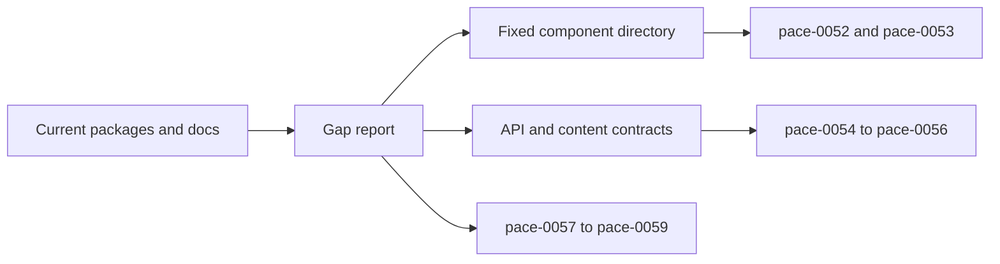

# pace-0051: Audit App-Builder Readiness and Fix the Component Directory

## Header

| Field | Value |
| --- | --- |
| Ticket | `pace-0051` |
| Branch | `pace-0051` |
| Parent Epic | `pace-0050` |
| Base Branch | `pace-0050` |
| Status | Implemented |
| Theme | App-builder readiness audit |
| Milestones | 4 discovery and planning slices |
| Primary stack | Markdown docs, Storybook, Hyper-Dank packages, Bun verification |
| Owner | `@Macavitymadcap` |
| Target PR | TBD |
| Last updated | 2026-05-19 |

## Summary

Audit Hyper-Dank's libraries, docs, Storybook, package READMEs, and reference app examples before
implementation begins, then produce the fixed component directory and package/API decisions that
control the rest of the `pace-0050` epic.

## Goals

- Compare current shared components, docs, and Storybook coverage against the app-builder goals in
  `pace-0050` and the Angular Material / Astro UXDS reference expectations.
- Produce a fixed accepted component directory for `pace-0052` and `pace-0053`, including which
  components are in scope, which are deferred, and which existing primitives should be improved
  rather than replaced.
- Audit `README.md`, `ARCHITECTURE.md`, `CONTRIBUTING.md`, package READMEs, `site/`, Storybook
  guide stories, and existing architecture notes for audience fit, stale claims, private consumer
  references, and missing API detail.
- Confirm the public API policy for new exports, subpaths, compatibility tests, package README
  coverage, Storybook coverage, and release impact notes.
- Confirm the `@macavitymadcap/hyper-dank-automation/content` subpath contract for reusable static
  content and Markdown helpers.
- Record package gaps for data, transport, automation, and static content helpers before source
  implementation tickets begin.

## Non-Goals

- No source implementation of new components or package helpers.
- No public docs redesign, Storybook reorganisation, or package API changes.
- No migration work in consuming apps.
- No private app names or private roadmap details in public docs, package READMEs, Storybook guides,
  recipes, or repo-level public docs.

## Milestones

| # | Commit Theme | Scope | Acceptance Criteria |
| --- | --- | --- | --- |
| 1 | `docs(platform): audit app-builder readiness` | Review current UI components, package APIs, docs, Storybook, and recipes against the `pace-0050` goals | A gap report lists current strengths, blockers, stale public material, private-reference leaks, and package API gaps |
| 2 | `docs(ui): fix component directory` | Decide the accepted component inventory for `pace-0052` and `pace-0053` | Each component is marked existing, improve, add, defer, or reject, with a short reason and target ticket |
| 3 | `docs(platform): define public api and content contracts` | Confirm package export policy and `@macavitymadcap/hyper-dank-automation/content` scope | Public API rules and static-content subpath boundaries are explicit enough for implementation tickets |
| 4 | `docs(platform): map implementation follow-ups` | Update the epic if ticket scope changes and record follow-up risks | Later tickets can start without re-deciding component scope, public docs boundaries, or package subpath shape |

## Affected Components

| Component / Area | Change Type | Notes | Verification |
| --- | --- | --- | --- |
| App composition | Reviewed | Walking Pace remains the reference app for composition examples | Audit notes |
| Data layer | Reviewed | Identify provider, repository, migration, and testing helper gaps | Audit notes |
| UI components | Reviewed | Audit current atoms/molecules plus accepted new component directory | Component directory and Storybook coverage map |
| Auth / permissions | N/A | No auth implementation changes | N/A |
| Scripts / tooling | Reviewed | Confirm automation and static-content helper gaps | Audit notes |
| Deployment | Reviewed | Check whether public docs and README deployment claims are current | Docs audit |
| Documentation | Modified | Add readiness audit, component directory, API policy, and implementation follow-up map | `bun run check` |

## Audit Flow

## Review Checklist

- `libs/components/src/` exports, tests, stories, CSS hooks, and public component naming.
- Existing `Icon` atom behaviour, aliases, inline SVG catalogue, tones, and missing app-builder
  icon names.
- Storybook group structure, generic component stories, Walking Pace reference-app stories, guide
  stories, light/dark behaviour, and keyboard/focus coverage.
- `libs/database/src/` lifecycle, migration, repository, provider, and testing exports.
- `libs/http/src/` form, route, responder, and HTMX/native fallback helpers.
- `libs/scripts/src/` process, GitHub, verification, local-server, browser, PR image, Pa11y, and
  future static-content helper boundaries.
- `apps/walking-pace/scripts/lib/docs-build.ts` Markdown rendering, route generation, asset copying,
  and code-highlighting behaviour that could move under
  `@macavitymadcap/hyper-dank-automation/content`.
- `README.md`, `ARCHITECTURE.md`, `CONTRIBUTING.md`, package READMEs, `site/`, `docs/architecture/`,
  and Storybook guide copy for audience fit and public/private boundaries.

## Fixed Component Directory

The ticket must produce a reviewed component directory with at least these fields:

| Field | Purpose |
| --- | --- |
| Component | Proposed public component or icon group name |
| Group | Atom, molecule, layout, navigation, overlay, feedback, data display, content, or icon |
| Decision | Existing, improve, add, defer, or reject |
| Target Ticket | `pace-0052`, `pace-0053`, later follow-up, or N/A |
| Reason | Why this belongs in or out of the epic |
| Required Evidence | Tests, Storybook coverage, a11y notes, docs, or compatibility checks needed later |

Implementation tickets must not add components outside the accepted directory unless they update the
epic and explain why the scope changed.

## Public API Contract

The audit must confirm that every later public export or subpath will provide:

- `package.json` export coverage.
- Package README usage and boundary notes.
- Public docs or Storybook coverage, depending on whether the export is UI or non-UI.
- Type-level, unit, or consumer-style compatibility coverage.
- Release impact notes, including whether the change is additive or breaking.

The audit should prefer interfaces, factories, and composable helpers. It may recommend base or
abstract classes only where repeated lifecycle code is proven and app-owned queries remain visible.

## Test Matrix

| Area | Test Layer | Expected Coverage |
| --- | --- | --- |
| Audit documentation | Static review | Findings are concrete, source-linked, and mapped to later tickets |
| Component directory | Planning review | Every accepted component has a group, target ticket, and required evidence |
| Public docs boundary | Static review | No public docs, package READMEs, Storybook guides, recipes, or repo-level docs expose private app names |
| API policy | Planning review | Later implementation tickets can apply export, docs, tests, and release-impact rules consistently |
| Markdown/content contract | Planning review | `@macavitymadcap/hyper-dank-automation/content` has a bounded helper list and clear app-owned responsibilities |

## Rollout Notes

- This ticket gates `pace-0052` through `pace-0059`; do not start implementation tickets until the
  component directory and API/content contracts are accepted.
- Keep the output as durable docs rather than one-off notes in a PR description.
- If the audit proves the epic is too broad, update `pace-0050` before writing implementation
  tickets.

## Implementation Notes

- Added `docs/architecture/app-builder-readiness-audit.md` as the durable output for this audit.
- Fixed the accepted component directory for `pace-0052` and `pace-0053`, including improve, add,
  defer, and reject decisions.
- Confirmed Storybook should separate shared library components from Walking Pace reference-app
  components.
- Confirmed reusable static-content helpers should live under
  `@macavitymadcap/hyper-dank-automation/content`.
- Recorded public API rules for new exports and subpaths: package exports, README coverage, docs or
  Storybook coverage, tests, and release impact notes.
- Mapped docs audiences across `README.md`, `ARCHITECTURE.md`, `CONTRIBUTING.md`, package READMEs,
  the public site, Storybook, and architecture notes.

## Assumptions

- Angular Material and Astro UXDS are reference systems for coverage and documentation quality, not
  visual design targets.
- Walking Pace stays visible in Storybook as a reference-app section, while generic shared
  components remain clearly separate.
- The first reusable static-content surface belongs under
  `@macavitymadcap/hyper-dank-automation/content`.
